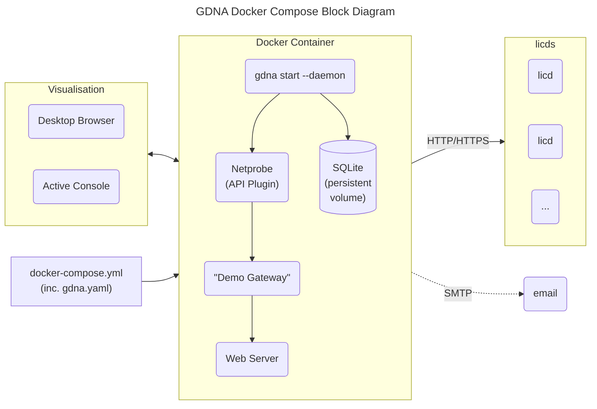
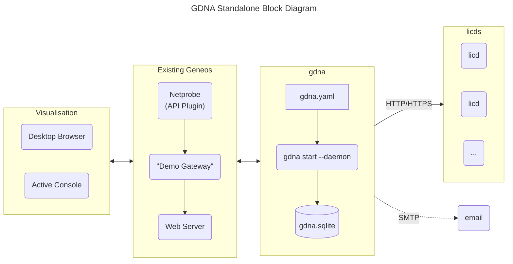
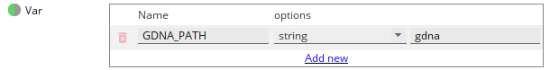

# GDNA Installation

The most straight-forward way to get GDNA up and running is using docker. We recommend using docker to get up and running in minutes, as well as making future updates easier. If docker is not available in your environment you can also run GDNA as a stand-alone process. Both of these methods are described below.

> [!NOTE]
> All the commands used to manage Geneos in this guide rely on the [`geneos`](../tools/geneos/) program. If you use other tools to manage your Geneos environment then you will need to adapt the examples below.
>
> The credential storage for sending email uses the `geneos login` command but this is independent of any other Geneos environment set-up.

## Prerequisites

Before you start there are some prerequisites:

GDNA uses license daemon usage data and this can be from either (or both):

* Report access via `licd` TCP endpoint

  You have to be able to connect to the `licd` port, normally port 7041, from the location that GDNA will be running. You may need to have firewall or network permissions changed.

> [!IMPORTANT]
> Your `licd` (after release 5.7.0, which was a while back) _**must**_ be running with `-report detail` command line options.
>
> Check this with:
>
> ```text
> $ geneos show licd | grep options
> ```
>
> or
>
> ```text
> $ geneos command licd
> ```
>
> If you cannot see the the settings in the options field or in the command output then you can add this to an existing `licd` with:
>
> ```text
> $ geneos set licd options+="-report detail"
> $ geneos restart licd
> ```
>
> Restarting the `licd` process should have no effects on your Geneos installation as Gateways cache license tokens for when the license daemon is not available.

> [!NOTE]
>
> To get the full benefit of the detailed data reports, you should plan to update the `licd` to version 7.0.0 or later and, where possible, you Gateways too. The 7.0.0 `licd` reports Operating System and Netprobe version information while the 7.0.0 Gateway add more data around the Gateway itself and dynamic entities.

* Alternatively: Access to `licd` summary reports

  If you are running GDNA on the same server as the `licd` process or have access to it's working directory via a file share then this option provides more information but requires an updated `licd`. In Geneos releases after 6.7.0 the `licd` process creates summary files in a `reporting/` sub-directory. These are created every 6 hours.

## Using Docker

### Connectivity



### Docker Compose

> [!NOTE]
> This version of GDNA has been built and tested using `docker-ce` version 27.2.0 on amd64 architecture Linux using Debian and Ubuntu distributions. We intend to also test using other version of docker as well as `podman`, which will be detailed in future releases.

First, create a `docker-compose.yml` file using the template below and edit, changing at minimum the `LICDHOST` to the name of the server running the first `licd` process. If the docker container will be running on the same server as GDNA then you can use the `host.docker.internal` as the hostname, like in the commented out example below. Add other license daemons here too.

```yaml
name: gdna

services:
  gdna:
    image: docker.itrsgroup.com/gdna:${VERSION:-release}
    ports:
      # This is the default Web Server port. Using this, the two included
      # dashboard will be available at:
      #
      # <https://HOSTNAME:8443/?fullscreen#WebDashboard:Monitoring%20Coverage>
      #
      # <https://HOSTNAME:8443/?fullscreen#WebDashboard:Plugin%20Utilization>
      #
      # To prevent access to the web-dashboard, for example if you only want emailed
      # reports, just comment out this line and recreate the container.
      - "8443:8443"

      # Uncomment this line if you want access to the Gateway in the container.
      #
      # You will want to do this to access more details in the GDNA Gateway's
      # Dataviews and/or to access the Gateway to populate external web dashboard
      # servers.
      #
      # Please note that the Gateway has no authentication configured beyond a
      # read-only account "gdna-dashboard" with the cleartext password of "geneos"
      # in order to allow both the internal and any external Web Dashboard servers
      # to consume report dataviews. All other connections are treated as fully
      # authorized but generic accounts. You will need to change this to prevent
      # unauthorized access.
      # - "8100:8100"

    configs:
      # this creates a `gdna.yaml` configuration file in the geneos
      # user's `.config/geneos` directory, using the YAML-in-YAML content
      # below.
      #
      # Please note that you will see a warning that uid/gid/mode are
      # not valid and ignored. This is not the case, as mentioned in
      # <https://github.com/docker/compose/issues/12010>
      - source: gdna.yaml
        target: /home/geneos/.config/geneos/gdna.yaml
        uid: "1000"
        gid: "1000"
        mode: 0644

    # if you want to send email reports via an SMTP server that requires
    # authentication then you will need to create secrets using `geneos login`
    # before running the container and then uncomment the next three lines, being
    # careful to maintain the correct indentation. They are then referenced as
    # /run/secrets/NAME and used in the `gdna.yaml` configuration below.

    # secrets:
    #   - keyfile.aes
    #   - credentials.json

    volumes:
      # `gdna-data` is the persistent volume for collected data. This should
      # not be changed.
      - gdna-data:/home/geneos/gdna

      # add any other volume mounts to local licd files you want to use,
      # which must be referenced by container paths in the `gdna.yaml`
      # sections below. Be careful not to mount anything into the stardard
      # Best Practise directories, otherwise the embedded `geneos` will get
      # confused and may not start; i.e. DO NOT usr `/home/geneos/licd/`:

      # - "${HOME}/geneos/licd/licds/perm/reporting:/home/geneos/licd-reporting"
      # - "./licdfiles:/home/geneos/licdfiles"

    extra_hosts:
      host.docker.internal: host-gateway

configs:
  # `gdna.yaml` is the configuration file for GDNA. The changes you are
  # likely to make are to the `licd-sources` list of URLs or local files
  # (mounted using the volumes above), `licd-skip-verify` if your license
  # daemon is in secure mode but using self-managed certificates and the
  # `licd-reports` list of file patterns to newer licd report files.
  #
  # If you want to enable email reports then uncomment and update the
  # `email-schedule` line and update the `email` sections. Remember to
  # create suitable credentials, if required, to access to access your
  # SMTP server using `geneos login`.
  #
  # For more complex configurations, including customised reports, you will
  # probably want to maintain this as an external file and replace the
  # entire `content` section with a `file` setting instead, like this:
  #
  # configs:
  #   gdna.yaml:
  #     file: /host/path/to/gdna.yaml
  #
  gdna.yaml:
    content: | #yaml
      gdna:
        licd-sources:
          - "https://LICDHOST:7041"
          # To access the host that the container is running on, use this URL:
          # - "https://host.docker.internal: host-gateway:7041"
        licd-skip-verify: true

        # licd-reports:
        #   - "./licd-reporting/summary*"

        # the schedule below sends a report every morning at 2am
        #
        # email-schedule: "0 2 * * *"
      db:
        file: ~/gdna/gdna.sqlite
      filters:
        file: ~/gdna/gdna-filters.json
      email:
        subject: "ITRS GDNA Report"
        from: from@example.com
        to: to@example.com
        cc: ""
        bcc: ""
        smtp-server: smtp.example.com

        # don't change these two settings unless you also change the
        # other settings in the secrets section of the docker compose
        # config file
        key-file: /run/secrets/keyfile.aes
        credentials-file: /run/secrets/credentials.json

        # to change the email HTML body text around the reports you can
        # supply a preamble and a postscript either from a file or
        # in-line using these settings:

        # html-preamble: ${file:/path/to/preamble.html}
        # html-postscript: ${file:/path/to/postscript.html}

        # or, in-line: 

        # html-preamble: |
        #   <html>
        #   <head>
        #   ...

        # see the full `gdna.yaml` example file for more details

secrets:
  keyfile.aes:
    file: ${HOME}/.config/geneos/keyfile.aes
  credentials.json:
    file: ${HOME}/.config/geneos/credentials.json

# a persistent volume to save collected data between restarts
volumes:
  gdna-data:
```

Next, login to the ITRS docker registry if you have not already done so:

```bash
docker login docker.itrsgroup.com -u username@example.com
```

If you are going to use the email feature, then you should now save encrypted credentials for your access to your email server in the `geneos` credentials file. Do this like this:

```bash
geneos login smtp.example.com -u username@example.com
```

You will be prompted for the password to use and these details are saved in the `credentials.json` file referred to in the `docker-compose.yml` file above. The password is encrypted using AES256 and the key file it uses it created if one doesn't exist. The security is in the key file, and this should be only accessible to the user (with default permissions 0400).

Then, pull the latest image and run it in the foreground (which you will want to do to, to test it at least the first time as the configuration can be challenging):

```bash
$ docker compose up
[+] Running 12/12
 ✔ gdna Pulled                                                                                                                                                      133.4s 
   ✔ 206929d2bade Pull complete                      19.3s 
   ✔ d01d4f154b5f Pull complete                      19.6s 
   ✔ ef79835647c9 Pull complete                      20.0s 
   ✔ 4f9fcfb6878f Pull complete                      20.0s 
   ✔ b8966d9c36d4 Pull complete                      20.1s 
   ✔ 438367799e46 Pull complete                      20.1s 
   ✔ f5417fb571ae Pull complete                      20.1s 
   ✔ 8f3dafe1280c Pull complete                      20.9s 
   ✔ 4f4fb700ef54 Pull complete                      20.9s 
   ✔ 363de8354d10 Pull complete                      20.9s 
   ✔ a1ec82f79fb6 Pull complete                     129.6s 
[+] Running 2/2
 ✔ Network gdna_default   Created                     0.1s 
 ✔ Container gdna-gdna-1  Created                     1.9s 
Attaching to gdna-1
gdna-1  | + geneos start
gdna-1  | gateway "Demo Gateway" started with PID 20
gdna-1  | netprobe "GDNA" started with PID 21
gdna-1  | webserver "GDNA" started with PID 19
gdna-1  | + sleep 3
gdna-1  | + gdna start --on-start -l - -f /gdna.yaml
gdna-1  | 2024-06-25T23:28:35Z INFO: gdna: version v1.15.0 built with go1.22.4
gdna-1  | 2024-06-25T23:28:35Z INFO: gdna: final configuration loaded from /gdna.yaml
gdna-1  | 2024-06-25T23:28:35Z INFO: gdna: opening database using DSN `file:./gdna/gdna.sqlite`
gdna-1  | 2024-06-25T23:28:35Z INFO: gdna: next scheduled report job 2024-06-25 23:30:00 +0000 UTC
gdna-1  | 2024-06-25T23:28:35Z INFO: gdna: running on start-up
gdna-1  | 2024-06-25T23:28:35Z ERROR: gdna: readLicenseReports for https://localhost:7041 failed error="Get \"https://localhost:7041/licensing/all_licences.csv\": dial tcp [::1]:7041: connect: connection refused"
gdna-1  | 2024-06-25T23:28:35Z INFO: gdna: no matches found for /home/geneos/geneos/licd/licds/*/reporting/summary*
gdna-1  | 2024-06-25T23:28:36Z INFO: gdna: finished on start-up
```

> [!NOTE]
>
> The warning you see like this is expected and the settings are actually applied:
>
> `WARN[0000] config 'uid', 'gid' and 'mode' are not supported, they will be ignored`
>
> This is described in <https://github.com/docker/compose/issues/12010>

It takes a few seconds for the components to start up, and you should be able to access the web dashboard server on port 8443. If you have enabled access to the Gateway on port 8100 then connect your Active Console to see the `GDNA` Managed Entity and data as it is being reported.

> [!TIP]
> Remember that your Active Console can only connect to a named Gateway once, so if you are already connected to a `Demo Gateway` then this new connection will fail; disconnect from the other `Demo Gateway` connection and try again.

Once you are happy that the container runs as expected you can restart it in the background. Interrupt the foreground container using CTRL+C and once you are ready start it again in the background:

```bash
docker compose up -d
```

The GDNA dashboards should once again be accessible at the URLs below, replace `HOSTNAME` with the name of the server where you have run GDNA, and maybe changing the port from 8443 to whatever you may have set it to in the `docker-compose.yml`:

* <https://HOSTNAME:8443/?fullscreen#WebDashboard:Monitoring%20Coverage>

* <https://HOSTNAME:8443/?fullscreen#WebDashboard:Plugin%20Utilization>

* <https://HOSTNAME:8443/?fullscreen#WebDashboard:Version%20Summary>

### Installing Without Docker

Docker will not always be available on the server where you want to run GDNA. It's almost as easy to set-up step-by-step, but will require a few more steps and attention to additional prerequisites:

#### Additional Prerequisites

* You will need a running Geneos Gateway and licenses for one `api` and one `process` sampler.

* You will also need somewhere to display the included dashboards; This can directly in your Active Console or, preferably, in a Web Dashboard Server. For a Web Dashboard Server, this should already be connected to your selected Gateway.

* You will either need to add a new Netprobe, as in the instructions below, or if you want to use an existing Netprobe you will have to adjust the configuration to suit, including the TCP connection details and perhaps the Managed Entity and Sampler names. If you want to change the latter two then more complex changes may be required to make the dashboards work - see the section below.

#### Standalone Connectivity



#### Unpack and Install

To run GDNA on your existing Geneos components you'll need the following from the `cordial-v1.18.0.tar.gz` release archive. For the latest release use [this link](https://github.com/ITRS-Group/cordial/releases/latest):

* `./bin/gdna` - program file

* `./etc/geneos/gdna.example.yaml` - an example configuration file

  The `gdna` program uses a configuration file called `gdna.yaml` to control behaviour. The supplied file, above, is intended to document all the settings that you may want to change. It is probably easier to start with an empty file and only add those settings you need to change. See the section below on [Configuring GDNA](#configure-gdna).
  
* `./etc/geneos/gdna/*.adb` dashboard files

  These two Dashboard files should be imported into your Geneos visualisation tool, i.e. the Active Console and/or Web Dashboard.

* `./etc/geneos/gdna.include.xml` - Gateway include file

  This Gateway Include file contains the baseline configuration for GDNA, to accept reports use the XML-RPC API and the publish these suitable for display in the dashboards above.

All of these files (and more) can be found in the `cordial` release archive. Download the `cordial-v1.18.0.tar.gz` file and unpack it in a suitable location. The archive has a top-level directory so you can simply do this:

```text
tar xf cordial-v1.18.0.tar.gz
cd cordial-v1.18.0
```

Copy the `gdna` program somewhere suitable in your execution path, for example to your `${HOME}/bin/` directory:

```bash
cp bin/gdna ${HOME}/bin/
```

When GDNA runs, with default configuration settings, it creates a number of files in the working directory (where you started it), so you should find a suitable location where it can run and create SQLite database files and log files. The SQLite database files and the log file can be placed anywhere by updating the configuration file.

> [!NOTE]
>
> The `gdna.include.xml` file contains context Commands that run from the Gateway to manage GDNA from the Active Console. The Commands run `gdna` using a Geneos User variable `GDNA_PATH` which defaults to expecting `gdna` to be in the Gateway user's execution path. If you install the binary in a location that the Gateway cannot find then you should override this variable in your Gateway's Operating Environment, e.g.:



#### Configure Geneos

The include file `gdna.include.xml` assumes there is a Netprobe listening securely on the same server as the Gateway on port 8101. You will either need to add a new Netprobe or change the include file after adding it to your Gateway. You will also need to make matching changes to the `gdna.yaml` file. To add a new Netprobe, assuming that TLS has been set-up, on your Gateway server run:

```bash
geneos add netprobe GDNA --port 8101 --start
```

Copy the `etc/geneos/gdna.include.xml` file into your Gateway's "shared" directory, like this:

```bash
$ geneos import gateway -c shared ./=etc/geneos/gdna/gdna.include.xml 
imported "etc/geneos/gdna/gdna.include.xml" to localhost:/opt/geneos/gateway/gateway_shared/gdna.include.xml
```

> [!NOTE]
> Note the use of the leading `./=` is **not** a typo in the argument `./=etc/geneos/gdna/gdna.include.xml` above. This is so that the path or file name is not interpreted as an instance name. Future version of `geneos` may address this issue through more explicit command line syntax.

Open your GSE and add the new include, using the path `../../gateway_shared/gdna.include.xml` and a priority _that is different_ from all other includes (and the main setup file):


Validate and save this config, ensuring that the new include can be found and loaded without clashing with existing configurations.

> [!NOTE]
>
> The `gdna.include.xml` file makes a number of assumptions about the location of the `gdna` binary and the `gdna.yaml` configuration file that may not match you chosen installation locations.

#### Configure GDNA

The program looks for its configuration file in the following directories, using the first one found:

* `./gdna.yaml`
* `${HOME}/.config/geneos/gdna.yaml`
* `/etc/geneos/gdna.yaml`

You can also specify an alternative location with the `--config PATH`/`-f PATH` command line option to any of the `gdna` commands.

You can start without a configuration file or with just an empty `gdna.yaml` and add sections for the settings you want to change. The example below, after you change the URL to your `licd`, is enough to get started:

```yaml
gdna:
  licd-sources:
    - "https://LICDHOST:7041"  
  licd-skip-verify: true
```

If you are not sure where to put the configuration file then you should put it into your Geneos user's configuration directory, which may need creating if it does not exist:

```bash
mkdir -p ${HOME}/.config/geneos
echo > ${HOME}/.config/geneos/gdna.yaml
```

If however you want a more complete reference in place then copy the example [`gdna.yaml`](gdna.yaml) file from the release archive in `./etc/geneos/gdna.yaml` to one of the locations above.

Even without a `gdna.yaml` configuration file, the program will run and produce useful reports, assuming you have set-up your Geneos environment using the `gdna.include.xml` file. This default behaviour includes:

* Attempts to connect to a `licd` report endpoint on `localhost` port 7041 trying both secure and insecure connections - at least one will always fail as both types cannot be supported at the same time. This is normal until a specific configuration is created.
* Creates a `gdna.sqlite` database (including other temp files) in the current working directory
* Creates a `gdna.log` file in the current working directory
* Publishing reports as Dataviews to a local Netprobe, using TLS, on port 8101 to a Managed Entity `GDNA` and an `api` Sampler named `GDNA`
* The dashboards rely on a `GDNA Process` sampler to indicate that the data in the Gateway is live, otherwise they show `DISCONNECTED`. Also they expect GDNA data is published from a Managed Entity with a `DASHBOARD` attribute set to `PROD`. This can be changed using the direction later in this document.

To change the default behaviour either use command line options (run `gdna [COMMAND] -h` for a list) or edit the `gdna.yaml` file. See the comments in the file for more information.

#### Test `gdna` Install

The `gdna` program supports a number of commands. Once you have everything configured and tested you will use the `gdna start --daemon --on-start` command to run the program as a daemon process, regularly collecting and reporting your monitoring coverage.

First, to test the set-up you have created, break this down into several stages, using `gdna fetch` and `gdna report` commands to make sure that the license data is available and the Geneos Gateway and Netprobe are set-up correctly.

* First, run `gdna fetch` like this:

  ```bash
  $ gdna fetch -l -
  2024-06-12T09:38:53+01:00 INFO: gdna: version v1.15.0 built with go1.22.4
  2024-06-12T09:38:53+01:00 INFO: gdna: final configuration loaded from /home/username/.config/geneos/gdna.yaml
  2024-06-12T09:38:53+01:00 INFO: gdna: opening database using DSN `file:gdna.sqlite`
  2024-06-12T09:38:53+01:00 ERROR: gdna: readLicenseReports for http://localhost:7041 failed error="Get \"http://localhost:7041/licensing/all_licences.csv\": read tcp 127.0.0.1:37886->127.0.0.1:7041: read: connection reset by peer"
  ```

  This will read the `gdna.yaml` configuration file and then try to read the license usage data from the sources you have configured. The `-l -` directs logs to the console so that you can see what is happening. In the example above the error is not really an error, but rather the failure to connect to the `licd` process insecurely. Remember that in the default configuration `gdna` tries to collect license usage data from a local `licd` process using both secure and insecure connections - one will always fail. You should update the `gdna.yaml` file to only connect to those sources of data that you expect to exist.

  Any other issues will need to be checked and corrected before proceeding.

* Next, run `gdna report` to process the collected data from the previous test and to publish it to the Netprobe:

  ```bash
  $ gdna report -l -
  $ releases/gdna report -l -
  2024-06-12T09:48:50+01:00 INFO: gdna: version v1.15.0 built with go1.22.4
  2024-06-12T09:48:50+01:00 INFO: gdna: final configuration loaded from /home/username/.config/geneos/gdna.yaml
  2024-06-12T09:48:50+01:00 INFO: gdna: opening database using DSN `file:gdna.sqlite`
  ```

  You should now be able to see new Dataviews in the `GDNA` Managed Entity. If you see any errors, such as no Managed Entity or Sampler found, you will need to address those before proceeding.

* If you are also setting up email, you can now test it like this:

  ```bash
  $ gdna email -l -
  2024-06-12T13:03:46+01:00 INFO: gdna: version v1.15.0 built with go1.22.4
  2024-06-12T13:03:46+01:00 INFO: gdna: final configuration loaded from /home/username/.config/geneos/gdna.yaml
  2024-06-12T13:03:46+01:00 INFO: gdna: opening database using DSN `file:gdna.sqlite`
  2024-06-12T13:03:46+01:00 INFO: gdna: running email report
  2024-06-12T13:03:53+01:00 INFO: gdna: email report complete
  ```

  Once again, if you see any errors you need to address them before continuing.

#### Run `gdna`

If all of the above steps work, you are ready to go!

You can now run `gdna` in the background, collecting data and reporting according to the schedule you have chose - we recommend the default 15 minutes - and sending email reports as desired:

```bash
cd .../suitable/working/directory
gdna start --daemon --on-start
```

This will run the process in the background, detached from your console session. Logs will be written to the file you have configured and the SQLite database will be written to the file(s) in the directory you have selected. The `--on-start` flag tells the program to immediately run a fetch/report cycle on start-up, otherwise it would wait for the next session. This is most useful when initialising a system or after a restart of the entire environment, else the GDNA Managed Entity would remain mostly empty until the next scheduled run.

To ensure GDNA runs when the system is restarted, you can create a `systemd` unit file or add a `cron` entry like this:

```cron
@reboot (cd /path/to/gdna/working/directory; gdna start --daemon --on-start)
```

> [!NOTE]
> In both of the above examples you can omit the `cd` if you have used absolute paths in your configuration file for the log and data files.
