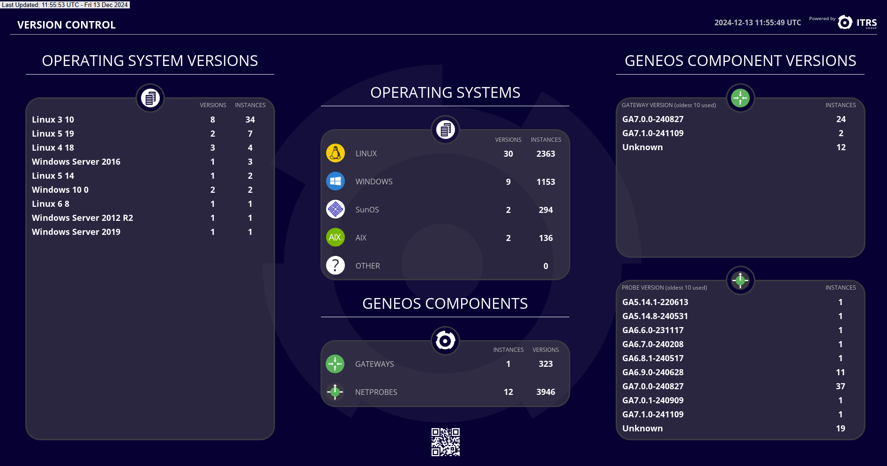

# GDNA - Geneos Dynamic Netprobe Analysis

The Geneos Dynamic Netprobe Analysis ("**GDNA**") tool provides an overview of Geneos monitoring coverage within your I.T. estate. GDNA prompts action to ensure that there are no gaps in the visibility of the health of your applications and systems. It does this through analysing Geneos license usage data to present reports and visual indicators of monitoring coverage levels through the bundled dashboards.

For many users installing GDNA this is as straight forward as creating a `docker-compose.yml` file, adding data sources and starting it up. For those without docker it can also be set-up as a standalone process.

> [!NOTE]
> This guide is for the GDNA shipped as part of cordial release v1.18.0.
>
> New features in GDNA rely on the additional license data introduced in Geneos 7.0.0 and later. For complete data you should have updated to 7.0.0 for both the License Daemon and the Gateways. GDNA will work with older version of both but will not show complete data. We have tried to clearly indicate which data will not be available in the report / Dataview descriptions in this document.

## Getting Started

Please see the [INSTALL.md](INSTALL.md) file for how to install and configure GDNA.

## How GDNA Works

GDNA is a program that collects live data from one or more Geneos license daemons (`licd`), transforms the data and saves it to a self-contained SQLite database, usually on-disk but can be stored in memory only; A typical `ETL` - Extract, Transform, Load - pipeline. When GDNA produces reports it creates a number of temporary tables, both for performance but also to apply filters and grouping without changing the underlying data.

Monitoring Coverage is determined by which plugins are running on a _**server**_. A server is identified by its host ID or, for Windows servers, the MAC address of the primary network interface. Coverage is not measured on individual Netprobes, as it is very common to run multiple Netprobes on one server, either for differing access privileges and/or connected to multiple Gateways to collect data for different user groups. This also means that coverage can span multiple Gateways. GDNA takes these into account to produce a consolidated view of monitoring coverage.

### Terminology

* Monitoring Coverage

  We describe Monitoring Coverage as a measure of how effectively Geneos is deployed and configured to collect appropriate metrics from your I.T. estate. We have chosen the default policies, expressed as Coverage Levels, based on our experience and your feedback. These can be customised later on.

* Coverage Levels

  GDNA uses three levels to represent policies based on ITRS' Geneos Best Practice recommendations. In the original recommendations there are 5 levels, plus a "Level 0" for Geneos self-monitoring:

  * Level 0 - Geneos Self-Monitoring
  * Level 1 - Infrastructure
  * Level 2 - Basic Application
  * Level 3 - Advanced Application
  * Level 4 - End-to-End
  * Level 5 - Business Activity

  GDNA uses Levels 1 to 3 and the presence of plugins from licence token data to map existing monitoring to defined Coverage Level policies. Levels 1 and 2 are largely in-line with the meanings above, with the additional of a list of "optional" level 1 plugins. Plugins that do not fall into the first two levels are classed as Level 3, Advanced Applications. In the Plugin Utilization dashboard these are grouped by Levels and technology families.

  The plugins in the Coverage Levels are:

  | Level                      | Plugins                                                                                                                                                 |
  | -------------------------- | ------------------------------------------------------------------------------------------------------------------------------------------------------- |
  | Level 1                    | `cpu`, `disk`, `hardware`, `network`                                                                                                                    |
  | Level&nbsp;1&nbsp;Optional | `deviceio`, `ipc`, `top`, `unix-users`, `winapps`, `win-cluster`, `win-services`, `wmi`, `wts-licenses`, `wts-processes`, `wts-sessions`, `wts-summary` |
  | Level 2                    | `fkm`, `processes`                                                                                                                                      |
  | Level 3                    | Everything else                                                                                                                                         |

  These lists of plugins (except Level 3) can be changed, but will result in the default dashboards showing incorrect or incomplete data. These lists can also contain multiple instances of the same plugin, for example if you require two `processes` plugins to meet your defined coverage policy, the you can add a extra `processes` plugin to the Level 2 list. A plugin must not however appear in different lists.

* Licence Token Data

  GDNA uses licence token data to build a view of your Geneos deployments. This data includes information on the various Geneos components such as Gateways and Netprobes but most importantly lists exactly which plugins are in use and where. Even if your license allows for unlimited instances of plugin "X", the usage is still recorded by the License Daemon, which allows GDNA to build it's view of your Monitoring Coverage.

* Server

  While Geneos relies on Netprobes to collect monitoring metrics we use the "server" as the basic unit of coverage for reporting, where a server may have multiple Netprobes running and each of these may be connected to different Gateways, but how well that server is being monitored is about how all the Netprobes are working together to give you a real view of it's status.

* Gateway

  A Gateway is the core processing component of Geneos. Gateways are typically configured to manage interrelated monitoring but it is also very common that monitoring of individual servers is spread across technology or team specific Gateways.

* Gateway Groups

  As Geneos is deployed more widely in your organisation you will see a growing range of Gateways serving the monitoring requirements of different groups of users. In some cases this will be through horizontal scaling, such as through different technology domains, vertically through lines-of-business or regionally, such as groups of countries or territories. In each case you will want to view the quality of your monitoring coverage for these groups. GDNA gives you the ability to create groups of Gateways.

## Dashboards

We include three out-of-the-box dashboards to show you how effectively Geneos is being used within your I.T. estate as well as detailed data in both the Active Console and via emailed XLSX workbooks.

### Monitoring Coverage Dashboard

The first dashboard, Monitoring Coverage, gives an overview of all your Geneos Gateways, the servers they are monitoring and the high-level plugin utilization, broken down into 3 coverage levels:


* Level 1 - Core compute infrastructure monitoring; The plugin names can be seen in the left had part of the Plugin Utilization area above. (There are also optional Level 1 plugins, which can be seen in the second dashboard below)

* Level 2 - Basic Application monitoring, the plugin names can be seen in the middle part of the Plugin Utilization area above

* Level 3 - All other technology and application specific plugins.

### Plugin Utilization Dashboard

The second dashboard, known as the "beehive", shows you a more in-depth view of individual plugin utilization:


Each hexagon represents a specific plugin, grouped into logical segments. The numbers are how many individual plugin instances are deployed and how many separate servers they are deployed on.

### Version Summary Dashboard

The third dashboard we include shows version data collected from Geneos 7 release `licd` and Gateways. It shows you version information about the servers that Netprobes are running on as well as Netprobe versions when `licd` is running release 7 or later. Additional Gateway version information becomes available when running Gateway of release 7 or later.



## Gateway Dataviews

GDNA creates Dataviews which provide the data to drive the dashboards, and also more detailed views of monitoring coverage to help you track down and address any gaps in your monitoring.

> [!TIP]
>
> If you install GDNA using docker and you want to access the Gateway, don't forget to allow connections to the Gateway port, as detailed in [INSTALL.md](INSTALL.md#docker-compose)

There are details of the content of these Dataviews in the [REPORTS.md](REPORTS.md) file.

Some of the Dataviews look like this:

* Missing Coverage

  These _**Missing Coverage**_ report contain a list of servers (a _server_ includes data for all Probes across all Gateways, which are identified by a common _host ID_) that have incomplete monitoring coverage.

  For more details see [Dataview: Missing Coverage](REPORTS.md#dataview-missing-coverage)

  

* Gateway Overviews

  The _**Gateway Overview**_ is an optional report that shows, for each Gateway, a separate Dataview or XLSX worksheet with information about all servers associated with that Gateway.

  For more details see [Dataviews: Gateway Overview](REPORTS.md#dataviews-gateway-overview)

  

* Gateway Details

  The _**Gateway Detail**_ optional report, as the name suggests, add more details over and above the _Gateway Summary_ above.

  For more details see [Dataviews: Gateway Details](REPORTS.md#dataviews-gateway-detail)

  

* Plugin Summary

  The _**Plugin Summary**_ report shows usage broken down by plugin type.

  

* More ... coming soon

## Email Reports

GDNA can send reports via email. These emails give a summary and attach an XLSX workbook that contains report data like the Dataviews above.

EMail features must be configured before use. Please see the [`gdna.example.yaml`](gdna.example.yaml) file, specifically the top-level `email` section and the `gdna.email-schedule` settings. Once the details of the email server are set-up you will also be able to send individual Dataviews as reports using right-click context Commands.

> [!IMPORTANT]
> To protect against the accidental exposure of potentially sensitive or confidential system identifiers, the default reports in the XLSX workbook scramble server names, host IDs and some other data. This can be changed in the configuration.

## Configuration

### `gdna.yaml`

GDNA uses one or more configuration files as well as command line flags to control it's behaviour. To make changes to how the `gdna` program runs, where is collects data from and where it publishes reports to, review the extensively commented [`gdna.example.yaml`](gdna.example.yaml) file provided with the distribution.

To make changes when using docker to run GDNA you should edit the `docker-compose.yml` file you first created, and then run:

```bash
docker compose up -d --force-recreate
```

This will restart the container with the new configuration in the background.

> [!TIP]
> On rare occasions in testing we found the `--force-recreate` flag doesn't seem to fully work. In these cases you will need to `docker compose rm` to remove the old containers and then start up the new one.

For standalone installations there is a `gdna stop` command to terminate any existing background process, then you can restart it after updating the configuration. The GDNA program will not reload the configuration file while it is running.

### Dashboard Configuration

The three dashboards included with GDNA are agnostic to the source of data as long as the Dataview names are unchanged from those produced by the standard `gdna` reports. The only exception is that there is a Managed Entity Attribute ("`DASHBOARD`") used, to allow the filtering of data based on your selected environment. By default the value is `PROD` but if you want to run multiple instances of GDNA, for example one in a development environment and another in your production one, then you can copy and update the dashboards to match the new configuration.

> [!NOTE]
>
> The `GDNA Process` Dataview monitors for a running `gdna` process and if the instance count is zero then the dashboards will show `DISCONNECTED`. This is to ensure that the data being shown is up-to-date and is not stale.

* Load the dashboard files into your Active Console using the `File` -> `Import` menu option.

> [!NOTE]
> Your Active Console should be relatively recent as the `.adb` file format can change with new releases and older AC2 release may not work correctly. You will normally see a warning dialogue when importing the file in this case.

* Open the `Tools` -> `Refactor Paths` window:

  

* In the new window select the top level `Advanced Mode` radio button and click on the plus `(+)` icon and finally double click on the `Undefined URL` row that appears.

  

* A new Path Editor window will open;

    

    If you are reading this as a static PDF please try to view the live document in the `cordial` GitHub repo or follow these steps:

    1. Drag the slightly off-screen `Managed Entity` item into the main area
    2. Select the `Managed Entity` box, click on `Edit` and if you are connected to a Gateway that has the `DASHBOARD` attribute already defined then it will appear in the list of properties, otherwise use the `ADD PROPERTY` button to add one. Set the value to `PROD` and close the properties editor.
    3. Then drag a `Replace` item to the right of the `Managed Entity`
    4. Finally another `Managed Entity` into the `Replace` box
    5. Now select the second `Managed Entity` inside the `Replace` box and click `Edit` to open the properties editor. Again, use the `ADD PROPERTY` button to add a `DASHBOARD` attribute if it does not exist.
    6. Close the Path Editor

* The Refactor Paths window will now show a large list of matching paths. Click on `REFACTOR` and wait. This is not a fast operation and cannot be cancelled.

* After about a minute, depending on the performance of your system, you should see a results window like this:

  

* Now close the results and refactor windows and your dashboard should change to reflect the data from the newly filtered data.

* You should now `Export` each of your updated dashboards so that you can import them into a Web Server or another user's Active Console. Do this by right-clicking on a blank area of each dashboard and selecting `Export...`. Follow the Save dialogue, picking a suitable new name for the dashboard. It will be saved with an `.adb` extension automatically.

## Troubleshooting

We hope you GDNA useful and we have tested it as much as is possible in those test environments we can create, we appreciate that there will be issues and features you may like to see added. Please let us know what you think, report an issues and suggest new features via [github](https://github.com/ITRS-Group/cordial/issues) or the [ITRS Community Forum](https://community.itrsgroup.com/).
