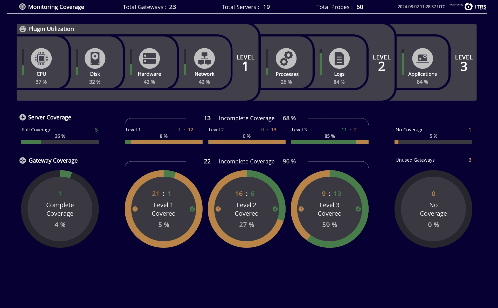
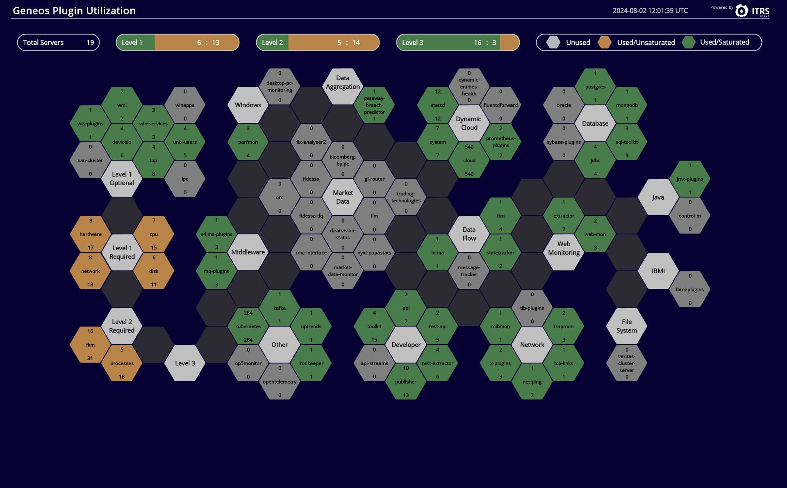
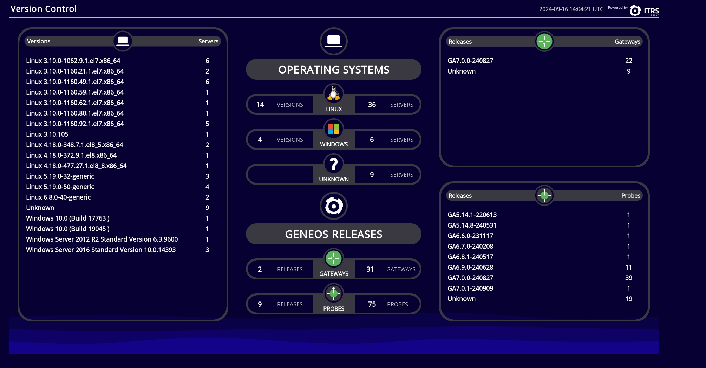
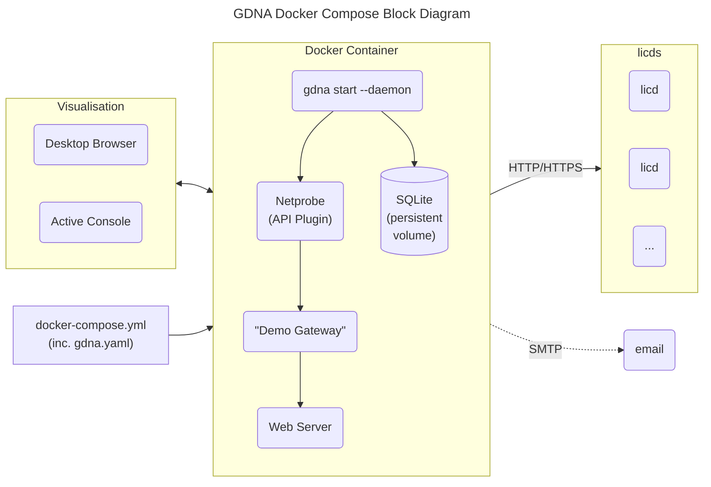
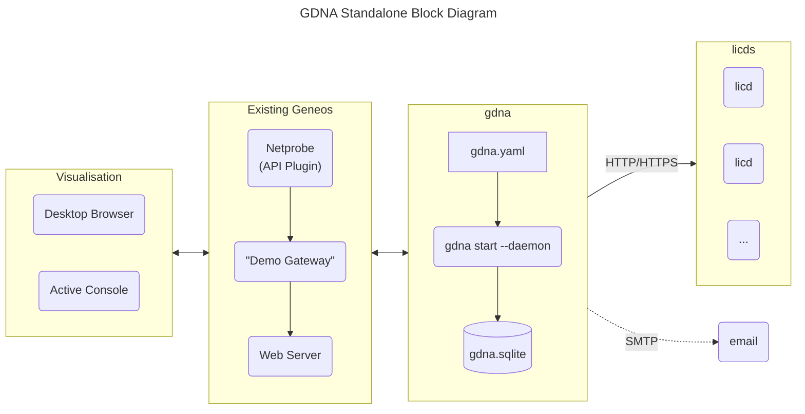

# GDNA - Geneos Dynamic Netprobe Analysis

The Geneos Dynamic Netprobe Analysis ("**GDNA**") tool provides an overview of Geneos monitoring coverage within your I.T. estate. GDNA prompts action to ensure that there are no gaps in the visibility of the health of your applications and systems. It does this through analysing Geneos license usage data to present reports and visual indicators of monitoring coverage levels through two supplied dashboards.

For many users installing GDNA this is as straight forward as creating a `docker-compose.yml` file, adding data sources and starting it up.

We include three out-of-the-box dashboards to show you how effectively Geneos is being used within your I.T. estate as well as detailed data in both the Active Console and via emailed XLSX workbooks.

To dive right in, head to the [Getting Started](#getting-started) section but we suggest taking the time to review the features and functionality first.

> [!NOTE]
> This guide is for the GDNA shipped as part of cordial release v1.17.1 and later.
>
> A number of the newer features in GDNA rely on the additional license data introduced in Geneos 7.0.0 and later. For complete data you should have updated to 7.0.0 for both the License Daemon and the Gateways. GDNA will work with older version of both but will not show complete data. We have tried to clearly indicate which data will not be available in the report / Dataview descriptions in this document.

## Dashboards

### Monitoring Coverage Dashboard

The first dashboard, Monitoring Coverage, gives an overview of all your Geneos Gateways, the servers they are monitoring and the high-level plugin utilization, broken down into 3 coverage levels:



* Level 1 - Core compute infrastructure monitoring; The plugin names can be seen in the left had part of the Plugin Utilization area above. (There are also optional Level 1 plugins, which can be seen in the second dashboard below)

* Level 2 - Basic Application monitoring, the plugin names can be seen in the middle part of the Plugin Utilization area above

* Level 3 - All other technology and application specific plugins.

### Plugin Utilization Dashboard

The second dashboard, known as the "beehive", shows you a more in-depth view of individual plugin utilization:



Each hexagon represents a specific plugin, grouped into logical segments.

### Version Summary Dashboard

The third dashboard we include in GDNA works when data is being collected from Geneos 7 release `licd` and Gateways. It shows you version information about the systems that Netprobes are running on as well as Netprobe versions when `licd` is running release 7 or later. Additional Gateway version information becomes available when running Gateway of release 7 or later.



## Gateway Dataviews

On the Gateway you can see Dataviews from GDNA, some of which provide the data to drive the dashboards above, but there are also more detailed views of monitoring coverage to help you track down and remediate any gaps in coverage. There are more details of the meaning of the cells in these Dataviews in the [Gateway Dataview Details](#dataviews-gateway-detail) section further below.

The Dataviews look like this:

* Missing Coverage

  These _**Missing Coverage**_ report contain a list of servers (a _server_ includes data for all Probes across all Gateways, which are identified by a common _host ID_) that have incomplete monitoring coverage.

  For more details see [Dataview: Missing Coverage](#dataview-missing-coverage)

  

* Gateway Overviews

  The _**Gateway Overview**_ is an optional report that shows, for each Gateway, a separate Dataview or XLSX worksheet with information about all servers associated with that Gateway.

  For more details see [Dataviews: Gateway Overview](#dataviews-gateway-overview)

  

* Gateway Details

  The _**Gateway Detail**_ optional report, as the name suggests, add more details over and above the _Gateway Summary_ above.

  For more details see [Dataviews: Gateway Details](#dataviews-gateway-detail)

  

* Plugin Summary

  The _**Plugin Summary**_ report shows usage broken down by plugin type.

  

## Emailed Reports

GDNA can be configured to send regular reports via email. The email contains a selectable cover-page summary and an XLSX workbook attachment that contains similar report data to the Dataviews above.

> [!IMPORTANT]
> To protect against the accidental exposure of potentially sensitive or confidential system identifiers, the default reports in the XLSX workbook scramble server names, host IDs and some other data. This can be changed in the configuration.

To configure email please see the installation specific details below as well as the [Configuration](#configuration) section.

## Getting Started

The easiest way to get GDNA up and running is using _docker compose_. We show you how to use _docker compose_ to get up and running in minutes as well as making future updates easier to deploy. You can also run GDNA as a stand-alone process without _docker_, but that takes a little more effort. Both of these methods are described below.

> [!NOTE]
> All the commands used to manage Geneos in this guide rely on the [`geneos`](../tools/geneos/) program. If you use other tools to manage your Geneos environment then you will need to adapt the examples below.
>
> The credential storage for sending email uses the `geneos login` command but this is independent of any other Geneos environment set-up.

### General Prerequisites

Before you start there are some prerequisites:

GDNA uses license usage data and this can be from either (or both):

* Report access via `licd` TCP endpoint

  You have to be able to connect to the `licd` port, normally port 7041, from the location that GDNA will be running. You may need to have firewall or network permissions changed.

> [!IMPORTANT]
> Your `licd` (after release 5.7.0, which was a while back) _**must**_ be running with `-report detail` command line options.
>
> Check this with:
>
>  ```text
>  $ geneos show licd | grep options
>  ```
>
>  or
>
>  ```text
>  $ geneos command licd
>  ```
>
> If you cannot see the the settings in the options field or in the command output then you can add this to an existing `licd` with:
>
>  ```text
>  $ geneos set licd options+="-report detail"
>  $ geneos restart licd
>  ```

> [!NOTE]
> Restarting the `licd` process should have no effects on your Geneos installation as Gateways cache license tokens for when the license daemon is not available.

* Access to newer `licd` summary reports

  If you are running GDNA on the same server as the `licd` process or have access to it's working directory via a file share then this option provides more information but requires an updated `licd`. In Geneos releases after 6.7.0 the `licd` process creates summary files in a `reporting/` sub-directory. These are created every 6 hours. When combined with the first option, you can get both additional data and more frequent reporting.

* `licd` and Gateways updated to 7.0.0 or later

  To get the full benefit of the detailed data reports, you should plan to update the `licd` to version 7.0.0 or later and, where possible, you Gateways too. The 7.0.0 `licd` reports Operating System and Netprobe version information while the 7.0.0 Gateway add more data around the Gateway itself and dynamic entities.

### Connectivity



### Using Docker Compose

> [!NOTE]
> GDNA has been built and tested using `docker-ce` version 26.1.4 on amd64 architecture Linux using Debian and Ubuntu distributions. We intend to also test using other version of docker as well as `podman`, which will be detailed in future releases.

First, create a `docker-compose.yml` file using the template below and edit, changing at minimum the `LICDHOST` to the name of the server running the first `licd` process. Add other license daemons here too.

```yaml
name: gdna

services:
  gdna:
    image: docker.itrsgroup.com/gdna:${VERSION:-release}
    ports:
      # This is the default Web Server port. Using this, the two included
      # dashboard will be available at:
      #
      # <https://HOSTNAME:8443/?fullscreen#WebDashboard:Monitoring%20Coverage>
      #
      # <https://HOSTNAME:8443/?fullscreen#WebDashboard:Plugin%20Utilization>
      #
      # To prevent access to the web-dashboard, for example if you only want emailed
      # reports, just comment out this line and recreate the container.
      - "8443:8443"

      # Uncomment this line if you want access to the Gateway in the container.
      #
      # You will want to do this to access more details in the GDNA Gateway's
      # Dataviews and/or to access the Gateway to populate external web dashboard
      # servers.
      #
      # Please note that the Gateway has no authentication configured beyond a
      # read-only account "gdna-dashboard" with the cleartext password of "geneos"
      # in order to allow both the internal and any external Web Dashboard servers
      # to consume report dataviews. All other connections are treated as fully
      # authorized but generic accounts. You will need to change this to prevent
      # unauthorized access.
      # - "8100:8100"

    configs:
      # this creates a `/gdna.yaml` configuration file using the YAML-in-YAML content
      # below.
      - gdna.yaml

    # if you want to send email reports via an SMTP server that requires
    # authentication then you will need to create secrets using `geneos login`
    # before running the container and then uncomment the next three lines, being
    # careful to maintain the correct indentation. They are then referenced as
    # /run/secrets/NAME and used in the `gdna.yaml` configuration below.

    # secrets:
    #   - keyfile.aes
    #   - credentials.json

    volumes:
      # `gdna-data` is the persistent volume for collected data. This should
      # not be changed.
      - gdna-data:/home/geneos/gdna

      # add any other volume mounts to local licd files you want to use,
      # which must be referenced by container paths in the `gdna.yaml`
      # sections below. Be careful not to mount anything into the stardard
      # Best Practise directories, otherwise the embedded `geneos` will get
      # confused and may not start; i.e. DO NOT usr `/home/geneos/licd/`:

      # - "${HOME}/geneos/licd/licds/perm/reporting:/home/geneos/licd-reporting"
      # - "./licdfiles:/home/geneos/licdfiles"

configs:
  # `gdna.yaml` is the configuration file for GDNA. The changes you are
  # likely to make are to the `licd-sources` list of URLs or local files
  # (mounted using the volumes above), `licd-skip-verify` if your license
  # daemon is in secure mode but using self-managed certificates and the
  # `licd-reports` list of file patterns to newer licd report files.
  #
  # If you want to enable email reports then uncomment and update the
  # `email-schedule` line and update the `email` sections. Remember to
  # create suitable credentials, if required, to access to access your
  # SMTP server using `geneos login`.
  #
  # For more complex configurations, including customised reports, you will
  # probably want to maintain this as an external file and replace the
  # entire `content` section with a `file` setting instead, like this:
  #
  # configs:
  #   gdna.yaml:
  #     file: /host/path/to/gdna.yaml
  #
  gdna.yaml:
    content: |
      gdna:
        licd-sources:
          - "https://LICDHOST:7041"  
        licd-skip-verify: true

        # licd-reports:
        #   - "./licd-reporting/summary*"

        # the schedule below sends a report every morning at 2am
        #
        # email-schedule: "0 2 * * *"
      db:
        file: ./gdna/gdna.sqlite
      email:
        subject: "ITRS GDNA Report"
        from: from@example.com
        to: to@example.com
        cc: ""
        bcc: ""
        smtp-server: smtp.example.com

        # don't change these two settings unless you also change the
        # other settings in the secrets section of the docker compose
        # config file
        key-file: /run/secrets/keyfile.aes
        credentials-file: /run/secrets/credentials.json

        # to change the email HTML body text around the reports you can
        # supply a preamble and a postscript either from a file or
        # in-line using these settings:

        # html-preamble: ${file:/path/to/preamble.html}
        # html-postscript: ${file:/path/to/postscript.html}

        # or, in-line: 

        # html-preamble: |
        #   <html>
        #   <head>
        #   ...

        # see the full `gdna.yaml` example file for more details

secrets:
  keyfile.aes:
    file: ${HOME}/.config/geneos/keyfile.aes
  credentials.json:
    file: ${HOME}/.config/geneos/credentials.json

# a persistent volume to save collected data between restarts
volumes:
  gdna-data:
```

Next, login to the ITRS docker registry if you have not already done so:

```bash
docker login docker.itrsgroup.com -u username@example.com
```

If you are going to use the email feature, then you should now save encrypted credentials for your access to your email server in the `geneos` credentials file. Do this like this:

```bash
geneos login smtp.example.com -u username@example.com
```

You will be prompted for the password to use and these details are saved in the `credentials.json` file referred to in the `docker-compose.yml` file above. The password is encrypted using AES256 and the key file it uses it created if one doesn't exist. The security is in the key file, and this should be only accessible to the user (with default permissions 0400).

Then, pull the latest image and run it in the foreground (which you will want to do to, to test it at least the first time as the configuration can be challenging):

```bash
$ docker compose up
[+] Running 12/12
 ✔ gdna Pulled                                                                                                                                                      133.4s 
   ✔ 206929d2bade Pull complete                      19.3s 
   ✔ d01d4f154b5f Pull complete                      19.6s 
   ✔ ef79835647c9 Pull complete                      20.0s 
   ✔ 4f9fcfb6878f Pull complete                      20.0s 
   ✔ b8966d9c36d4 Pull complete                      20.1s 
   ✔ 438367799e46 Pull complete                      20.1s 
   ✔ f5417fb571ae Pull complete                      20.1s 
   ✔ 8f3dafe1280c Pull complete                      20.9s 
   ✔ 4f4fb700ef54 Pull complete                      20.9s 
   ✔ 363de8354d10 Pull complete                      20.9s 
   ✔ a1ec82f79fb6 Pull complete                     129.6s 
[+] Running 2/2
 ✔ Network gdna_default   Created                     0.1s 
 ✔ Container gdna-gdna-1  Created                     1.9s 
Attaching to gdna-1
gdna-1  | + geneos start
gdna-1  | gateway "Demo Gateway" started with PID 20
gdna-1  | netprobe "GDNA" started with PID 21
gdna-1  | webserver "GDNA" started with PID 19
gdna-1  | + sleep 3
gdna-1  | + gdna start --on-start -l - -f /gdna.yaml
gdna-1  | 2024-06-25T23:28:35Z INFO: gdna: version v1.15.0 built with go1.22.4
gdna-1  | 2024-06-25T23:28:35Z INFO: gdna: final configuration loaded from /gdna.yaml
gdna-1  | 2024-06-25T23:28:35Z INFO: gdna: opening database using DSN `file:./gdna/gdna.sqlite`
gdna-1  | 2024-06-25T23:28:35Z INFO: gdna: next scheduled report job 2024-06-25 23:30:00 +0000 UTC
gdna-1  | 2024-06-25T23:28:35Z INFO: gdna: running on start-up
gdna-1  | 2024-06-25T23:28:35Z ERROR: gdna: readLicenseReports for https://localhost:7041 failed error="Get \"https://localhost:7041/licensing/all_licences.csv\": dial tcp [::1]:7041: connect: connection refused"
gdna-1  | 2024-06-25T23:28:35Z INFO: gdna: no matches found for /home/geneos/geneos/licd/licds/*/reporting/summary*
gdna-1  | 2024-06-25T23:28:36Z INFO: gdna: finished on start-up
```

It takes a few seconds for the components to start up, and you should be able to access the web dashboard server on port 8443. If you have enabled access to the Gateway on port 8100 then connect your Active Console to see the `GDNA` Managed Entity and data as it is being reported.

> [!IMPORTANT]
> Remember that your Active Console can only connect to a named Gateway once, so if you are already connected to a `Demo Gateway` then this new connection will fail; disconnect from the other `Demo Gateway` connection and try again.

Once you are happy that the container runs as expected you can restart it in the background. Interrupt the foreground container using CTRL+C and once you are ready start it again in the background:

```bash
docker compose up -d
```

The GDNA dashboards should once again be accessible at the URLs below, replace `HOSTNAME` with the name of the server where you have run GDNA, and maybe changing the port from 8443 to whatever you may have set it to in the `docker-compose.yml`:

* <https://HOSTNAME:8443/?fullscreen#WebDashboard:Monitoring%20Coverage>

* <https://HOSTNAME:8443/?fullscreen#WebDashboard:Plugin%20Utilization>

* <https://HOSTNAME:8443/?fullscreen#WebDashboard:Version%20Summary>

### Installing Without Docker

Docker will not always be available on the server where you want to run GDNA. It's almost as easy to set-up step-by-step, but will require a little more work and attention to some other prerequisites.

#### Prerequisites

* You will need a running Geneos Gateway and licenses for one `api` and one `process` sampler.

* You will also need somewhere to display the included dashboards; This can directly in your Active Console or, preferably, in a Web Dashboard Server. For a Web Dashboard Server, this should already be connected to your selected Gateway.

* You will either need to add a new Netprobe, as in the instructions below, or if you want to use an existing Netprobe you will have to adjust the configuration to suit, including the TCP connection details and perhaps the Managed Entity and Sampler names. If you want to change the latter two then more complex changes may be required to make the dashboards work - see the section below.

#### Standalone Connectivity



#### Unpack and Install

To run GDNA on your existing Geneos components you'll need the following from the `cordial-vX.Y.Z-tar.gz` release archive. For the latest release use [this link](https://github.com/ITRS-Group/cordial/releases/latest):

* `./bin/gdna` - program file

* `./etc/geneos/gdna.yaml` - configuration file

  The `gdna` program uses a configuration file called `gdna.yaml` to control behaviour. The supplied file, above, is intended to document all the settings that you may want to change. It is probably easier to start with an empty file and only add those settings you need to change. See the section below on [Configuring GDNA](#configure-gdna).
  
* `./etc/geneos/gdna/monitoring-coverage-PROD.adb` and `./etc/geneos/gdna/plugin-utilization-PROD.adb` - dashboard files

  These two Dashboard files should be imported into your Geneos visualisation tool, i.e. the Active Console and/or Web Dashboard.

* `./etc/geneos/gdna.include.xml` - Gateway include file

  This Gateway Include file contains the baseline configuration for GDNA, to accept reports use the XML-RPC API and the publish these suitable for display in the dashboards above.

All of these files (and more) can be found in the `cordial` release. Download the `cordial-vX.X.X.tar.gz` file and unpack it in a suitable location. The archive has a top-level directory so you can simply do this:

```text
$ tar xf cordial-vN.N.N.tar.gz
...
$ cd cordial-vN.N.N
```

Copy the `gdna` program somewhere suitable in your execution path, for example to your `${HOME}/bin/` directory:

```bash
$ cp bin/gdna ${HOME}/bin/
```

When GDNA runs, with default configuration settings, it creates a number of files in the working directory (where you started it), so you should find a suitable location where it can run and create SQLite database files and log files. The SQLite database files and the log file can be placed anywhere by updating the configuration file.

#### Configure Geneos

The include file `gdna.include.xml` assumes there is a Netprobe listening securely on the same server as the Gateway on port 8101. You will either need to add a new Netprobe or change the include file after adding it to your Gateway. You will also need to make similar changes to the `gdna.yaml` file in the next steps. To add a new Netprobe, assuming that TLS has been set-up, on your Gateway server run:

```bash
$ geneos add netprobe GDNA --port 8101 --start
```

Copy the `etc/geneos/gdna.include.xml` file into your Gateway's "shared" directory, like this:

```bash
$ geneos import gateway -c shared ./=etc/geneos/gdna/gdna.include.xml 
imported "etc/geneos/gdna/gdna.include.xml" to localhost:/opt/geneos/gateway/gateway_shared/gdna.include.xml
```

> [!NOTE]
> Note the use of the leading `./=` is not a typo in the `./=etc/geneos/gdna/gdna.include.xml` above. This is so that the path or file name is not interpreted as an instance name. Future version of `geneos` may address this issue through more explicit command line syntax.

Open your GSE and add the new include, using the path `../../gateway_shared/gdna.include.xml` and a priority _that is different_ from all other includes (and the main setup file):


Validate and save this config, ensuring that the new include can be found and loaded without clashing with existing configurations.

#### Configure GDNA

The program looks for a `gdna.yaml` configuration file in the following directories, using the first one found:

* `./gdna.yaml`
* `${HOME}/.config/geneos/gdna.yaml`
* `/etc/geneos/gdna.yaml`

You can also specify an alternative location with the `--config PATH`/`-f PATH` command line option to any of the `gdna` commands.

You can start without a configuration file or with just an empty `gdna.yaml` and add sections for the settings you want to change. The example below, after you change the URL to your `licd`, is enough to get started:

```yaml
gdna:
  licd-sources:
    - "https://LICDHOST:7041"  
  licd-skip-verify: true
```

If you are not sure where to put the configuration file then you should put it into your Geneos user configuration directory, which may need creating if it does not exist:

```bash
$ mkdir -p ${HOME}/.config/geneos
$ echo > ${HOME}/.config/geneos/gdna.yaml
```

If however you want a more complete reference in place then copy the example [`gdna.yaml`](gdna.yaml) file from the release archive in `./etc/geneos/gdna.yaml` to one of the locations above.


Even without a `gdna.yaml` configuration file, the program will run and produce useful reports, assuming you have set-up your Geneos environment using the `gdna.include.xml` file. This default behaviour includes:

* Attempts to connect to a `licd` report endpoint on `localhost` port 7041 using both secure and insecure connections
* Creates a `gdna.sqlite` database (including other temp files) in the current working directory
* Creates a `gdna.log` file in the current working directory
* Publishing reports as Dataviews to a local Netprobe, using TLS, on port 8101 to a Managed Entity `GDNA` and an `api` Sampler named `GDNA`
* The dashboards rely on a `GDNA Process` sampler to indicate that the data in the Gateway is "live" from a running process, otherwise they show `DISCONNECTED`

To change the default behaviour either use command line options (run `gdna [COMMAND] -h` for a list) or edit the `gdna.yaml` file. See the comments in the file for more information.

#### Test `gdna`

The `gdna` program supports a number of commands. Once you have everything configured and tested you will use the `gdna start --daemon --on-start` command to run the program as a daemon process, regularly collecting and reporting your monitoring coverage.

First, to test the set-up you have created, break this down into several stages, using `gdna fetch` and `gdna report` commands to make sure that the license data is available and the Geneos Gateway and Netprobe are set-up correctly.

* First, run `gdna fetch` like this:

  ```bash
  $ gdna fetch -l -
  2024-06-12T09:38:53+01:00 INFO: gdna: version v1.15.0 built with go1.22.4
  2024-06-12T09:38:53+01:00 INFO: gdna: final configuration loaded from /home/username/.config/geneos/gdna.yaml
  2024-06-12T09:38:53+01:00 INFO: gdna: opening database using DSN `file:gdna.sqlite`
  2024-06-12T09:38:53+01:00 ERROR: gdna: readLicenseReports for http://localhost:7041 failed error="Get \"http://localhost:7041/licensing/all_licences.csv\": read tcp 127.0.0.1:37886->127.0.0.1:7041: read: connection reset by peer"
  ```

  This will read the `gdna.yaml` configuration file and then try to read the license usage data from the sources you have configured. The `-l -` directs logs to the console so that you can see what is happening. In the example above the error is not really an error, but rather the failure to connect to the `licd` process insecurely. Remember that in the default configuration `gdna` tries to collect license usage data from a local `licd` process using both secure and insecure connections - one will always fail. You should update the `gdna.yaml` file to only connect to those sources of data that you expect to exist.

  Any other issues will need to be checked and corrected before proceeding.

* Next, run `gdna report` to process the collected data from the previous test and to publish it to the Netprobe:

  ```bash
  $ gdna report -l -
  $ releases/gdna report -l -
  2024-06-12T09:48:50+01:00 INFO: gdna: version v1.15.0 built with go1.22.4
  2024-06-12T09:48:50+01:00 INFO: gdna: final configuration loaded from /home/username/.config/geneos/gdna.yaml
  2024-06-12T09:48:50+01:00 INFO: gdna: opening database using DSN `file:gdna.sqlite`
  ```

  You should now be able to see new Dataviews in the `GDNA` Managed Entity. If you see any errors, such as no Managed Entity or Sampler found, you will need to address those before proceeding.

* If you are also setting up email, you can now test it like this:

  ```bash
  $ gdna email -l -
  2024-06-12T13:03:46+01:00 INFO: gdna: version v1.15.0 built with go1.22.4
  2024-06-12T13:03:46+01:00 INFO: gdna: final configuration loaded from /home/username/.config/geneos/gdna.yaml
  2024-06-12T13:03:46+01:00 INFO: gdna: opening database using DSN `file:gdna.sqlite`
  2024-06-12T13:03:46+01:00 INFO: gdna: running email report
  2024-06-12T13:03:53+01:00 INFO: gdna: email report complete
  ```

  Once again, if you see any errors you need to address them before continuing.

#### Run `gdna`

If all of the above steps work, you are ready to go!

You can now run `gdna` in the background, collecting data and reporting according to the schedule you have chose - we recommend the default 15 minutes - and sending email reports as desired:

```bash
cd .../suitable/working/directory
gdna start --daemon --on-start
```

This will run the process in the background, detached from your console session. Logs will be written to the file you have configured and the SQLite database will be written to the file(s) in the directory you have selected. The `--on-start` flag tells the program to immediately run a fetch/report cycle on start-up, otherwise it would wait for the next session. This is most useful when initialising a system or after a restart of the entire environment, else the GDNA Managed Entity would remain mostly empty until the next scheduled run.

To ensure GDNA runs when the system is restarted, you can create a `systemd` unit file or add a `cron` entry like this:

```cron
@reboot (cd /path/to/gdna/working/directory; gdna start --daemon --on-start)
```

> [!NOTE]
> In both of the above examples you can omit the `cd` if you have used absolute paths in your configuration file for the log and data files.

## Configuration

### `gdna.yaml`

To make changes to how the `gdna` program runs, where is collects data from and where it publishes reports to, you should review the extensively commented [`gdna.yaml`](gdna.yaml) file provided with the distribution (if you are reading this on GitHub then the file name is a link to the file).

To make changes when using docker compose you should edit the `docker-compose.yml` file you first created, and then run:

```bash
$ docker compose up -d --force-recreate
```

This will restart the container with the new configuration in the background.

> [!TIP]
> On rare occasions in testing we found the `--force-recreate` flag doesn't seem to fully work. In these cases you will need to `docker compose rm` to remove the old containers and then start up the new one.

For standalone installations there is a `gdna stop` command to terminate any existing background process, then you can restart is after updating the configuration.

### Dashboard Configuration

The three dashboards included with GDNA are largely agnostic to the source of data as long as the Dataview names are the same as those produced by `gdna` reports. The only exception is that there is a Managed Entity Attribute ("`DASHBOARD`") used, to allow the filtering of data based on your selected environment. By default the value is `PROD` but if you want to run multiple instances of GDNA, for example one in a development environment and another in your production one, then you can copy and update the dashboards to match the new configuration.

* Load the dashboard files into your Active Console using the `File` -> `Import` menu option.

> [!NOTE]
> Your Active Console should be relatively recent as the `.adb` file format can change with new releases and older AC2 release may not work correctly. You will normally see a warning dialogue when importing the file in this case.

* Open the `Tools` -> `Refactor Paths` window:

  

* In the new window select the top level `Advanced Mode` radio button and click on the plus `(+)` icon and finally double click on the `Undefined URL` row that appears.

  

* A new Path Editor window will open;

    

    If you are reading this as a static PDF please try to view the live document in the `cordial` GitHub repo or follow these steps:

    1. Drag the slightly off-screen `Managed Entity` item into the main area
    2. Select the `Managed Entity` box, click on `Edit` and if you are connected to a Gateway that has the `DASHBOARD` attribute already defined then it will appear in the list of properties, otherwise use the `ADD PROPERTY` button to add one. Set the value to `PROD` and close the properties editor.
    3. Then drag a `Replace` item to the right of the `Managed Entity`
    4. Finally another `Managed Entity` into the `Replace` box
    5. Now select the second `Managed Entity` inside the `Replace` box and click `Edit` to open the properties editor. Again, use the `ADD PROPERTY` button to add a `DASHBOARD` attribute if it does not exist.
    6. Close the Path Editor

* The Refactor Paths window will now show a large list of matching paths. Click on `REFACTOR` and wait. This is not a fast operation and cannot be cancelled.

* After about a minute, depending on the performance of your system, you should see a results window like this:

  

* Now close the results and refactor windows and your dashboard should change to reflect the data from the newly filtered data.

* You should now `Export` each of your updated dashboards so that you can import them into a Web Server or another user's Active Console. Do this by right-clicking on a blank area of each dashboard and selecting `Export...`. Follow the Save dialogue, picking a suitable new name for the dashboard. It will be saved with an `.adb` extension automatically.

## Reports

In addition to the dashboards you can also drill down into the reports themselves through the Dataviews published by the GDNA connected Gateway. While many of the Dataviews exist to drive the dashboards there are also more detailed views of your monitoring coverage to help you remediate any gaps in coverage.

Below is the list of reports from the `gdna list` command (with minor edits for clarity).

> [!NOTE]
> The `Report Name` column is the internal name of the report and can be used with the `gdna report` command. If you are reading this documentation online then you can also click through most of the report names to go to a section giving more details of that report.
>
> The `Title` is the display label of the report.
>
> The `Type`, when not blank, indicates that a report is not a simple table.
>
> The `Dataview` and `XLSX` columns show if they are included in those outputs, and this can be changed in the configuration file.

| Report Name                                                 | Title                        | Type     | Dataview | XLSX |
| ----------------------------------------------------------- | ---------------------------- | -------- | -------- | ---- |
| coverage-by-level-and-plugin                                | Coverage By Level And Plugin |          | Y        | N    |
| [coverage-per-gateway-detail](#dataviews-gateway-detail)    | "GATEWAY" Detail             | split    | N        | N    |
| [coverage-per-gateway-summary](#dataviews-gateway-overview) | "GATEWAY" Overview           | split    | N        | N    |
| coverage-summary                                            | Coverage Summary             |          | Y        | Y    |
| gateway-coverage                                            | Gateway Coverage             |          | Y        | N    |
| [gateway-summary](#dataview-gateways)                       | Gateways                     |          | Y        | Y    |
| [gateway-versions](#dataview-gateway-versions)              | Gateway Versions             |          | Y        | Y    |
| gateway-coverage-by-group                                  | Gateway Coverage By Group    |          | Y        | Y    |
| [gdna-summary](#dataview-gdna-summary)                      | GDNA Summary                 | summary  | Y        | Y    |
| [missing-coverage](#dataview-missing-coverage)              | Missing Coverage             |          | Y        | Y    |
| [os-versions](#dataview-operating-system-versions)          | Operating System Versions    |          | Y        | Y    |
| plugin-coverage                                             | Plugin Coverage              |          | Y        | N    |
| plugin-groups                                               | Plugin Groups                |          | Y        | N    |
| [plugin-summary](#dataview-plugin-summary)                  | Plugin Summary               |          | Y        | Y    |
| plugins-per-gateway                                         | Plugins Per Gateway          | indirect | Y        | Y    |
| [probe-versions](#dataview-probe-versions)                  | Probe Versions               |          | Y        | Y    |
| server-coverage                                             | Server Coverage              |          | Y        | N    |
| [server-summary](#dataview-servers)                         | Servers                      |          | N        | Y    |
| [sources](#dataview-sources)                                | Sources                      |          | Y        | Y    |
| unused-gateways                                             | Unused Gateways              |          | Y        | Y    |

> [!NOTE]
> Reports are not grouped in the XLSX report output

### Dataview Group: GDNA Information

The **GDNA Information** Dataview group contains data about GDNA and software versions of Geneos components and Operating Systems.

#### Dataview: GDNA Summary

| Report Name  | Title        | Type    | Dataview | XLSX |
| ------------ | ------------ | ------- | -------- | ---- |
| gdna-summary | GDNA Summary | summary | Y        | Y    |

The `gdna-summary` report shows a high level overview of GDNA and the moist recent set of data.

#### Dataview: Sources

| Report Name | Title   | Type | Dataview | XLSX |
| ----------- | ------- | ---- | -------- | ---- |
| sources     | Sources |      | Y        | Y    |

The `sources` report shows details of all the configured license data, the last time it was updated and the status and validity of the source.

| Headlines        | Description                                                                                                          |
| ---------------- | -------------------------------------------------------------------------------------------------------------------- |
| `latestUpdate`   | The time that data collection last ran                                                                               |
| `latestSource`   | The most recent source to report                                                                                     |
| `totalSources`   | The total number of sources configured, regardless of status or validity                                             |
| `erroredSources` | The number of sources that errored on the most recent attempt to fetch data                                          |
| `staleSources`   | The number of sources where the data is older than the configured `stale-after` duration, which defaults to 12 hours |

---

| Columns           | Description                                                                                                                                                                                                                                                                                                                                                                                         |
| ----------------- | --------------------------------------------------------------------------------------------------------------------------------------------------------------------------------------------------------------------------------------------------------------------------------------------------------------------------------------------------------------------------------------------------- |
| `source`          | Used as the unique row name, the `source` column is made up of the type of license source and either the hostname (for URLs) or the base filename for local files                                                                                                                                                                                                                                   |
| `status`          | This column indicates if the license data source is `OK`, `STALE` or in an `ERROR` state                                                                                                                                                                                                                                                                                                            |
| `firstSeen`       | Timestamp of when data was first collected from this source                                                                                                                                                                                                                                                                                                                                         |
| `lastSeen`        | The timestamp of the most recent data collection from this source                                                                                                                                                                                                                                                                                                                                   |
| `sourceType`      | The type of data source, one of `http`, `file` or `licd`                                                                                                                                                                                                                                                                                                                                            |
| `path`            | The URL or the file path used to collect data                                                                                                                                                                                                                                                                                                                                                       |
| `valid`           | Set to `1` if the data is valid. Invalid data is when the last successful data collection is longer that the `stale-after` value in the configuration. This is intended to ensure that license data is considered useful. An error accessing a data source is not a reason to label that source invalid, as the previous data will still be reported on until the `stale-after` interval has passed |
| `extendedFormat`  | Set to `1` if GDNA sees extra fields associated with either `licd` report files or Geneos release 7 `licd` and Gateways                                                                                                                                                                                                                                                                             |
| `gateways`        | The number of Gateways seen in the most recent collection of data from this source                                                                                                                                                                                                                                                                                                                  |
| `probes`          | The number of probes seen in the most recent collection of data from this source                                                                                                                                                                                                                                                                                                                    |
| `samplers`        | The number of sampler instances seen in the most recent collection of data from this source. This is the total of sampler instances and not the number of licensed instances, as some are per-server and others per-instance                                                                                                                                                                        |
| `dynamicEntities` | The number of dynamicEntities seen in the most recent collection of data from this source                                                                                                                                                                                                                                                                                                           |

#### Dataview: Gateway Versions

The `gateway-versions` report lists all the known Gateway versions with a count of each one plus an `Unknown` value for those where version information is not available.


> [!NOTE]
> This data is only available if the `licd` **and** Gateway have been upgraded to Geneos release 7 or later

| Columns          | Description                                           |
| ---------------- | ----------------------------------------------------- |
| `gatewayVersion` | The release version of the Gateway                    |
| `count`          | The total number of Gateways for each release version |

#### Dataview: Operating System Versions

The `os-versions` report lists all the known OS versions with a count of each one plus an `Unknown` value for those where version information is not available.

> [!NOTE]
> This data is only available if the `licd` connected to is either Geneos release 7 or later, or if you are processing `licd` reporting files directly.

| Columns     | Description                                                       |
| ----------- | ----------------------------------------------------------------- |
| `osVersion` | The OS version as seen on each server                             |
| `count`     | The total number of this OS version per server (not per Netprobe) |

#### Dataview: Probe Versions

The `probe-versions` report lists all the known Netprobe versions with a count of each one plus an `Unknown` value for those where version information is not available.

> [!NOTE]
> This data is only available if the `licd` connected to is either Geneos release 7 or later, or if you are processing `licd` reporting files directly.

| Columns        | Description                                            |
| -------------- | ------------------------------------------------------ |
| `probeVersion` | The release version of the Netprobe                    |
| `count`        | The total number of Netprobes for each release version |

### Dataview Group: Monitored Estate

The **Monitored Estate** group shows reports with details of the overall 

#### Dataview: Gateways

| Report Name     | Title    | Type | Dataview | XLSX |
| --------------- | -------- | ---- | -------- | ---- |
| gateway-summary | Gateways |      | Y        | Y    |

The `gateway-summary` report shows information about all your active Gateways.


| Columns                        | Description                                                                                                                                                                                                                                                                                    |
| ------------------------------ | ---------------------------------------------------------------------------------------------------------------------------------------------------------------------------------------------------------------------------------------------------------------------------------------------- |
| `gateway`                      | The name of the Gateway                                                                                                                                                                                                                                                                        |
| `gatewayHost`                  | The hostname that the Gateway is currently running on, as reported by the Gateway itself. This may not be the same as your expected host name format, depending on the server configuration.<br>ℹ️ This data is only available when both `licd` and the Gateway are running Geneos 7 or later |
| `gatewayPort`                  | The primary port the Gateway is listening on. Where a Gateway is listening on both secure (TLS) and insecure ports, the secure port is reported.<br>ℹ️ This data is only available when both `licd` and the Gateway are running Geneos 7 or later                                             |
| `gatewayVersion`               | The Gateway release.<br>ℹ️ This data is only available when both `licd` and the Gateway are running Geneos 7 or later                                                                                                                                                                         |
| `probes`                       | The number of Netprobes attached to this Gateway                                                                                                                                                                                                                                               |
| `samplers`                     | The number of samplers across all probes on this Gateway                                                                                                                                                                                                                                       |
| `dynamicEntities`              | The number of Collection Agent dynamic entities on this Gateway. Note that this value is always available on a per-Gateway basis, while the same column may be empty in other reports for specific servers and probes, as those requires Geneos 7 and later                                    |
| `dynamicEntitiesUnknownServer` | The number of Collection Agent dynamic entities on this Gateway that do not have server information associated with them.                                                                                                                                                                      |
| `serversComplete`              | The number of servers on this Gateway that are considered to have complete monitoring coverage, which may be spread over multiple Netprobes connected to multiple Gateways                                                                                                                     |
| `serversIncomplete`            | The number of servers on this Gateway with incomplete monitoring coverage                                                                                                                                                                                                                      |
| `serversEmpty`                 | The number of servers on this Gateway that have no associated samplers across all the Netprobes over multiple Gateways. Unless these servers have associated dynamic entities then they may be wasting a server license                                                                        |
| `sources`                      | The `licd` source of the data for this Gateway                                                                                                                                                                                                                                                 |

#### Dataview: Servers

| Report Name    | Title   | Type | Dataview | XLSX |
| -------------- | ------- | ---- | -------- | ---- |
| server-summary | Servers |      | N        | Y    |

This optional report is, by default, included in email XLSX reports as the number of servers in a mid to large estate may regularly exceed the normal row limit of 500.


> [!TIP]
> As for all other reports, it can be controlled through the `enable-for-dataview` parameter in the `gdna.yaml` file, like this:
>
> ```yaml
> reports:
>   # ...
>   server-summary:
>     enable-for-dataview: true
> ```

| Columns           | Description                                                                                                                                                                                                                                                                                                                                                                                                                              |
| ----------------- | ---------------------------------------------------------------------------------------------------------------------------------------------------------------------------------------------------------------------------------------------------------------------------------------------------------------------------------------------------------------------------------------------------------------------------------------- |
| `serverID`        | The row name is a combination of the derived server name (see below) and the host ID                                                                                                                                                                                                                                                                                                                                                     |
| `server`          | The server name as derived from all the probe names associated with the same host ID. The probe name is what is configured in the Gateway configuration and is the label reported to the `licd` process. For each host ID all the different probe names are sorted and the first existing on of: longest non-IP, non-localhost, an IP address or `localhost`                                                                             |
| `osVersion`       | The OS version reported by at least one of the probes located on this server.<br>ℹ️ This data is only available if the `licd` is either release 7+ or if you are processing `licd` reporting files directly. Also, if probes are connected to Gateways which are in turn connected to multiple `licd` processes running varying Geneos releases then this data may be incomplete. Note that the Gateway version does *not* need to be 7 |
| `probes`          | The number of Netprobes on this server                                                                                                                                                                                                                                                                                                                                                                                                   |
| `samplers`        | The number sampler instances across all Netprobes on this server                                                                                                                                                                                                                                                                                                                                                                         |
| `dynamicEntities` | The number of Collection Agent dynamic entities  across all Netprobes on this server.<br>ℹ️ This requires both `licd` and Gateways to be running Geneos 7 and later. Where there is a mix of versions these number may be incorrect                                                                                                                                                                                                     |
| `l1missing`       | This column shows any missing level 1 plugins. When it is empty then all level 1 plugins have been deployed at least once on this server<br><br>ℹ️ Level 1 plugins consist of `cpu`, `disk`, `hardware` and `network`                                                                                                                                                                                                                   |
| `l2missing`       | This column shows any missing level 2 plugins. When it is empty then all level 2 plugins have been deployed at least once on this server<br><br>ℹ️ Level 2 plugins consist of `fkm` and `processes`                                                                                                                                                                                                                                     |
| `l3missing`       | This column shows `missing` when no level 3 plugins are found on this server.<br><br>ℹ️ Level 3 plugins are all those that are not in the lists for levels 1 & 2 above or in the list of _optional_ level 1 plugins.                                                                                                                                                                                                                    |
| `gateway`         | A comma-separated list of all the Gateways that are attached to a Probe on this server.                                                                                                                                                                                                                                                                                                                                                  |
| `plugins`         | A comma-separated list of the different plugin types found on this server                                                                                                                                                                                                                                                                                                                                                                                                                                         |

### Dataview Group: Monitoring Coverage

Most if the report Dataviews in this group are used to drive the dashboards.

#### Dataview: Missing Coverage

These `missing-coverage` report contain a list of servers (a _server_ is the data from all Probes across all Gateways for the same host ID) that have missing monitoring coverage:


What you can see above includes:

| Headlines                                                                 | Description                                                                                                                                                 |
| ------------------------------------------------------------------------- | ----------------------------------------------------------------------------------------------------------------------------------------------------------- |
| `servers`                                                                 | Total Servers (`complete` + `incomplete`)                                                                                                                   |
| `serversComplete`                                                         | Count of servers are have coverage for all three levels                                                                                                     |
| `serversEmpty`                                                            | Count of servers have no samplers configured<br>ℹ️ This may not include dynamic entities, depending on the version of Geneos `licd` and Gateways installed |
| `serversIncomplete`                                                       | Count of servers have partial coverage in at least one of the three level                                                                                |
| `serversL1incomplete`,<br>`serversL2incomplete`,<br>`serversL3incomplete` | Count of servers have incomplete level 1,2 or 3 coverage, respectively                                                                                      |

---

| Columns           | Description                                                                                                                                                                                                                                                                                                               |
| ----------------- | ------------------------------------------------------------------------------------------------------------------------------------------------------------------------------------------------------------------------------------------------------------------------------------------------------------------------- |
| `serverID`        | The _server name_ plus the _host ID_ separated by a `:`. This is required to maintain the unique row names required by Geneos Dataviews.                                                                                                                                                                                  |
| `server`          | The _server name_, which may be different from the _hostname_ used in the Probe settings in the Geneos Gateway.<br><br>💡 The server name is heuristically derived from the longest alphanumeric name for all probes across all Gateways that share the same host ID. It can be an IP address where a name is not found. |
| `osVersion`       | The Operating Systems version reported by the Netprobes on the server.<br>ℹ️ This information is only available if the `licd` version is at least 7.0.0 or the GDNA program has been configured to read on-disk reporting files.                                                                                         |
| `probes`          | The number of probes found on this server across all Gateways.                                                                                                                                                                                                                                                            |
| `samplers`        | The total number of sampler instances on this server over all Netprobes and Gateways                                                                                                                                                                                                                                     |
| `dynamicEntities` | The count of dynamic entities on this server, across all Netprobes and Gateways.<br>ℹ️ This information is only available if both the `licd` and Gateways are running at least release 7.0.0                                                                                                                             |
| `l1missing`       | This column shows any missing level 1 plugins. When it is empty then all level 1 plugins have been deployed at least once on this server<br><br>ℹ️ Level 1 plugins consist of `cpu`, `disk`, `hardware` and `network`                                                                                                    |
| `l2missing`       | This column shows any missing level 2 plugins. When it is empty then all level 2 plugins have been deployed at least once on this server<br><br>ℹ️ Level 2 plugins consist of `fkm` and `processes`                                                                                                                      |
| `l3missing`       | This column shows `missing` when no level 3 plugins are found on this server.<br><br>ℹ️ Level 3 plugins are all those that are not in the lists for levels 1 & 2 above or in the list of _optional_ level 1 plugins.                                                                                                     |
| `gateway`         | A comma-separated list of all the Gateways that are attached to a Probe on this server.                                                                                                                                                                                                                                   |

### Dataview Group: Gateways

#### Dataviews: "Gateway" Overview

The `coverage-per-gateway-summary` report is a report that shows, for each Gateway, a separate Dataview or XLSX worksheet with information about all servers associated with that Gateway.


> [!TIP]
> To enable this report set one or both of the following "enable" options in the `gdna.yaml` file you have used:
>
> ```yaml
> reports:
>   coverage-per-gateway-summary:
>     enable-for-dataview: true
>     enable-for-xlsx: true
> ```
>
> If you do not have the hierarchy shown, add it in full as above, with `reports:` starting at the first column, i.e. the top-level.

In addition to the Missing Coverage Dataview details, the Summary Dataview also contains:

| Headlines         | Description                                                                                                                                                                                                                                                                                                                                    |
| ----------------- | ---------------------------------------------------------------------------------------------------------------------------------------------------------------------------------------------------------------------------------------------------------------------------------------------------------------------------------------------- |
| `dynamicEntities` | The number of Dynamic Entities associated with this Gateway. When this is non-zero then the severity highlights for both the `empty` servers Headline and servers with zero in the `samplers` column changes as there is a good chance that there Dynamic Entities are co-located with at least one of these otherwise unused servers or Probes |
| `relatedProbes`   | The number of Probes not shown that are attached to other Gateways, as so visible in other Dataviews                                                                                                                                                                                                                                           |

---

| Columns         | Description                                                                                                                                                                                                                                                                                         |
| --------------- | --------------------------------------------------------------------------------------------------------------------------------------------------------------------------------------------------------------------------------------------------------------------------------------------------- |
| `otherGateways` | A list of other Gateways that this server has Probes attached to.<br>💡 Note that the Gateway names in this Dataview are not scrambled even when that feature is enabled. This is because the Dataview itself is specific to a Gateway and has little meaning without the gateway name(s) visible. |
| `plugins`       | A list of all the plugin types on this server. This includes plugins that are attached via other Gateways, listed in the `otherGateways` column above.                                                                                                                                              |

#### Dataviews: "Gateway" Detail

The `coverage-per-gateway-detail` report, as the name suggests, add more details over and above the [Overviews](#dataviews-gateway-overview) above.


>[!TIP]
> To enable this report set one or both of the following "enable" options in the `gdna.yaml` file you have used:
>
> ```yaml
> reports:
>   coverage-per-gateway-detail:
>     enable-for-dataview: true
>     enable-for-xlsx: true
> ```
>
> If you do not have the hierarchy shown, add it in full as above, with `reports:` starting at the first column, i.e. the top-level.

For each server the report also shows an additional, indented, row per Probe on that server including those associated with other Gateways. As an Geneos administrator you can use this level of detail to make judgements about where and how to fill in any monitoring coverage gaps.

The headlines and columns have very similar meaning as for the Summary report above, with the following changes:

| Columns                                     | Description                                                                                                                                                                                                                                   |
| ------------------------------------------- | --------------------------------------------------------------------------------------------------------------------------------------------------------------------------------------------------------------------------------------------- |
| `otherGateways`                             | This column is only populated on _probe_ rows to show which other Gateways each Probe may be associated with. It is empty for _server_ rows as well as Probe rows where the Probe is associated with the Gateway that the view is for.        |
| `l1missing`,<br>`l2missing`,<br>`l3missing` | These columns are only populated for _server_ rows as coverage is measured on a per-server basis.                                                                                                                                             |
| `probeName`                                 | The name of the probe as per the _Hostname_ field in the Gateway configuration.<br><br>This may be different to the server name, which is derived from all the Probes found on that server                                                        |
| `probePort`                                 | The TCP port that the Probe is listening on.<br><br>This value is not scrambled as the small number of logically available TCP ports (65534 at most) cannot be protected beyond even the simplest dictionary search for the scrambled equivalent. |

#### Dataview: Plugin Summary

The `plugin-summary` report shows usage broken down by plugin type.


| Headlines      | Description                                                                                  |
| -------------- | -------------------------------------------------------------------------------------------- |
| `totalServers` | The total number of servers, which includes any servers with no associated plugin instances. |

---

| Columns             | Description                                                                                     |
| ------------------- | ----------------------------------------------------------------------------------------------- |
| `plugin`            | Plugin name.                                                                                    |
| `servers`           | Servers using this plugin.                                                                      |
| `instances`         | Instances of this plugin.                                                                       |
| `previousServers`   | Servers that this plugin was in use on in the past.                                             |
| `previousInstances` | Instances of this plugin in use in the past.                                                    |
| `location`          | Where this plugin is deployed, one of `netprobe`, `collectionAgent` or `gateway`                |
| `required`          | Is this a required level 1 or 2 plugin?                                                         |
| `level`             | Which coverage level this plugin supports                                                       |
| `license`           | Plugin license type, one of `server` or `instance`                                              |
| `t1`                | For use with dashboards to drive a transparency modifier. Do not change.                        |
| `Availability`      | Column created by expect rows to create empty rows for plugins not found in license usage data. |

## Troubleshooting and Issues

This is the first public release of GDNA and while we hope you find it useful and we have tested it as much as is possible in limited environments we appreciate that there will be issues and missing features. Please let us know what you think, report an issues and suggest new features via [github](https://github.com/ITRS-Group/cordial/issues) or the [ITRS Community Forum](https://community.itrsgroup.com/).
