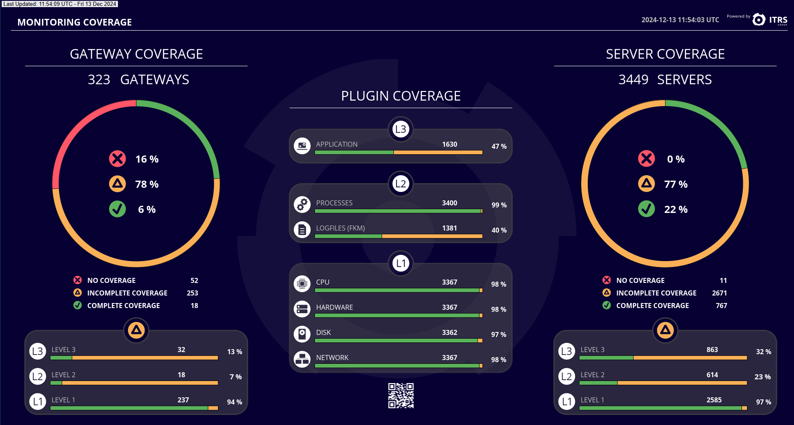
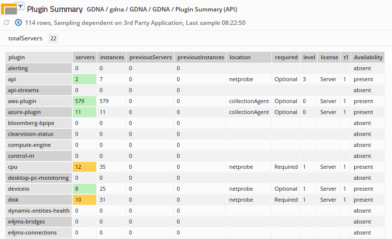

# GDNA - Geneos Dynamic Netprobe Analysis

The GDNA (Geneos Dynamic Netprobe Analysis) tool provides an overview of Geneos monitoring coverage within your I.T. estate. GDNA prompts action to ensure that there are no gaps in the visibility of the health of your applications and systems. It does this through analysing Geneos license usage data to present reports and visual indicators of monitoring coverage levels through two supplied dashboards.

For many users installing GDNA this is as straight forward as creating a `docker-compose.yml` file, adding data sources and starting it up.

We include two out-of-the-box dashboards to show you how effectively Geneos is being used within your I.T. estate as well as detailed data in both the Active Console and via emailed XLSX workbooks.

To dive right in, head to the [Getting Started](#getting-started) section but we suggest taking the time to review the features and functionality first.

## Monitoring Coverage Dashboard

The first dashboard, Monitoring Coverage, gives an overview of all your Geneos Gateways, the servers they are monitoring and the high-level plugin utilization, broken down into 3 coverage levels:



* Level 1 - Core compute infrastructure monitoring; The plugin names can be seen in the left had part of the Plugin Utilization area above. (There are also optional Level 1 plugins, which can be seen in the second dashboard below)

* Level 2 - Basic Application monitoring, the plugin names can be seen in the middle part of the Plugin Utilization area above

* Level 3 - All other technology and application specific plugins.

## Plugin Utilization Dashboard

The second dashboard, known as the "beehive", shows you a more in-depth view of individual plugin utilization:


Each hexagon represents a specific plugin, grouped into logical segments.

## Gateway Dataviews

On the Gateway you can see Dataviews from GDNA, some of which provide the data to drive the dashboards above but there are also more detailed views of monitoring coverage. There are more details of the meaning of the cells in these Dataviews in the [Gateway Dataview Details](#gateway-dataview-details) section further below.

The Dataview look like this:

* Missing Coverage

  These **Missing Coverage** report contain a list of servers (a _server_ includes all Probes across all Gateways, which is identified by the same _host ID_) that have incomplete monitoring coverage

  

* Coverage Per Gateway Summary

  The **Coverage Per Gateway Summary** is an optional report that shows, for each Gateway, a separate Dataview or XLSX worksheet with information about all servers associated with that Gateway.

  

* Coverage Per Gateway Detail

  The **Coverage Per Gateway Detail** optional report, as the name suggests, add more details over and above the _Coverage Per Gateway Summary_ above.

  

* Plugin Summary

  The Plugin Summary report shows usage broken down by plugin type.

  

## Email Reports

GDNA can be configured to send regular reports via email. The email contains a selectable cover-page summary and an XLSX workbook attachment that contains similar report data to the Dataviews above.

💡 To protect against the accidental exposure of potentially sensitive or confidential system identifiers, the default reports in the XLSX workbook scramble server names, host IDs and some other data. This can be changed in the configuration.

To configure email please see the installation specific details below as well as the [Configuration](#configuration) section.

## Getting Started

The easiest way to get GDNA up and running is using _docker compose_. We show you how to use _docker compose_ to get up and running in minutes as well as making future updates easier to deploy. You can also run GDNA as a stand-alone process without _docker_, but that takes a little more effort. Both of these methods are described below.

> 💡 All the commands used to manage Geneos in this guide rely on the [`geneos`](../tools/geneos/) program. If you use other tools to manage your Geneos environment then you will need to adapt the examples below.
>
> The credential storage for sending email uses the `geneos login` command but this is independent of any other Geneos environment set-up.

### General Prerequisites

> [!IMPORTANT]
>
> Before you start there are some prerequisites:

GDNA uses license usage data and this can be from either (or both):

* Report access via `licd` TCP endpoint

  You have to be able to connect to the `licd` port, normally port 7041, from the location that GDNA will be running. You may need to have firewall or network permissions changed.

  > [!IMPORTANT]
  > Your `licd` (after release 5.7.0, which was a while back) must be running with `-report detail` command line options. Check this with:
  >
  >  ```text
  >  $ geneos show licd | grep options
  >  ```
  >
  >  or
  >
  >  ```text
  >  $ geneos command licd
  >  ```
  >
  > If you cannot see the the settings in the options field or in the command output then you can add this to an existing `licd` with:
  >
  >  ```text
  >  $ geneos set licd options+="-report detail"
  >  $ geneos restart licd
  >  ```
  >
  > 💡 Restarting the `licd` process should have no effects on your Geneos installation as Gateways cache license tokens for when the license daemon is not available.

* Access to newer `licd` summary reports

  If you are running GDNA on the same server as the `licd` process or have access to it's working directory via a file share then this option provides more information but requires an updated `licd`. In Geneos releases after 6.7.0 the `licd` process creates summary files in a `reporting/` sub-directory. These are created every 6 hours. When combined with the first option, you can get both additional data and more frequent reporting.

### Using Docker Compose

GDNA has been built and tested using `docker-ce` version 26.1.4 on amd64 architecture Linux using Debian and Ubuntu distributions. We intend to also test using other version of docker as well as `podman`, but these will be confirmed in future releases.

Create a `docker-compose.yml` file using the template below and edit, changing at minimum the `LICDHOST` to the name of the server running the `licd` process, which can be `localhost` for the host machine running the container.

```yaml
name: gdna

services:
  gdna:
    image: docker.itrsgroup.com/gdna:${VERSION:-release}
    ports:
      # This is the default Web Server port. Using this, the two included
      # dashboard will be available at:
      #
      # <https://HOSTNAME:8443/?fullscreen#WebDashboard:Monitoring%20Coverage>
      #
      # <https://HOSTNAME:8443/?fullscreen#WebDashboard:Plugin%20Utilization>
      #
      # To prevent access to the web-dashboard, for example if you only want emailed
      # reports, just comment out this line and recreate the container.
      - "8443:8443"

      # Uncomment this line if you want access to the Gateway in the container.
      #
      # You will want to do this to access more details in the GDNA Gateway's
      # Dataviews and/or to access the Gateway to populate external web dashboard
      # servers.
      #
      # Please note that the Gateway has no authentication configured beyond a
      # read-only account "gdna-dashboard" with the cleartext password of "geneos"
      # in order to allow both the internal and any external Web Dashboard servers
      # to consume report dataviews. All other connections are treated as fully
      # authorized but generic accounts. You will need to change this to prevent
      # unauthorized access.
      # - "8100:8100"

    configs:
      # this creates a `/gdna.yaml` configuration file using the YAML-in-YAML content
      # below.
      - gdna.yaml

    # if you want to send email reports via an SMTP server that requires
    # authentication then you will need to create secrets using `geneos login`
    # before running the container and then uncomment the next three lines, being
    # careful to maintain the correct indentation. They are then referenced as
    # /run/secrets/NAME and used in the `gdna.yaml` configuration below.

    # secrets:
    #   - keyfile.aes
    #   - credentials.json

    volumes:
      # `gdna-data` is the persistent volume for collected data. This should
      # not be changed.
      - gdna-data:/home/geneos/gdna

      # add any other volume mounts to local licd files you want to use,
      # which must be referenced by container paths in the `gdna.yaml`
      # sections below. Be careful not to mount anything into the stardard
      # Best Practise directories, otherwise the embedded `geneos` will get
      # confused and may not start; i.e. DO NOT usr `/home/geneos/licd/`:

      # - "${HOME}/geneos/licd/licds/perm/reporting:/home/geneos/licd-reporting"
      # - "./licdfiles:/home/geneos/licdfiles"

configs:
  # `gdna.yaml` is the configuration file for GDNA. The changes you are
  # likely to make are to the `licd-sources` list of URLs or local files
  # (mounted using the volumes above), `licd-skip-verify` if your license
  # daemon is in secure mode but using self-managed certificates and the
  # `licd-reports` list of file patterns to newer licd report files.
  #
  # If you want to enable email reports then uncomment and update the
  # `email-schedule` line and update the `email` sections. Remember to
  # create suitable credentials, if required, to access to access your
  # SMTP server using `geneos login`.
  #
  # For more complex configurations, including customised reports, you will
  # probably want to maintain this as an external file and replace the
  # entire `content` section with a `file` setting instead, like this:
  #
  # configs:
  #   gdna.yaml:
  #     file: /host/path/to/gdna.yaml
  #
  gdna.yaml:
    content: |
      gdna:
        licd-sources:
          - "https://LICDHOST:7041"  
        licd-skip-verify: true

        # licd-reports:
        #   - "./licd-reporting/summary*"

        # the schedule below sends a report every morning at 2am
        #
        # email-schedule: "0 2 * * *"
      db:
        file: ./gdna/gdna.sqlite
      email:
        subject: "ITRS GDNA Report"
        from: from@example.com
        to: to@example.com
        cc: ""
        bcc: ""
        smtp-server: smtp.example.com

        # don't change these two settings unless you also change the
        # other settings in the secrets section of the docker compose
        # config file
        key-file: /run/secrets/keyfile.aes
        credentials-file: /run/secrets/credentials.json

        # to change the email HTML body text around the reports you can
        # supply a preamble and a postscript either from a file or
        # in-line using these settings:

        # html-preamble: ${file:/path/to/preamble.html}
        # html-postscript: ${file:/path/to/postscript.html}

        # or, in-line: 

        # html-preamble: |
        #   <html>
        #   <head>
        #   ...

        # see the full `gdna.yaml` example file for more details

secrets:
  keyfile.aes:
    file: ${HOME}/.config/geneos/keyfile.aes
  credentials.json:
    file: ${HOME}/.config/geneos/credentials.json

# a persistent volume to save collected data between restarts
volumes:
  gdna-data:
```

Next, remember to login to the ITRS docker registry if you have not already done so:

```bash
docker login docker.itrsgroup.com -u username@example.com
```

If you are going to use the email feature, then you should save encrypted credentials for your email server in your `geneos` credentials file. Do this like this:

```bash
geneos login smtp.example.com -u username@example.com
```

You will be prompted for the password to use and these details are saved in the `credentials.json` file referred to in the `docker-compose.yml` file above. The password is encrypted using AES256 and the key file it uses it created if one doesn't exist. The security is in the key file, and this should be only accessible to the user (permissions 0400).

Then, to pull the latest image and run it in the foreground (which you want to do to test it first time):

```bash
docker compose up
```

It takes a few seconds for the components to start up, and you should be able to access the web dashboards on port 8443. If you have allowed access to the Geneos Gateway on port 8100 then connect your Active Console to see the `GDNA` Managed Entity and data as it is being reported.

💡️ Remember that your Active Console can only connect to a Gateway with the same name once, so if you are already connected to a `Demo Gateway` then this new connection will fail; disconnect from the other `Demo Gateway` connection and try again.

Once you are happy that the container runs as expected you can restart it in the background. Interrupt the foreground container using CTRL+C and once you are ready start it again in the background:

```bash
docker compose up -d
```

The GDNA dashboards should once again be accessible at the URLs below, replace `HOSTNAME` with the name of the server where you have run GDNA:

* <https://HOSTNAME:8443/?fullscreen#WebDashboard:Monitoring%20Coverage>

* <https://HOSTNAME:8443/?fullscreen#WebDashboard:Plugin%20Utilization>

### Installing Without Docker

Docker will not always be available on the server where you want to run GDNA. It's almost as easy to set-up step-by-step, but will require a little more work and some other prerequisites.

#### Prerequisites

* You will need a running Geneos Gateway and available licenses for one `api` and one `process` sampler.

* You will also need somewhere to display the included dashboards; This can directly in your Active Console or, preferably, in a Web Dashboard Server. For a Web Dashboard Server, this should already be connected to your selected Gateway.

* You will either need to add a new Netprobe, as in the instructions below, or if you want to use an existing Netprobe you will have to adjust the configuration to suit, including the TCP connection details and perhaps the Managed Entity and Sampler names. If you want to change the latter two then more complex changes may be required to make the dashboard work - see the section below

#### Unpack and Install

To run GDNA with your existing Geneos components you'll need the following from the `cordial-vN.N.N-tar.gz` release archive:

* `./bin/gdna` - program file

* `./etc/geneos/gdna.yaml` - configuration file

  The `gdna` program uses a configuration file to control behaviour. By default it also creates a number of files in it's working directory, so you should find a suitable location where it can run and create SQLite database files and log files. There are also optional files you can create for ignore and groupings of ...

* `./etc/geneos/gdna/monitoring-coverage-PROD.adb` and `./etc/geneos/gdna/plugin-utilization-PROD.adb` - dashboard files

  These two Dashboard files should be imported into your Geneos visualisation tool, ie. the Active Console and/or Web Dashboard.

* `./etc/geneos/gdna.include.xml` - Gateway include file

  This Gateway Include file contains the baseline configuration for GDNA, to accept reports use the XML-RPC API and the publish these suitable for display in the dashboards above.

All of these files (and more) can be found in the `cordial` release. Download the `cordial-vX.X.X.tar.gz` file and unpack it in a suitable location. The archive has a top-level directory so you can simply do this:

```text
$ tar xf cordial-vN.N.N.tar.gz
...
$ cd cordial-vN.N.N
```

Copy the `gdna` program somewhere suitable in your execution path, for example to your `${HOME}/bin/` directory:

```bash
$ cp bin/gdna ${HOME}/bin/
```
    
#### Configure Geneos

The include file `gdna.include.xml` assumes there is a Netprobe listening securely on the same server as the Gateway on port 8101. You will either need to add a new Netprobe or change the include file after adding it to your Gateway. You will also need to make similar changes to the `gdna.yaml` file in the next steps. To add a new Netprobe, assuming that TLS has been set-up, on your Gateway server run:

```bash
$ geneos add netprobe GDNA --port 8101 --start
```

Copy the `etc/geneos/gdna.include.xml` file into your Gateway's "shared" directory, like this:

```bash
$ geneos import gateway -c shared ./=etc/geneos/gdna/gdna.include.xml 
imported "etc/geneos/gdna/gdna.include.xml" to localhost:/opt/geneos/gateway/gateway_shared/gdna.include.xml
```

> 💡️ Note the use of the leading `./=` in the `./=etc/geneos/gdna/gdna.include.xml` above. This is so that the path or file name is not interpreted as an instance name. Future version of `geneos` may address this issue through more explicit command line syntax.

Open your GSE and add the new include, using the path `../../gateway_shared/gdna.include.xml` and a priority that is different from all other includes (and the main setup file):


Validate and save this config, ensuring that the new include can be found and loaded without clashing with existing configurations.

2. Configure GDNA

The program looks for a `gdna.yaml` configuration file in the following directories, using the first one found:

* `./gdna.yaml`
* `${HOME}/.config/geneos/gdna.yaml`
* `/etc/geneos/gdna.yaml`

Copy the example [`gdna.yaml`](gdna.yaml) file from `./etc/geneos/gdna.yaml` to one of the locations above, probably the second option, into your user configuration directory.

Even without a `gdna.yaml` configuration file, the program will run and produce useful reports, assuming if you have set-up your Geneos environment using the `gdna.include.xml` file. This default behaviour includes:

* Attempts to connect to a `licd` report endpoint on `localhost` port 7041 using both secure and insecure connections
* Creates a `gdna.sqlite` database (including other temp files) in the current working directory
* Creates a `gdna.log` file in the current working directory
* Publishing reports as Dataviews to a local Netprobe, using TLS, on port 8101 to a Managed Entity `GDNA` and an `api` Sampler named `GDNA`

To change the default behaviour edit the `gdna.yaml` file. See the comments in the file for more information.

#### Test

The `gdna` program supports a number of commands. Once everything is configured you will use the `gdna start` command to run the program as a daemon process, regularly collecting and reporting your monitoring coverage.

To test the set-up you can break this down into the stages, by using `geneos fetch` and `geneos report` to make sure that the license data is available and the Geneos Gateway and Netprobe are set-up correctly.

* First, run `geneos fetch` like this:

  ```bash
  $ gdna fetch -l -
  2024-06-12T09:38:53+01:00 INFO: gdna: version v1.15.0 built with go1.22.4
  2024-06-12T09:38:53+01:00 INFO: gdna: final configuration loaded from /home/username/.config/geneos/gdna.yaml
  2024-06-12T09:38:53+01:00 INFO: gdna: opening database using DSN `file:gdna.sqlite`
  2024-06-12T09:38:53+01:00 ERROR: gdna: readLicenseReports for http://localhost:7041 failed error="Get \"http://localhost:7041/licensing/all_licences.csv\": read tcp 127.0.0.1:37886->127.0.0.1:7041: read: connection reset by peer"
  ```

  This will read the `gdna.yaml` configuration file and then try to read the license usage data from the sources you have configured. The `-l -` directs logs to the console so that you can see what is happening. In the example above the error is not really an error, but rather the failure to connect to the `licd` process insecurely. Remember that in the default configuration `gdna` tries to collect license usage data from a local `licd` process using both secure and insecure connections - one will always fail. You should update the `gdna.yaml` file to only connect to those sources of data that you expect to exist.

  Any other issues will need to be checked and corrected before proceeding.

* Next, run `geneos report` to process the collected data from the previous test and to publish it to the Netprobe:

  ```bash
  $ gdna report -l -
  $ releases/gdna report -l -
  2024-06-12T09:48:50+01:00 INFO: gdna: version v1.15.0 built with go1.22.4
  2024-06-12T09:48:50+01:00 INFO: gdna: final configuration loaded from /home/username/.config/geneos/gdna.yaml
  2024-06-12T09:48:50+01:00 INFO: gdna: opening database using DSN `file:gdna.sqlite`
  ```

  You should now be able to see new Dataviews in the `GDNA` Managed Entity. If you see any errors, such as no Managed Entity or Sampler found, you will need to address those before proceeding.

* If you are also setting up email, you can now test it like this:

  ```bash
  $ gdna email -l -
  2024-06-12T13:03:46+01:00 INFO: gdna: version v1.15.0 built with go1.22.4
  2024-06-12T13:03:46+01:00 INFO: gdna: final configuration loaded from /home/username/.config/geneos/gdna.yaml
  2024-06-12T13:03:46+01:00 INFO: gdna: opening database using DSN `file:gdna.sqlite`
  2024-06-12T13:03:46+01:00 INFO: gdna: running email report
  2024-06-12T13:03:53+01:00 INFO: gdna: email report complete
  ```

  Once again, if you see any errors you need to address them before continuing.

#### Run `gdna`

If all of the above steps work, you are ready to go!

You can now run `gdna` in the background, collecting data and reporting according to the schedule y9ou have chose - we recommend the default 15 minutes - and seeding email reports as desired:

```bash
cd .../suitable/working/directory
gdna start --daemon
```

This will run the process in the background, detached from your console session. Logs will be written to the file you have configured and the SQLite database will be written to the file(s) in the directory you have selected.

To ensure GDNA runs when the system is restarted, you can create a `systemd` unit file or add a `cron` entry like this:

```cron
@reboot (cd /path/to/gdna/working/directory; gdna start --daemon)
```

> 💡In both of the above examples you can omit the `cd` if you have used absolute paths in your configuration file for the log and data files.

## Configuration

### `gdna.yaml`

To make changes to how the `gdna` program runs, where is collects data from and where it reports to, you should review the extensively commented [`gdna.yaml`](gdna.yaml) file provided with the distribution (if you are reading this on GitHub then the file name just there is a link to the file).

To make changes when using docker compose you should edit the `docker-compose.yml` file you first created, and then run:

```bash
$ docker compose up -d --force-recreate
```

This will restart the container with the new configuration in the background.

### Dashboards

The two dashboards included with GDNA are large agnostic to the source of data as long as the Dataview names are the same as those produced by default `gdna` reports. The only exception is that there is a Managed Entity Attribute (`DASHBOARD`) in use to allow the filtering of data based on the chosen environment. By default the value is `PROD` but if you want to run multiple instances of GDNA, for example one in a development environment and another in your production one, then you can copy and update the dashboards to match the new configuration.

* Load the dashboard files into your Active Console using the `File` -> `Import` menu option.

    > 💡 Your Active Console should be relatively recent as the `.adb` file format can change with new releases and older AC2 release may not work correctly. You will normally see a message when importing the file in this case.

* Open the `Tools` -> `Refactor Paths` window:


* In the new window select the top level `Advanced Mode` radio button and click on the plus `(+)` icon and finally double click on the `Undefined URL` row that appears.


* A new Path Editor window will open;

    * Drag the slightly off-screen `Managed Entity` item into the main area
    * Select the `Managed Entity` box, click on `Edit` and if you are connected to a Gateway that has the `DASHBOARD` attribute already defined then it will appear in the list of properties, otherwise use the `ADD PROPERTY` button to add one. Set the value to `PROD` and close the properties editor.
    * Then drag a `Replace` item to the right of the `Managed Entity`
    * Finally another `Managed Entity` into the `Replace` box
    * Now select the second `Managed Entity` inside the `Replace` box and click `Edit` to open the properties editor. Again, use the `ADD PROPERTY` button to add a `DASHBOARD` attribute if it does not exist.

    If that was too much, watch the animation below (unless you are reading this as a static PDF in which case please try to view the live document in the `cordial` GitHub repo):

    

    * Close the Path Editor

* The Refactor Paths window will now show a large list of matching paths. Click on `REFACTOR` and wait. This is not a fast operation and cannot be cancelled.

* After about a minute, depending on the performance of your system, you should see a results window like this:


* Now close the results and refactor windows and your dashboard should change to reflect the data from the newly filtered data.

* You should now `Export` each of your updated dashboards so that you can import them into a Web Server or another user's Active Console. Do this by right-clicking on a blank area of each dashboard and selecting `Export...`. Follow the Save dialogue, picking a suitable new name for the dashboard. It will be saved with an `.adb` extension automatically.


## Gateway Dataview Details

In addition to the dashboards you can also drill down into the reports themselves through the Dataviews published to the Geneos Gateway. While many of the Dataviews exist to drive the dashboards above there are also more detailed views of your monitoring coverage to help you fill in any gaps you may have.

Here are the current built-in reports courtesy of the `gdna list` command:

| Report Name                  | Title                        | Type     | Dataview | XLSX |
| ---------------------------- | ---------------------------- | -------- | -------- | ---- |
| coverage-by-level-and-plugin | Coverage By Level And Plugin |          | Y        | N    |
| coverage-per-gateway-detail  | "GATEWAY" Detail             | split    | N        | N    |
| coverage-per-gateway-summary | "GATEWAY" Summary            | split    | N        | N    |
| coverage-summary             | Coverage Summary             |          | Y        | Y    |
| gateway-coverage             | Gateway Coverage             |          | Y        | N    |
| gateways-coverage-by-group   | Gateway Coverage By Group    |          | Y        | Y    |
| gdna-summary                 | GDNA Summary                 | summary  | Y        | Y    |
| missing-coverage             | Missing Coverage             |          | Y        | Y    |
| plugin-coverage              | Plugin Coverage              |          | Y        | N    |
| plugin-groups                | Plugin Groups                |          | Y        | N    |
| plugin-summary               | Plugin Summary               |          | Y        | Y    |
| plugins-per-gateway          | Plugins Per Gateway          | indirect | Y        | Y    |
| server-coverage              | Server Coverage              |          | Y        | N    |
| sources                      | Sources                      |          | Y        | Y    |

Each of the reports above will have it's own documentation outside this guide, but to highlight those reports that are the ones most likely to be useful in working through any coverage gaps; These will be `missing-coverage`, `plugin-summary` plus one of the two optional per-Gateway reports `coverage-per-gateway-summary` or `coverage-per-gateway-detail`.

* Missing Coverage

  These **Missing Coverage** report contain a list of servers (including all Probes across all Gateways) that have incomplete monitoring coverage:

  

  💡 Note that in the screenshot above all the names of servers, Geneos Gateways and hostIDs have been scrambled. This is normally off by default for Dataviews but we've turned it on here for demonstration purposes. It's enabled by default for reports sent via email or saved as XLSX workbooks in order to prevent the accidental disclosure of potentially sensitive information. This can be controlled through various settings which are details further below.

  What you can see above includes:

  | Headlines                                            | Description                                                                             |
  | ---------------------------------------------------- | --------------------------------------------------------------------------------------- |
  | `complete`                                           | Servers are considered covered to levels 1, 2 and 3                                     |
  | `empty`                                              | Servers have no samplers configured<br>(this does not include Collection Agent plugins) |
  | `incomplete`                                         | Servers have partial coverage in to at least one level                                  |
  | `l1incomplete`,<br>`l2incomplete`,<br>`l3incomplete` | Servers have incomplete level 1,2 or 3 coverage, respectively                           |
  | `servers`                                            | Total Servers (`complete` + `incomplete`)                                               |

  * Columns

  | Columns     | Description                                                                                                                                                                                                                                                                                                                                                                                                                                                                                                                                                                                                                                          |
  | ----------- | ---------------------------------------------------------------------------------------------------------------------------------------------------------------------------------------------------------------------------------------------------------------------------------------------------------------------------------------------------------------------------------------------------------------------------------------------------------------------------------------------------------------------------------------------------------------------------------------------------------------------------------------------------- |
  | `serverID`  | The server name plus the hostID separated by a `:`. This is required to maintain unique column names.                                                                                                                                                                                                                                                                                                                                                                                                                                                                                                                                                |
  | `server`    | The server name, which may be different from the hostname used in the Probe settings in the Geneos Gateway.<br><br>💡 The server name is heuristically derived from the longest common name for all probes across all Gateways that share the same host ID.                                                                                                                                                                                                                                                                                                                                                                                         |
  | `probes`    | The number of probes found on this server across all Gateways.                                                                                                                                                                                                                                                                                                                                                                                                                                                                                                                                                                                       |
  | `samplers`  | The total number of sampler licenses issued to this server over all Probes.<br><br>This is not the same as the number of individual samplers as it is based on the total number of separate license tokens issued for plugin instances, where some plugins are licensed _per-server_ and others _per-instance_<br><br>When this is zero, which is shown as a Critical above, it means that a _server_ license is being used to monitor a server with no samplers.<br><br>💡 It is important to note that these servers may be configured with Collection Agent only plugins, but these cannot be linked to specific servers or Probes at this time. |
  | `l1missing` | This column shows any missing level 1 plugins. When it is empty then all level 1 plugins have been deployed at least once on this server<br><br>ℹ️ Level 1 plugins consist of `cpu`, `disk`, `hardware` and `network`                                                                                                                                                                                                                                                                                                                                                                                                                               |
  | `l2missing` | This column shows any missing level 2 plugins. When it is empty then all level 2 plugins have been deployed at least once on this server<br><br>ℹ️ Level 2 plugins consist of `fkm` and `processes`                                                                                                                                                                                                                                                                                                                                                                                                                                                 |
  | `l3missing` | This column shows the literal `yes` when no level 3 plugins are found on this server.<br><br>ℹ️ Level 3 plugins are all those that are not in the lists for levels 1 & 2 above or inb the list of _optional_ level 1 plugins.                                                                                                                                                                                                                                                                                                                                                                                                                       |
  | `gateway`   | A comma-separated list of all the Gateways that are attached to a Probe on this server.                                                                                                                                                                                                                                                                                                                                                                                                                                                                                                                                                                               |
* Coverage Per Gateway Summary

  The **Coverage Per Gateway Summary** is an optional report that shows, for each Gateway, a separate Dataview or XLSX worksheet with information about all servers associated with that Gateway.

  

  > 💡 To enable this report set one or both of the following "enable" options in the `gdna.yaml` file you have used:
  >
  > ```yaml
  > reports:
  >   coverage-per-gateway-summary:
  >     enable-for-dataview: true
  >     enable-for-xlsx: true
  > ```
  >
  > If you do not have the hierarchy shown, add it in full as above, with `reports:` starting at the first column, i.e. the top-level.

  In addition to the Missing Coverage Dataview details, the summary Dataview also contains:

  | Headlines         | Description                                                                                                                                                                                                                                                                                                                                    |
  | ----------------- | ---------------------------------------------------------------------------------------------------------------------------------------------------------------------------------------------------------------------------------------------------------------------------------------------------------------------------------------------- |
  | `dynamicEntities` | The number of Dynamic Entities associated with this Gateway. When this is non-zero then the severity highlights for both the `empty` servers Headline and servers with zero in the `samplers` column changes as there is a good chance that there Dynamic Entities are colocated with at least one of these otherwise unused servers or Probes |
  | `relatedProbes`   | The number of Probes not shown that are attached to other Gateways, as so visible in other Dataviews                                                                                                                                                                                                                                           |

  | Columns         | Description                                                                                                                                                                                                                                                                                                          |
  | --------------- | -------------------------------------------------------------------------------------------------------------------------------------------------------------------------------------------------------------------------------------------------------------------------------------------------------------------- |
  | `otherGateways` | A list of other Gateways that this server has Probes attached to.<br>💡 It is worth noting that the Gateway names in this Dataview are not scrambled even when that feature is enabled. This is because the Dataview itself is specific to a Gateway and is relatively useless without the gateway name(s) visible. |
  | `plugins`       | A list of all the plugin types on this server. This includes plugins that are attached via other Gateways, listed in the `otherGateways` column above.                                                                                                                                                               |

* Coverage Per Gateway Detail

  The **Coverage Per Gateway Detail** optional report, as the name suggests, add more details over and above the _Coverage Per Gateway Summary_ above.

  

  > 💡 To enable this report set one or both of the following "enable" options in the `gdna.yaml` file you have used:
  >
  > ```yaml
  > reports:
  >   coverage-per-gateway-detail:
  >     enable-for-dataview: true
  >     enable-for-xlsx: true
  > ```
  >
  > If you do not have the hierarchy shown, add it in full as above, with `reports:` starting at the first column, i.e. the top-level.

  For each server row the report also shows an additional, indented, row per Probe on that server including those associated with other Gateways. As an Geneos administrator you can use this level of detail to make judgements about where and how to fill in any monitoring coverage gaps.

  The headlines and columns have very similar meaning as for the Summary report above, with the following changes:

  | Columns                                     | Description                                                                                                                                                                                                                                   |
  | ------------------------------------------- | --------------------------------------------------------------------------------------------------------------------------------------------------------------------------------------------------------------------------------------------- |
  | `otherGateways`                             | This column is only populated on _Probe_ rows to show which other Gateways each Probe may be associated with. It is empty for _server_ rows as well as Probe rows where the Probe is associated with the Gateway that the view is for.        |
  | `l1missing`,<br>`l2missing`,<br>`l3missing` | These columns are only populated for _server_ rows as coverage is measured on a per-server basis.                                                                                                                                             |
  | `probeName`                                 | The name of the probe as per the _Hostname_ field in the Gateway configuration.<br>This may be different to the server name, which is derived from all the Probes found on that server                                                        |
  | `probePort`                                 | The TCP port that the Probe is listening on.<br>This value is not scrambled as the small number of logically available TCP ports (65534 at most) cannot be protected beyond even the simplest dictionary search for the scrambled equivalent. |

