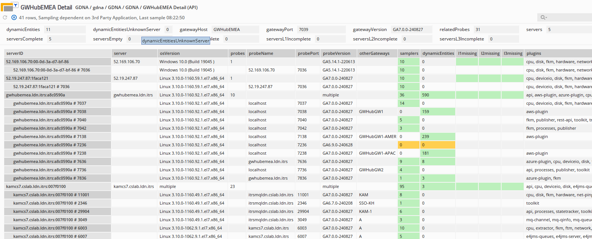

# GDNA Reports

> [!IMPORTANT]
>
> This document is a work in progress. It is incomplete in some details as we wanted to get the release out, and the online version of this document will be updated leading up to the next release. If you cannot find specific details you need, please contact us.

## Report Details

In addition to the dashboards you can also drill down into the reports themselves through the Dataviews published by the GDNA connected Gateway. While many of the Dataviews are primarilt there to drive the dashboards there are also more detailed views of your monitoring coverage to help you remediate any gaps in coverage.

Below is the list of reports from the `gdna list reports` command (with minor changes for clarity).

> [!NOTE]
> The `Report Name` column is the internal name of the report and can be used with the `gdna report` command. If you are reading this documentation online then you can also click through most of the report names to go to a section giving more details of that report. This also appears as a headline called `reportName` on all Dataviews and in XLSX sheets.
>
> The `Group` is the display group in the Metrics views in the Active Console.
>
> The `Title` is the display label of the report.
>
> The `Type`, when not blank, indicates that a report is not a simple table.
>
> The `Dataview` and `XLSX` columns show if they are included in those outputs, and this can be changed in the configuration file.

| Report Name                           | Group               | Title                           | Type     | Dataview | XLSX |
| ------------------------------------- | ------------------- | ------------------------------- | -------- | -------- | ---- |
| filters                               | GDNA Information    | Filters                         |          | Y        | N    |
| gdna-summary                          | GDNA Information    | GDNA Summary                    | summary  | Y        | Y    |
| coverage-per-gateway-detail           | Gateways            | "Gateway" Detail                | split    | N        | Y    |
| coverage-per-gateway-overview         | Gateways            | "Gateway" Overview              | split    | Y        | Y    |
| gateway-versions                      | Geneos Estate       | Gateway Versions                |          | Y        | Y    |
| gateways                              | Geneos Estate       | Gateways                        |          | Y        | Y    |
| os-versions                           | Geneos Estate       | Operating System Versions       |          | Y        | Y    |
| plugins                               | Geneos Estate       | Plugins                         |          | Y        | Y    |
| probe-versions                        | Geneos Estate       | Probe Versions                  |          | Y        | Y    |
| servers                               | Geneos Estate       | Servers                         |          | Y        | Y    |
| gateway-groups                        | Groups              | Gateway Groups                  |          | Y        | Y    |
| plugin-groups                         | Groups              | Plugin Groups                   |          | Y        | N    |
| server-groups                         | Groups              | Server Groups                   |          | Y        | Y    |
| instance-licences-per-gateway         | Licensing           | Instance Licences Per Gateway   | indirect | Y        | Y    |
| licence-allocations                   | Licensing           | Licence Allocations             |          | Y        | N    |
| licence-sources                       | Licensing           | Licence Sources                 |          | Y        | Y    |
| multiple-os-versions-per-hostid       | Licensing           | Multiple OS Versions Per HostID |          | Y        | Y    |
| plugin-licences-per-gateway           | Licensing           | Plugin Licences Per Gateway     | indirect | N        | N    |
| servers-with-multiple-licence-sources | Licensing           | Servers Using Multiple Licenses |          | Y        | Y    |
| coverage-by-level-and-plugin          | Monitoring Coverage | Coverage By Level And Plugin    |          | Y        | N    |
| coverage-summary                      | Monitoring Coverage | Coverage Summary                |          | Y        | Y    |
| gateway-coverage                      | Monitoring Coverage | Gateway Coverage                |          | Y        | N    |
| missing-coverage                      | Monitoring Coverage | Missing Coverage                |          | Y        | Y    |
| plugin-coverage                       | Monitoring Coverage | Plugin Coverage                 |          | Y        | N    |
| server-coverage                       | Monitoring Coverage | Server Coverage                 |          | Y        | N    |
| unused-gateways                       | Monitoring Coverage | Unused Gateways                 |          | Y        | Y    |

> [!NOTE]
> Reports are not grouped in the XLSX report output, only as Dataviews in the Active Console

### Dataview Group: GDNA Information

The **GDNA Information** Dataview group contains data about the GDNA system and it's configuration.

| Report Name  | Group            | Title        | Type    | Dataview | XLSX |
| ------------ | ---------------- | ------------ | ------- | -------- | ---- |
| filters      | GDNA Information | Filters      |         | Y        | N    |
| gdna-summary | GDNA Information | GDNA Summary | summary | Y        | Y    |

#### Dataview: Filters

The `filters` report shows the current set of include/exclude/grouping filters and also allows changes in the Active Console through right-click commands.

#### Dataview: GDNA Summary

The `gdna-summary` report shows a high level overview of GDNA and the most recent set of data.

### Dataview Group: Gateways

| Report Name                   | Group    | Title              | Type  | Dataview | XLSX |
| ----------------------------- | -------- | ------------------ | ----- | -------- | ---- |
| coverage-per-gateway-detail   | Gateways | "Gateway" Detail   | split | N        | Y    |
| coverage-per-gateway-overview | Gateways | "Gateway" Overview | split | Y        | Y    |

#### Dataviews: Coverage Per Gateway Overview

The `coverage-per-gateway-overview` report is a report that shows, for each Gateway, a separate Dataview or XLSX worksheet with information about all servers associated with that Gateway. Servers may also be connected to other Gateways through other Netprobe instances and this is shown in the `otherGateways` column.


> [!TIP]
> To enable this report set one or both of the following "enable" options in the `gdna.yaml` file you have used:
>
> ```yaml
> reports:
>   coverage-per-gateway-summary:
>     dataview:
>       enable: true
>     xlsx:
>       enable: true
> ```
>
> ℹ️ If you do not have the YAML `reports:` hierarchy, add it in full, as above, with `reports:` starting in the first column.

| Headlines                                                                 | Description                                                                                                                                                                                                                                                                                                                                     |
| ------------------------------------------------------------------------- | ----------------------------------------------------------------------------------------------------------------------------------------------------------------------------------------------------------------------------------------------------------------------------------------------------------------------------------------------- |
| `dynamicEntities`                                                         | The number of Dynamic Entities associated with this Gateway. When this is non-zero then the severity highlights for both the `empty` servers Headline and servers with zero in the `samplers` column changes as there is a good chance that there Dynamic Entities are co-located with at least one of these otherwise unused servers or Probes |
| `dynamicEntitiesUnknownServer`                                            | The number of Dynamic Entities associated with this Gateway but that cannot be assigned to a specific server.<br><br>ℹ️ If this headline is non-zero this is most likely because the Gateway is older than version 7.0.0 which is required to match Dynamic Entities to specific probes and hence servers                                      |
| `gatewayHost`                                                             | The hostname that the Gateway is running on. This information is from the Gateway itself and so may not exactly match a host or FQDN in the environment.<br><br>ℹ️ This headline is only populated on Gateways running version 7.0.0 or later                                                                                                  |
| `gatewayName`                                                             | The name of the Gateway. While the Dataview itself contains the Gateway name, this headline is intended to make automation like Rules simpler                                                                                                                                                                                                   |
| `gatewayPort`                                                             | The primary port that the Gateway is listening on. If the Gateway listens on both secure and insecure ports then only the secure port will be listed.<br><br>ℹ️ This headline is only populated on Gateways running version 7.0.0 or later                                                                                                     |
| `gatewayVersion`                                                          | The Gateway release version.<br><br>ℹ️ This headline is only populated on Gateways running version 7.0.0 or later                                                                                                                                                                                                                              |
| `licenceSource`                                                           |                                                                                                                                                                                                                                                                                                                                                 |
| `relatedProbes`                                                           | The number of Probes not shown that are attached to other Gateways, and so visible in other Dataviews                                                                                                                                                                                                                                           |
| `servers`                                                                 | Total Servers (`complete` + `incomplete`)                                                                                                                                                                                                                                                                                                       |
| `serversComplete`                                                         | Count of servers are have coverage for all three levels.<br><br>When this value matches the number of `servers` then the severity is set to OK/green to highlight all servers on this Gateway are considered fully covered                                                                                                                      |
| `serversEmpty`                                                            | Count of servers have no samplers configured<br>ℹ️ This may not include dynamic entities, depending on the version of Geneos `licd` and Gateways installed                                                                                                                                                                                     |
| `serversIncomplete`                                                       | Count of servers have partial coverage in at least one of the three level                                                                                                                                                                                                                                                                       |
| `serversL1incomplete`,<br>`serversL2incomplete`,<br>`serversL3incomplete` | Count of servers have incomplete level 1,2 or 3 coverage, respectively                                                                                                                                                                                                                                                                          |

---

| Columns           | Description                                                                                                                                                                                                                                                                                                                                                                                       |
| ----------------- | ------------------------------------------------------------------------------------------------------------------------------------------------------------------------------------------------------------------------------------------------------------------------------------------------------------------------------------------------------------------------------------------------- |
| `serverID`        | The _server name_ plus the _host ID_ separated by a `:`. This is required to maintain the unique row names required by Geneos Dataviews.                                                                                                                                                                                                                                                          |
| `server`          | The _server name_, which may be different from the _hostname_ used in the Probe settings in the Geneos Gateway.<br><br>💡 The server name is heuristically derived from the longest alphanumeric name for all probes across all Gateways that share the same host ID. It can be an IP address where a name is not found.                                                                         |
| `osVersion`       | The Operating Systems version reported by the Netprobes on the server.<br>ℹ️ This information is only available if the `licd` version is at least 7.0.0 files.                                                                                                                                                                                                                                   |
| `probes`          | The number of probes found on this server across all Gateways.                                                                                                                                                                                                                                                                                                                                    |
| `probeVersion`    | The Netprobe release version on this server. When multiple Netprobes are installed with different versions then the work `multiple` is shown. Use the `coverage-per-gateway-detail` report instead of this overview report if knowing the individual Netprobe versions is important.<br><br>ℹ️ This information is only available if the `licd` version is at least 7.0.0                        |
| `licenceSources`  | The number of License Daemons on which GDNA finds the Host ID that identifies this server. Normally this should be 1, but in the case that multiple Gateways are monitoring this server and these Gateways are connected to different License Daemons this could indicate the over use of server licence tokens. The report multiple... will show all servers that use more than 1 license daemon |
| `samplers`        | The total number of sampler instances on this server over all Netprobes and Gateways                                                                                                                                                                                                                                                                                                              |
| `dynamicEntities` | The count of dynamic entities on this server, across all Netprobes and Gateways.<br>ℹ️ This information is only available if the `licd` **and** Gateway version is at least 7.0.0                                                                                                                                                                                                                |
| `l1missing`       | This column shows any missing level 1 plugins. When it is empty then all level 1 plugins have been deployed at least once on this server<br><br>ℹ️ By default, Level 1 plugins consist of `cpu`, `disk`, `hardware` and `network`. If changed and multiple instances of a plugin are required (and missing) to meet the coverage policy then this is indicated in parenthesis, e.g. `disk(2)`    |
| `l2missing`       | This column shows any missing level 2 plugins. When it is empty then all level 2 plugins have been deployed at least once on this server<br><br>ℹ️ By default, Level 2 plugins consist of `fkm` and `processes`. As above, if the list is changed and multiple instances of a plugin are missing then this is shown in parenthesis.                                                              |
| `l3missing`       | This column shows `missing` when no level 3 plugins are found on this server.<br><br>ℹ️ Level 3 plugins are all those that are not in the lists for levels 1 & 2 above or in the list of _optional_ level 1 plugins.                                                                                                                                                                             |
| `otherGateways`   | A list of other Gateways that this server has Probes attached to.<br>ℹ️ Gateway names in this Dataview are not scrambled even when that feature is enabled. This is because the Dataview itself is specific to a Gateway and has little meaning without the gateway name(s) visible.                                                                                                             |
| `plugins`         | A list of all the plugin types on this server. This includes plugins that are attached via other Gateways, listed in the `otherGateways` column above. Where there are multiple instances of a plugin, this is shown in parenthesis, e.g. `fkm(12)`                                                                                                                                               |

#### Dataviews: Coverage Per Gateway Detail

The `coverage-per-gateway-detail` report, as the name suggests, add more details over and above the [Overviews](#dataviews-coverage-per-gateway-overview) above.



>[!TIP]
> To enable this report set one or both of the following "enable" options in the `gdna.yaml` file:
>
> ```yaml
> reports:
>   coverage-per-gateway-detail:
>     dataview:
>       enable: true
>     xlsx:
>       enable: true
> ```
>
> ℹ️ If you do not have the YAML `reports:` hierarchy, add it in full, as above, with `reports:` starting in the first column.

For each server the report also shows an additional row per Probe found on that server, including those associated with other Gateways. As an Geneos administrator you can use this level of detail to make judgements about where and how to fill in any monitoring coverage gaps.

The headlines and columns have very similar meaning as for the Overview report above, with the following differences:

| Columns                                     | Description                                                                                                                                                                                                                                   |
| ------------------------------------------- | --------------------------------------------------------------------------------------------------------------------------------------------------------------------------------------------------------------------------------------------- |
| `probeName`                                 | New column: The name of the probe as per the _Hostname_ field in the Gateway configuration.<br><br>This may be different to the server name, which is derived from all the Probes found on that server                                                        |
| `probePort`                                 | New column: The TCP port that the Probe is listening on.<br><br>This value is not scrambled as the small number of logically available TCP ports (65534 at most) cannot be protected beyond even the simplest dictionary search for the scrambled equivalent. |
| `otherGateways`                             | Changed column: This column is only populated on _probe_ rows to show which other Gateways each Probe may be associated with. It is empty for _server_ rows as well as Probe rows where the Probe is associated with the Gateway that the view is for.        |
| `l1missing`,<br>`l2missing`,<br>`l3missing` | Changed columns: These columns are only populated for _server_ rows as coverage is measured on a per-server basis.                                                                                                                                             |

### Dataview Group: Groups

| Report Name    | Group  | Title          | Type | Dataview | XLSX |
| -------------- | ------ | -------------- | ---- | -------- | ---- |
| gateway-groups | Groups | Gateway Groups |      | Y        | Y    |
| plugin-groups  | Groups | Plugin Groups  |      | Y        | N    |
| server-groups  | Groups | Server Groups  |      | Y        | Y    |

#### Dataviews: Gateway Groups

#### Dataviews: Plugin Groups

#### Dataviews: Server Groups

### Dataview Group: Geneos Estate

The **Geneos Estate** group shows reports with details of the Geneos components.

| Report Name      | Group         | Title                     | Type | Dataview | XLSX |
| ---------------- | ------------- | ------------------------- | ---- | -------- | ---- |
| gateway-versions | Geneos Estate | Gateway Versions          |      | Y        | Y    |
| gateways         | Geneos Estate | Gateways                  |      | Y        | Y    |
| os-versions      | Geneos Estate | Operating System Versions |      | Y        | Y    |
| plugins          | Geneos Estate | Plugins                   |      | Y        | Y    |
| probe-versions   | Geneos Estate | Probe Versions            |      | Y        | Y    |
| servers          | Geneos Estate | Servers                   |      | Y        | Y    |

#### Dataview: Gateway Versions

The `gateway-versions` report lists all the known Gateway versions with a count of each one plus an `Unknown` value for those where version information is not available.


> [!NOTE]
> This data is only available if the `licd` **and** Gateway have been upgraded to Geneos 7.0.0 or later

| Columns          | Description                                           |
| ---------------- | ----------------------------------------------------- |
| `gatewayVersion` | The release version of the Gateway                    |
| `count`          | The total number of Gateways for this release version |

#### Dataview: Gateways

The `gateway` report shows information about all your active Gateways.


| Columns                                                                   | Description                                                                                                                                                                                                                                                                                                                                              |
| ------------------------------------------------------------------------- | -------------------------------------------------------------------------------------------------------------------------------------------------------------------------------------------------------------------------------------------------------------------------------------------------------------------------------------------------------- |
| `gateway`                                                                 | The name of the Gateway                                                                                                                                                                                                                                                                                                                                  |
| `gatewayHost`                                                             | The hostname that the Gateway is currently running on, as reported by the Gateway itself. This may not be the same as your expected host name format, depending on the server configuration.<br>ℹ️ This data is only available when both `licd` and the Gateway are running Geneos 7 or later                                                           |
| `gatewayPort`                                                             | The primary port the Gateway is listening on. Where a Gateway is listening on both secure (TLS) and insecure ports, the secure port is reported.<br>ℹ️ This data is only available when both `licd` and the Gateway are running Geneos 7 or later                                                                                                       |
| `gatewayVersion`                                                          | The Gateway release.<br>ℹ️ This data is only available when both `licd` and the Gateway are running Geneos 7 or later                                                                                                                                                                                                                                   |
| `servers`                                                                 | The number of servers associated with this Gateway. The total number of servers is not the same as the sum of the values in this column as it is likely that one server is associated with multiple Gateways                                                                                                                                             |
| `probes`                                                                  | The number of Netprobes attached to this Gateway                                                                                                                                                                                                                                                                                                         |
| `samplers`                                                                | The number of samplers across all probes on this Gateway                                                                                                                                                                                                                                                                                                 |
| `dynamicEntities`                                                         | The number of Collection Agent dynamic entities on this Gateway. Note that this value is always available on a per-Gateway basis, while the same column may be empty in other reports for specific servers and probes, as those requires Geneos 7 and later                                                                                              |
| `dynamicEntitiesUnknownServer`                                            | The number of Collection Agent dynamic entities on this Gateway that do not have server information associated with them.                                                                                                                                                                                                                                |
| `serversComplete`                                                         | The number of servers on this Gateway that are considered to have complete monitoring coverage, which may be spread over multiple Netprobes connected to multiple Gateways                                                                                                                                                                               |
| `serversIncomplete`                                                       | The number of servers on this Gateway with incomplete monitoring coverage                                                                                                                                                                                                                                                                                |
| `serversEmpty`                                                            | The number of servers on this Gateway that have no associated samplers across all the Netprobes over multiple Gateways. Unless these servers have associated dynamic entities then they may be wasting a server license                                                                                                                                  |
| `sources`                                                                 | The `licd` source of the data for this Gateway                                                                                                                                                                                                                                                                                                           |
| `serversL1incomplete`,<br>`serversL2incomplete`,<br>`serversL3incomplete` | Count of servers have incomplete level 1,2 or 3 coverage, respectively                                                                                                                                                                                                                                                                                   |
| `licenceSource`                                                           | The name of the license daemon(s) that this Gateway was found on. This is normally a single license source but where a common Gateway Name - such as one that is on both production and test environments - is found in two license daemon data reports, then this is shown here as a comma separated list. The format of the name is the same as for the `license-sources` report |

#### Dataview: Operating System Versions

The `os-versions` report lists all the known OS versions with a count of each one plus an `Unknown` value for those where version information is not available.

> [!NOTE]
> This data is only available if the `licd` connected to is either Geneos release 7 or later, or if you are processing `licd` reporting files directly.

| Columns     | Description                                                                                                                                                                             |
| ----------- | --------------------------------------------------------------------------------------------------------------------------------------------------------------------------------------- |
| `osVersion` | The OS version as seen on each server. Where no data is available the value `Unknown` is used<br><br>ℹ️ OS Version information is only available when `licd` is version 7.0.0 or later |
| `count`     | The total number of this servers (not Netprobes) found with this OS version                                                                                                             |

#### Dataview: Plugins

The `plugins` report shows usage broken down by plugin type.


| Headlines      | Description                                                                                 |
| -------------- | ------------------------------------------------------------------------------------------- |
| `totalServers` | The number of servers, which also includes any servers with no associated plugin instances. |

---

| Columns             | Description                                                                                     |
| ------------------- | ----------------------------------------------------------------------------------------------- |
| `plugin`            | Plugin name.                                                                                    |
| `servers`           | Servers using this plugin.                                                                      |
| `instances`         | Instances of this plugin.                                                                       |
| `tokensAvailable`   |                                                                                                 |
| `tokensUsed`        |                                                                                                 |
| `tokensUsedPct`     |                                                                                                 |
| `previousServers`   | Servers that this plugin was in use on in the past.                                             |
| `previousInstances` | Instances of this plugin in use in the past.                                                    |
| `location`          | Where this plugin is deployed, one of `netprobe`, `collectionAgent` or `gateway`                |
| `required`          | Is this a required level 1 or 2 plugin?                                                         |
| `level`             | Which coverage level this plugin supports                                                       |
| `license`           | Plugin license type, one of `server` or `instance`                                              |
| `t1`                | For use with dashboards to drive a transparency modifier. Do not change.                        |

#### Dataview: Probe Versions

The `probe-versions` report lists all the known Netprobe versions with a count of each one plus an `Unknown` value for those where version information is not available.

> [!NOTE]
> This data is only available if the `licd` connected to is either Geneos release 7 or later, or if you are processing `licd` reporting files directly.

| Columns        | Description                                                                                                                                                                                 |
| -------------- | ------------------------------------------------------------------------------------------------------------------------------------------------------------------------------------------- |
| `probeVersion` | The release version of the Netprobe. Where no data is available the value `Unknown` is used<br><br>ℹ️ Netprobe version information is only available when `licd` is version 7.0.0 or later |
| `count`        | The total number of Netprobes for each release version                                                                                                                                      |

#### Dataview: Servers

This optional report is included in email XLSX reports but not as a Dataview as the number of servers in a mid to large estate may regularly exceed the normal row limit of 500.


> [!TIP]
> As for all other reports, it can be controlled through the `gdna.yaml` file, like this:
>
> ```yaml
> reports:
>   servers:
>     dataview:
>       enable: true
> ```
>
> ℹ️ If you do not have the YAML `reports:` hierarchy, add it in full, as above, with `reports:` starting in the first column.

| Columns           | Description                                                                                                                                                                                                                                                                                                                                                                                                                              |
| ----------------- | ---------------------------------------------------------------------------------------------------------------------------------------------------------------------------------------------------------------------------------------------------------------------------------------------------------------------------------------------------------------------------------------------------------------------------------------- |
| `serverID`        | The row name is a combination of the derived server name (see below) and the host ID                                                                                                                                                                                                                                                                                                                                                     |
| `server`          | The server name as derived from all the probe names associated with the same host ID. The probe name is what is configured in the Gateway configuration and is the label reported to the `licd` process. For each host ID all the different probe names are sorted and the first existing on of: longest non-IP, non-localhost, an IP address or `localhost`                                                                             |
| `osVersion`       | The OS version reported by at least one of the probes located on this server.<br>ℹ️ This data is only available if the `licd` is either release 7+ or if you are processing `licd` reporting files directly. Also, if probes are connected to Gateways which are in turn connected to multiple `licd` processes running varying Geneos releases then this data may be incomplete. Note that the Gateway version does *not* need to be 7 |
| `probes`          | The number of Netprobes on this server                                                                                                                                                                                                                                                                                                                                                                                                   |
| `samplers`        | The number sampler instances across all Netprobes on this server                                                                                                                                                                                                                                                                                                                                                                         |
| `dynamicEntities` | The number of Collection Agent dynamic entities  across all Netprobes on this server.<br>ℹ️ This requires both `licd` and Gateways to be running Geneos 7 and later. Where there is a mix of versions these number may be incorrect                                                                                                                                                                                                     |
| `l1missing`       | This column shows any missing level 1 plugins. When it is empty then all level 1 plugins have been deployed at least once on this server<br><br>ℹ️ Level 1 plugins consist of `cpu`, `disk`, `hardware` and `network`                                                                                                                                                                                                                   |
| `l2missing`       | This column shows any missing level 2 plugins. When it is empty then all level 2 plugins have been deployed at least once on this server<br><br>ℹ️ Level 2 plugins consist of `fkm` and `processes`                                                                                                                                                                                                                                     |
| `l3missing`       | This column shows `missing` when no level 3 plugins are found on this server.<br><br>ℹ️ Level 3 plugins are all those that are not in the lists for levels 1 & 2 above or in the list of _optional_ level 1 plugins.                                                                                                                                                                                                                    |
| `gateway`         | A comma-separated list of all the Gateways that are attached to a Probe on this server.                                                                                                                                                                                                                                                                                                                                                  |
| `plugins`         | A comma-separated list of the different plugin types found on this server                                                                                                                                                                                                                                                                                                                                                                                                                                         |

### Dataview Group: Licensing

| Report Name                           | Group     | Title                           | Type     | Dataview | XLSX |
| ------------------------------------- | --------- | ------------------------------- | -------- | -------- | ---- |
| instance-licences-per-gateway         | Licensing | Instance Licences Per Gateway   | indirect | Y        | Y    |
| licence-allocations                   | Licensing | Licence Allocations             |          | Y        | N    |
| licence-sources                       | Licensing | Licence Sources                 |          | Y        | Y    |
| plugin-licences-per-gateway           | Licensing | Plugin Licences Per Gateway     | indirect | N        | N    |
| servers-with-multiple-licence-sources | Licensing | Servers Using Multiple Licenses |          | Y        | Y    |

#### Dataview: Licence Sources

| Report Name     | Group     | Title           | Type | Dataview | XLSX |
| --------------- | --------- | --------------- | ---- | -------- | ---- |
| licence-sources | Licensing | Licence Sources |      | Y        | Y    |

> [!NOTE]
>
> This report was previously named `sources` but has been changed based on feedback and testing.

The `licence-sources` report shows details of all the configured license data, the last time it was updated and the status and validity of the source.

| Headlines        | Description                                                                                                          |
| ---------------- | -------------------------------------------------------------------------------------------------------------------- |
| `latestUpdate`   | The time that data collection last ran                                                                               |
| `latestSource`   | The most recent source to report                                                                                     |
| `totalSources`   | The total number of sources configured, regardless of status or validity                                             |
| `erroredSources` | The number of sources that errored on the most recent attempt to fetch data                                          |
| `staleSources`   | The number of sources where the data is older than the configured `stale-after` duration, which defaults to 12 hours |

---

| Columns           | Description                                                                                                                                                                                                                                                                                                                                                                                         |
| ----------------- | --------------------------------------------------------------------------------------------------------------------------------------------------------------------------------------------------------------------------------------------------------------------------------------------------------------------------------------------------------------------------------------------------- |
| `source`          | Used as the unique row name, the `source` column is made up of the type of license source and either the hostname (for URLs) or the base filename for local files                                                                                                                                                                                                                                   |
| `status`          | This column indicates if the license data source is `OK`, `STALE` or in an `ERROR` state                                                                                                                                                                                                                                                                                                            |
| `firstSeen`       | Timestamp of when data was first collected from this source                                                                                                                                                                                                                                                                                                                                         |
| `lastSeen`        | The timestamp of the most recent data collection from this source                                                                                                                                                                                                                                                                                                                                   |
| `sourceType`      | The type of data source, one of `http`, `file` or `licd`                                                                                                                                                                                                                                                                                                                                            |
| `path`            | The URL or the file path used to collect data                                                                                                                                                                                                                                                                                                                                                       |
| `valid`           | Set to `1` if the data is valid. Invalid data is when the last successful data collection is longer that the `stale-after` value in the configuration. This is intended to ensure that license data is considered useful. An error accessing a data source is not a reason to label that source invalid, as the previous data will still be reported on until the `stale-after` interval has passed |
| `extendedFormat`  | Set to `1` if GDNA sees extra fields associated with either `licd` report files or Geneos release 7 `licd` and Gateways                                                                                                                                                                                                                                                                             |
| `gateways`        | The number of Gateways seen in the most recent collection of data from this source                                                                                                                                                                                                                                                                                                                  |
| `probes`          | The number of probes seen in the most recent collection of data from this source                                                                                                                                                                                                                                                                                                                    |
| `samplers`        | The number of sampler instances seen in the most recent collection of data from this source. This is the total of sampler instances and not the number of licensed instances, as some are per-server and others per-instance                                                                                                                                                                        |
| `dynamicEntities` | The number of dynamicEntities seen in the most recent collection of data from this source                                                                                                                                                                                                                                                                                                           |

### Dataview Group: Monitoring Coverage

| Report Name                  | Group               | Title                        | Type | Dataview | XLSX |
| ---------------------------- | ------------------- | ---------------------------- | ---- | -------- | ---- |
| coverage-by-level-and-plugin | Monitoring Coverage | Coverage By Level And Plugin |      | Y        | N    |
| coverage-summary             | Monitoring Coverage | Coverage Summary             |      | Y        | Y    |
| gateway-coverage             | Monitoring Coverage | Gateway Coverage             |      | Y        | N    |
| missing-coverage             | Monitoring Coverage | Missing Coverage             |      | Y        | Y    |
| plugin-coverage              | Monitoring Coverage | Plugin Coverage              |      | Y        | N    |
| server-coverage              | Monitoring Coverage | Server Coverage              |      | Y        | N    |
| unused-gateways              | Monitoring Coverage | Unused Gateways              |      | Y        | Y    |

Most if the report Dataviews in this group are used to drive the dashboards.

#### Dataview: Missing Coverage

These `missing-coverage` report contain a list of servers (a _server_ is the data from all Probes across all Gateways for the same host ID) that have missing monitoring coverage:


What you can see above includes:

| Headlines                                                                 | Description                                                                                                                                                 |
| ------------------------------------------------------------------------- | ----------------------------------------------------------------------------------------------------------------------------------------------------------- |
| `servers`                                                                 | Total Servers (`complete` + `incomplete`)                                                                                                                   |
| `serversComplete`                                                         | Count of servers are have coverage for all three levels                                                                                                     |
| `serversEmpty`                                                            | Count of servers have no samplers configured<br>ℹ️ This may not include dynamic entities, depending on the version of Geneos `licd` and Gateways installed |
| `serversIncomplete`                                                       | Count of servers have partial coverage in at least one of the three level                                                                                |
| `serversL1incomplete`,<br>`serversL2incomplete`,<br>`serversL3incomplete` | Count of servers have incomplete level 1,2 or 3 coverage, respectively                                                                                      |

---

| Columns           | Description                                                                                                                                                                                                                                                                                                               |
| ----------------- | ------------------------------------------------------------------------------------------------------------------------------------------------------------------------------------------------------------------------------------------------------------------------------------------------------------------------- |
| `serverID`        | The _server name_ plus the _host ID_ separated by a `:`. This is required to maintain the unique row names required by Geneos Dataviews.                                                                                                                                                                                  |
| `server`          | The _server name_, which may be different from the _hostname_ used in the Probe settings in the Geneos Gateway.<br><br>💡 The server name is heuristically derived from the longest alphanumeric name for all probes across all Gateways that share the same host ID. It can be an IP address where a name is not found. |
| `osVersion`       | The Operating Systems version reported by the Netprobes on the server.<br>ℹ️ This information is only available if the `licd` version is at least 7.0.0 or the GDNA program has been configured to read on-disk reporting files.                                                                                         |
| `probes`          | The number of probes found on this server across all Gateways.                                                                                                                                                                                                                                                            |
| `samplers`        | The total number of sampler instances on this server over all Netprobes and Gateways                                                                                                                                                                                                                                     |
| `dynamicEntities` | The count of dynamic entities on this server, across all Netprobes and Gateways.<br>ℹ️ This information is only available if both the `licd` and Gateways are running at least release 7.0.0                                                                                                                             |
| `l1missing`       | This column shows any missing level 1 plugins. When it is empty then all level 1 plugins have been deployed at least once on this server<br><br>ℹ️ Level 1 plugins consist of `cpu`, `disk`, `hardware` and `network`                                                                                                    |
| `l2missing`       | This column shows any missing level 2 plugins. When it is empty then all level 2 plugins have been deployed at least once on this server<br><br>ℹ️ Level 2 plugins consist of `fkm` and `processes`                                                                                                                      |
| `l3missing`       | This column shows `missing` when no level 3 plugins are found on this server.<br><br>ℹ️ Level 3 plugins are all those that are not in the lists for levels 1 & 2 above or in the list of _optional_ level 1 plugins.                                                                                                     |
| `gateway`         | A comma-separated list of all the Gateways that are attached to a Probe on this server.                                                                                                                                                                                                                                   |
