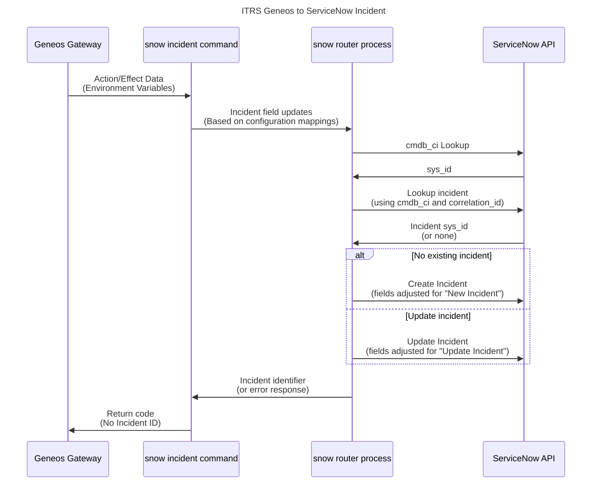

# ITRS Geneos to ServiceNow Incident Integration

**Note**: All long format flags now require two dashes, i.e. `-conf` is now `--conf`. There are also short-form flags for many options.

**Note 2**: The two binaries in previous releases have been merged into one and use sub-commands to direct requests. There may be references to the old split binary in this document.

## Introduction

This Geneos to ServiceNow integration provides a way for you to create or update incidents in ServiceNow from your Geneos Gateways. The selection of the ServiceNow components to raise incidents against, the user and the mappings of Geneos data to specific fields in ServiceNow are all configurable.

The binary provided is for `linux-amd64` as this is the standard architecture supported by the Geneos Gateway, however there should be no restriction on platform if you build from source.

## ServiceNow Flow Diagram

As a very high level view of how the integration handles Geneos alerts and actions:



## Components

There are two primary components of the integration; The router (`servicenow router`) and the incident trigger (`servicenow incident`).

When run as a router it can run as a service and listens for connections on the configured TCP port. It supports one REST endpoint that can service two methods, GET and POST, on `/api/v1/incident`. Access control is via a simple shared token.

Issuing a GET request fetches a list of active incidents for the user, which defaults to the Username in the router configuration. An alternative user can be give as a query parameter, e.g. `/api/v1/incident?user=fred`.

Issuing a POST request takes the supplied JSON request body and after processing according to router configuration either updates or creates an incident. There is no support for specific RESTful POST and PUT methods for creation or updating, as the router searches for an existing incident and makes the decision on whether a new incident or an update should be issued to the Service Now system.

When run as a non-router the program provides a CLI interface to deliver formatted calls to the router. This CLI will normally be called from a wrapper scripts such as the `ticket.sh` example provided.

## Command Line Flags

### Incident Mode

    servicenow incident
        [-c | --conf FILE]
        [-s | --short SHORT]
        -t | --text TEXT | --rawtext TEXT
        -f | --search QUERY
        [-i | --id CORRELATION | --rawid RAW_CORRELATION]
        [-S | --severity SEVERITY]
        [-U | --updateonly]
        [key=value ...]

The `--text` and `--search` flags are mandatory.

* `--conf FILE` or `-c FILE`

  An optional path to a configuration file. This must be a YAML file. The default is described below.

* `--short SHORT` or `-s SHORT`

  An optional `short_description` value, used for incident creation. In a typical configuration this is removed for incident updates to it is safe to supply this option even when you are not sure if this call will result in a new incident or an update.

* `--text TEXT` or `-t TEXT` / `--rawtext TEXT`

  A REQUIRED text value to use in incident creation (as `description`) or incident update (as `work_notes`). Ensure that you have correctly quoted the text string for the shell you are using to ensure that it is passed as a single argument after the flag name.
  The argument passed to `--text` is processed by an `Unquote` function that converts embedded special characters, e.g. `\n` and '`\t`, into their well known real equivalents as well as removing extra quoting while the argument passed to `--rawtext` is left unchanged. `--rawtext` takes precendence over `-text` if both are supplied.

* `--search QUERY` or `-f QUERY` (mnemonic: `f` for find)

  A REQUIRED query that is used to locate the `sys_id` of the CMDB item that the incident applies to. There are two types of query, defined by the route configuration, and are documented in detail below. In short, the typical format is `[TABLE:]FIELD=VALUE`, where the optional TABLE defaults to `cmdb_ci` and a typical query is `name=MyServerName`. As for `-text` above, you should ensure that you quote the QUERY so that any spaces or special characters are passed correctly by the shell as a single argument.
  If the search returns no result and a `default_cmdb_ci` has been supplied, either on the command line or as a field in the client `IncidentDefaults` part of the configuration file then this is used as a fallback. It cannot be specified in the router configuration as it is a required value to lookup incidents before the `IncidentStateDefaults` section of the route configuration is referenced.
  Note: If the search fails because of a syntax error then the ticket submission will return an error and not use any default value.

* `--id CORRELATION` or `-i CORRELATION`
* `--rawid RAW_CORRELATION`

  An optional correlation value used to match incidents. Only one of two flags can be used.
  The `-id` flag takes the value of CORRELATION and applies a one way hash function to generate a fixed length hexadecimal string which helps both limit the size of the field and also to opaque the underlying value passed to the integration. This value is then used when searching for an existing incident for the same CMDB item.
  The `--rawid` passes the value given without change to the integration and this is used when searching for an incident.

* `--severity SEVERITY` or `-S SEVERITY` (note capital `S`)

  An optional, but recommended, value passed in from Geneos that maps the selection of zero or more fields to set (or remove) based on the configuration file's `GeneosSeverityMap` (see example below). Any text value is converted to lower case (e.g. `Critical` becomes `critical`) to match the way the YAML file is processed. You can also pass numeric values, which are simply used as their text equivalents.

* `--updateonly` or `-U`

  If set then no new incident will be created and only existing incidents will be updated with the details given. An error is returned if no incident is found.

* `key=value ...`

  After all flags are processed, the remaining command line arguments are treated as key/value pairs and, after configuration parameters are applied, passed as fields to the router and then to Service Now. This allows arbitrary incident fields to be set (but NOT removed, unlike configuration fields, below) by the caller.

### Router Mode

The router mode has fewer options:

    servicenow router [-c | --conf FILE] [-D | --daemon]

* `--conf FILE` or `-c FILE`

  An optional path to a configuration file. This must be a YAML file. The default is described below.

* `--daemon` or `-D`

  Run as a background daemon. The process is detached from the session and no output is logged. Logging to a file will be added in a later release.

## Configuration

The integration consists of one executable, by default called `servicenow`, and a configuration file with the same name and a `.yaml` extension. If you rename the executable to suit your environment then note that the configuration files (mentioned below) also change to match. e.g. if you rename the executable `itrs-snow` then the configuration files will be `itrs-snow.yaml` etc.

### Configuration Sources

The integration takes it settings from the following, in order of priority from highest to lowest:

1. Command line flags
2. Configuration files (in the order below, first found 'wins' - they are not merged)

      * `./servicenow.yaml`
      * `${HOME}/.config/geneos/servicenow.yaml`
      * `/etc/geneos/servicenow.yaml`

3. External Defaults File (as above but named `servicenow.defaults.yaml` etc.)
4. Internal Defaults

The values in the configuration files are handled by the [config](https://pkg.go.dev/github.com/itrs-group/cordial/pkg/config) package and support a variety of expansion options through the [config.ExpandString()](https://pkg.go.dev/github.com/itrs-group/cordial/pkg/config#Config.ExpandString) function

The configuration for router and incident modes are independent but can share a single configuration file.

### Router configuration

Here is an example router configuration file.

```yaml
api:
  host: 0.0.0.0
  port: 3000
  apikey: RANDOMAPIKEY

servicenow:
  instance: instancename
  username: ${SERVICENOW_USERNAME}
  password: ${enc:~/.keyfile:env:SERVICENOW_PASSWORD}
  # PasswordFile: ~/.snowpw
  clientid: ${SERVICENOW_CLIENTID}
  clientsecret: ${enc:~/.keyfile:+encs+6680A7836122519CE44EEE1BA9152900}
  searchtype: simple
  queryresponsefields: number,sys_id,cmdb_ci.name,short_description,description,correlation_id,opened_by,state
  incident-user:
    field: class_id
    lookup: true
  incidenttable: incident
  incidentstates:
    0: create
    1: [ new, update ]
    2: update
    3: hold
    4: hold
    5: hold
    6: resolved
  incidentstatedefaults:
    create:
      assignment_group: something
      contact_type: email
      impact: 3
      urgency: 3
      category: hardware
      state: 1
      watch_list: ""
      caller_id: admin
      short_description: must exist
      description: default long description here
    new:
      someother: value
    update:
      assignment_group: somethingelse
      contact_type: email
      impact: 3
      urgency: 3
      category: hardware
      state: 2
      caller_id: admin
      work_notes: long description here
      short_description: ""  # delete / never update
    resolved:
      short_description: ""
      caller_id: admin
      state: 1
```

### Client Config

```yaml
api:
  host: localhost
  port: 3000
  apikey: RANDOMAPIKEY

servicenow:
  geneosseveritymap:
    critical: impact=1,urgency=1
    warning: impact=3,urgency=3
    ok: state=6,close_code="Closed/Resolved by Caller",close_notes="Resolved"
    3: impact=1,urgency=1
    2: impact=3,urgency=3
    1: state=6,close_code="Closed/Resolved by Caller",close_notes="Resolved"
  incidentdefaults:
    assignment_group: group1
    incident_type: event
    impact: 3
    urgency: 3
    category: hardware
    contact_type: email
    caller_id: admin
```

### Configuration Items

Note: All values that are intended to be passed to ServiceNow as a field are unquoted to allow the embedding of special characters unless otherwise noted.

* `api`

  Configuration of the router connection

  * `host`

    * For the router this is an optional IP address to listen on. If not given than the router listens on all network interfaces (including localhost).

    * For the client this is the hostname or IP address of the router

  * `port`

  The TCP port that the router listens on (and that the CLI client should connect to).

  * `apikey`

    This can be any string, however a randomly generated key should be used. The router will only accept requests (GET or POST) if the client has the same Bearer token. This also applies to the GET API call to list all existing incidents.

  * `tls` **Router Only**

    The router can listen on a secure connection but for this to work you must supply a certificate and a private key. These can either be the path to a file or an embedded PEM value in the configuration file. The program will first try to decode the value and if that fails will try to load it from a file. Please see online YAML resources on how to format a multiline certificate or key as a value.

    * `enable`

      If this is set to `true` (no quotes) then the router will load a certificate and key from the locations given below and start a TLS (https) listener, otherwise the router uses plain HTTP.

    * `certificate`

      An embedded or a path to a server certificate bundle. The underlying Go documentation says:

          If the certificate is signed by a certificate authority,
          the certFile should be the concatenation of the server's
          certificate, any intermediates, and the CA's certificate.

    * `key`

      An embedded or a path to a TLS private key. The key file cannot be encrypted at this time.

* `servicenow`

  * `instance` **Router Only**

    The Service Now instance name. If the name does _not_ contain a dot (`.`) then it is suffixed with `.service-now.com` otherwise it is assumed to have a domain name (or be an IP address) and is used as is.

  * `username` **Router Only**

    The Service Now API username. This, and a password, are required even if OAuth2 is configured. See the documentation links below.

  * `password` **Router Only**

    A password for the user above. This takes precedence over `passwordfile` below. Passwords can be encoded using Geneos style `+encs+...` AES256 values. The format is documented in [config.ExpandString()](https://pkg.go.dev/github.com/itrs-group/cordial/pkg/config#Config.ExpandString). Keyfiles and encoded strings can be created either using the details in the [Secure Passwords](https://docs.itrsgroup.com/docs/geneos/6.0.0/Gateway_Reference_Guide/gateway_secure_passwords.htm) documentation or by using the [`geneos`](https://github.com/ITRS-Group/cordial/tree/main/tools/geneos) tool's `aes` commands.

  * `passwordfile` **Router Only** - **Deprecated**

    A path to a file containing the plain text password for the user above. This file should be protected with Linux permissions 0600 to prevent unauthorised access. If a tilde (`~`) is the first character then the path is relative to the user home directory. e.g. `~/.snowpw`
    This setting has been deprecated in favour of encoded value expansion for `password` above.

  * `clientid` **Router Only**

  * `clientsecret` **Router Only**

    If these configuration values are supplied then the router will use a 2-legged OAuth2 flow to obtain a token and auto refresh token. This requires OAuth to be configured and enabled in your Service Now instance. OAuth is not attempted if the instance name contains a dot (`.`) which indicates that you are using a non-SaaS/cloud instance.

    `clientsecret` can be encoded like `password` above.

    See the following document for more information:

    * <https://docs.servicenow.com/bundle/rome-platform-administration/page/administer/security/task/t_SettingUpOAuth.html>

    Note: You must still supply a suitable username and password as documented in the following:

    * <https://docs.servicenow.com/bundle/rome-platform-administration/page/administer/security/reference/r_OAuthAPIRequestParameters.html>

  * `searchtype` **Router Only**
  
    There are two search types for `cmdb_ci` table queries, `simple` and any other value. When using `simple` the query format is `[TABLE:]FIELD=VALUE`. The `TABLE` defaults to `cmdb_ci` if not supplied. `FIELD` and `VALUE` are partially validated by simply (hence the name) splitting on the first `=` found. No further validation of the contents of the two parameters is done.
    Is the `searchtype` is not set to `simple` then the query is passed through as-is to the Service Now API.

  * `queryresponsefields` **Router Only**

    A comma separated list of fields to return when calling the request-all-incident endpoint.

  * `incident-user` **Router Only**

    * `field`

      This parameter controls which field is used to set the user on behalf of which to raise or update incidents. The default is `caller_id`.

    * `lookup`

      This parameter controls if the router tries to lookup the user in the `sys_user` table and sends the `sys_id` for the user instead of the literal user identifier. If `true` (the default) then the lookup is performed, looking for the user named in the field above in the `user_name` field of the `sys_user` table. If set to `false` then the field is sent unchanged.

  * `incidenttable` **Router Only**

    The `incident` table to use. Normally this is `incident` but there may be circumstances where there are multiple similar tables in their Service Now implementation. There is no way to change this at run-time and if support is required for multiple tables then you can run multiple routers listening on different ports.

  * `geneosseveritystates` **Client only**

    User-defined mapping from the `-severity` flag to field values to pass to the router. Each entry is of the form:
    `KEY: FIELD=VALUE[,...]`

    The `KEY` is the value passed by the `-severity` flag and, depending how it is called, this could be a word a numeric value. Like all YAML keys this is case insensitive, so `CRITICAL`, `critical` and `Critical` are all treated equally.

    The `FIELD=VALUE` list is a comma-separated list of key/value pairs for fields to pass to the router. These are case sensitive. Leading and trailing spaces are trimmed from each key/value pair.

  * `incidentdefaults` **Client Only**

    These defaults are applied to any unset fields and passed to the router. Further details below

  * `incidentstates` **Router Only**

    A list of numeric `state` values that map to named set(s) of defaults (defined by `incidentstatedefaults` below) to apply to incidents depending on the `state` of the incident after initial lookup. `0` (zero) is used when no active incident match is found.

  * `incidentstatedefaults` **Router Only**

    A list of named defaults to apply to the incident depending on the `state` match above. These are in the form `field: value`.

### Configuration Security

All plain values in the configuration support string expansion according to the function [ExpandString](https://pkg.go.dev/github.com/itrs-group/cordial/pkg/config#Config.ExpandString).

### Service Now Incident Field Processing

Command line flags, field mappings and other settings are applied in the following order:

* CLI Client:

  1. Command line flags for `--short` and `--text`

  2. Command line `key=value` pairs set incident fields, including earlier values above

  3. The --severity flag feeds the `geneosseveritymap` in the client configuration which will overwrite and/or delete fields. A delete is done if passed an literal empty string, with quotes (`""`).

  4. Subsequent fields without values take defaults from the client `incidentdefaults` configuration. As above, a literal empty string value (`""`) means delete any previously defined value.

* Router receives the fields from the client as above, and then:

  1. After the incident lookup the value in the `state` field is used as a key in the `incidentstates` configuration, where 0 (zero) means that no active incident was found.

  2. Fields without values take any defined default from the matching router configuration `incidentstatedefaults` lists in the order they are listed in `incidentstates`, but a literal empty string (`""`) means delete any previous value.

Other built-in processing, which is necessary for the Service Now incident table API to work, include:

  1. `caller_id` is looked up in the `sys_user` table after all the above default processing

  2. A field passwd internally with the name `text` for the purposes of settings is turned into `description` for creation or `work_notes` for updates, the two real fields are overwritten. `text` should not be used for user defined values.

  3. The `cmdb_ci` field is set to the `sys_id` value found for incident creation (updates use the incident `sys_id`).

  4. If a field `update_only` is set to `true` (the literal word `true` as a string) then no new incident will be created. This has the same effect as using `-updateonly` on the client command line. This field can also be set in the client configuration file, e.g. for certain severity mappings, but on the router side can only be applied when `incidentstates` = `0` (i.e. for new incidents) but can still be overridden by a client supplied `update_only` set to any non `true` value.

### Wrapper script configuration

A typical wrapper script might look like this:

```bash
#!/bin/bash

SNOW_CLIENT_BINARY=${HOME}/bin/servicenow

if [ "${_PLUGINNAME}" = "FKM" ]
then
ID="${_GATEWAY}${_NETPROBE_HOST}${_MANAGED_ENTITY}${_SAMPLER}${_DATAVIEW}${_COLUMN}${_triggerDetails}${_Filename}"
else
ID="${_GATEWAY}${_NETPROBE_HOST}${_MANAGED_ENTITY}${_SAMPLER}${_DATAVIEW}${_ROWNAME}${_COLUMN}${_HEADLINE}"
fi

SHORT="Incident in ${REGION}: Value ${_MANAGED_ENTITY} | ${_SAMPLER} | ${_ROWNAME} | ${_COLUMN}${_HEADLINE}"
SHORT="Incident in ${REGION}: Value ${_MANAGED_ENTITY} | ${_SAMPLER} | ${_ROWNAME} | ${_COLUMN}${_HEADLINE}"
TEXT="Geneos time: ${_ALERT_CREATED}\nGateway: ${_GATEWAY}\nManaged Entity: ${_MANAGED_ENTITY}\nPlugin: ${_PLUGINNAME}\nSampler: ${_SAMPLER}\nRow: ${_ROWNAME}\nColumn/headline: ${_COLUMN}${_HEADLINE}\nValue: ${_VALUE}${_triggerDetails}\nEnvironment: ${ENVIRONMENT}\nClient: ${CLIENT}\nRegion: ${Region}\nLocation: ${LOCATION}\nPlatform: ${PLATFORM}\nComponent: ${COMPONENT}"
# The cmdb sys_id may be an explicitly defined Managed Entity attribute value, then you can do this:
# SEARCH="sys_id=${UUID}"
SEARCH="name=${_NETPROBE_HOST}"

${SNOW_CLIENT_BINARY} incident --short "${SHORT}" --search "${SEARCH}" --text "${TEXT}" \
-id "${ID:-$_MANAGED_ENTITY}" --severity "${_SEVERITY}" category="${COMPONENT:-Hardware}"
```

In the above example we build a correlation ID, depending on the sampler type, from a number of Geneos XPath components, a SHORT and TEXT description and a SEARCH query. These are then passed into the client binary along with the Geneos severity value and one custom field.

Note: The value passed to `--text` is passed through the [`strconv.Unquote`](https://pkg.go.dev/strconv#Unquote) function and so can include escape sequences such as embedded newlines and tabs if required, while `--rawtext` is left unchanged.

The wrapper script will typically be called from a Geneos Action or Effect depending on your Geneos configuration. It is worth noting that Action and Effects export similar, but not identical, sets of environment variables to external programs. These are detailed in the technical reference documentation linked below:

1. [Action Environment Information](https://docs.itrsgroup.com/docs/geneos/current/Gateway_Reference_Guide/geneos_rulesactionsalerts_tr.html#Action_Configuration)
2. [Alerting Environment Information](https://docs.itrsgroup.com/docs/geneos/current/Gateway_Reference_Guide/geneos_rulesactionsalerts_tr.html#Alert_information)

## Stateless Operation and Resilience

The client to router connection is stateless and operates on a per invocation basis. This means that for resilience it is possible to run multiple routers - within any constraints imposed by your Service Now account - and have CLI clients call any based on round-robin DNS. There is no support for configuring multiple router connection details in the client at this time.

## Use with HTTP(s) Proxies

The integration uses the Go http and Labstack's echo packages. Both support the use of proxies as documented here: [Go http `ProxyFromEnvironment`](https://pkg.go.dev/net/http#ProxyFromEnvironment). This applies to environment variables for both the client, for connection to the router, and the router, for connections to Service Now.

## Running the Router

Once you have edited the configuration file, running the router is straightforward.

### Option 1 - Execute in terminal

Simply execute the router binary. It will run in the foreground in your user's session and log to STDOUT.

### Option 2 - Run as a SystemD Service

**Note** This option has not been tested for a couple of minor release now. It will be validated (and changes made as required) in the next release.

The router can be run as a SystemD service.

```ini
[Unit]
Description=ITRS Geneos ServiceNow Incident Router
ConditionPathExists=/opt/itrs/servicenow
After=network.target

[Service]
Type=simple
User=monitor
Group=apache
LimitNOFILE=1024

Restart=on-failure
RestartSec=10
StartLimitIntervalSec=60

WorkingDirectory=/opt/itrs
ExecStart=/opt/itrs/servicenow router

PermissionsStartOnly=true
StandardOutput=syslog
StandardError=syslog
SyslogIdentifier=geneos-servicenow

[Install]
WantedBy=multi-user.target
```

Edit the above to suit your installation and then copy it to `/lib/systemd/system/geneos-servicenow.service`

You will need to edit the paths in several places (`ConditionPathExists`,`WorkingDirectory`,`ExecStart`) as well as change the `User` and `Group` to use values appropriate to your server and environment.

Once the service file is configured and in place you must perform the following steps:

1. `systemctl daemon-reload` This will restart the Systemd daemon so that it is aware of the new service.
2. `systemctl start geneos-servicenow.service` - This will start the service
3. `systemctl enable geneos-servicenow.service` - This will ensure that the service will survive a reboot.
4. `systemctl status geneos-servicenow.service` - This lets you view the state of the service.

To view the logs of the service while running you can use journalctl. Executing the following will show you the logs.

`journalctl -u geneos-servicenow.service`

If you wish to view the logs in real time (tail -f) you can accomplish that with the following command.

`journalctl -u geneos-servicenow.service -f`

To view logs for a specific time range use the following.

* `journalctl -u geneos-servicenow.service --since "1 hour ago"`
* `journalctl -u geneos-servicenow.service --since "2 days ago"`
* `journalctl -u geneos-servicenow.service --since "2020-06-26 23:15:00" --until "2020-06-26 23:20:00"`
