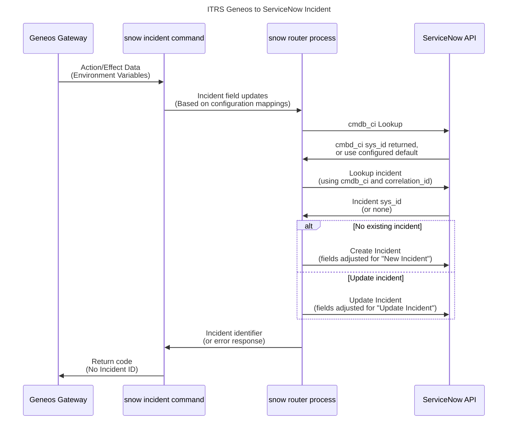

# Geneos ServiceNow Integration v2

## Introduction

The Geneos ServiceNow integration connects your Gateways to ServiceNow to raise and manage incidents. The integration understands the environment variables set by Gateway Actions and Alert/Effects, transforming them under administrator control into ServiceNow field values. 

The integration is divided into two functions; A _client_, executed by Gateways, and a background _router_. The router acts both as a proxy and an additional layer of configuration driven data transformation.

The client works solely with environment variables and three command line flags, which act as selectors for configuration sections, while the router accepts resulting key/value pairs from clients and creates a ServiceNow table API data set. The client has no direct link to the ServiceNow instance.

>[!NOTE]
> Previous versions of this integration also required a wrapper script to translate Gateway Action/Effect environment variables, but these functions have now all been moved into the client configuration files. This version also uses two distinct configuration files for client and router.

## Getting Started

The ServiceNow integration is a single binary and command line arguments are used to execute it as either a client or a router. You will need to install this binary (`servicenow2`) in a suitable directory so that it can be executed by Geneos Gateways as a client and, if the same host is used to connect to your ServiceNow instance, run as a router. If your ServiceNow instance can only be contacted from a separate network endpoint / server then you must also install the binary there and ensure you select a listening port that the gateway server's client process can connect to. 

The example configuration files provided with the integration should serve as a good starting point to get you up and running. You will need to edit, at minimum, the router configuration file to set-up the details of your ServiceNow instance; the network address and authentication details. If your router runs on a different endpoint to your client then you will also need to modify the listening address, which defaults to localhost only, and also consider implementing TLS, which requires a certificate and private key matching the host and domain name of the router endpoint.

### Run The Router

Copy the `servicenow2` binary to a suitable directory. If you are not sure where then we suggest either `/usr/local/bin/` (if you have superuser privileges), or `${HOME}/bin/` if you are doing this as a normal user. If `${HOME}/bin` does not exist then create it with `mkdir ${HOME}/bin`. (Note: `${HOME}` is your user home directory and is automatically set by your Linux shell when you login). Check that the binary is executable using `ls -l` or just set it to executable by running `chmod +x [PATH]` where `[PATH]` is the full path to the binary, e.g. `${HOME}/bin/servicenow2`

Create a router configuration file using the example one packaged with the binary. This configuration file should go in one of three locations that are checked on start-up:

* `./servicenow2.router.yaml`
* `${HOME}/.config/geneos/servicenow2.router.yaml`
* `/etc/geneos/servicenow2.router.yaml`

Like for installing the binary, use the first location if you have superuser privileges or the second if not, only using the third option if you have no other choice. You may need to create the user config directory with `mkdir -p ${HOME}/.config/geneos` first. So, for example:

```bash
mkdir -p ${HOME}/.config/geneos
cp servicenow2.router.example.yaml ${HOME}/.config/geneos/servicenow2.router.yaml
```

Edit the router configuration file, following the suggestions in the comments. At minimum you will need to set the ServiceNow instance name and authentication details for the ServiceNow user that will be used to create and update incidents.

Start by running the router in the foreground, so you can watch for any errors:

```bash
servicenow2 router
```

If the directory you installed the binary is not in your executable path, such as if you had just created the `${HOME}/bin` directory and not logged out and in again, then use the full path to the binary.

In another terminal session test the router by issuing a `curl` command to query existing incidents. To do this you will need the plaintext value of the router's authentication token (in the `router.authentication.token` configuration field). Then run:

```bash
curl -H 'Authorization: Bearer EXAMPLE' http://localhost:3000/snow/api/v2/incident
```

>[!NOTE]
> If you have changed the listening address or port or the API endpoint path then you must, of course, adjust the URL above to match.

Where `EXAMPLE` should be replaced by your token, in plaintext. You should see output in JSON format with all the configured user's incidents. If you see an empty list (`[]`) then that may be OK. On the router side you should see a corresponding log entry, like this:

```log
2025-05-07T15:52:47+01:00  HTTP/1.1 200 0/5524 1.794s 127.0.0.1 GET /snow/api/v2/incident ""
```

Any other results means you need to review the configuration, the ServiceNow user details and the connectivity to your ServiceNow instance.

### Configure The Client

Now that the router is running you can build the client configuration file and the Gateway Actions/Effects you want to use to invoke it.

Just like for the router functionality, the integration client looks for a configuration file in this order:

* `./servicenow2.client.yaml`
* `${HOME}/.config/geneos/servicenow2.client.yaml`
* `/etc/geneos/servicenow2.client.yaml`
  
If you want to use a different location or filename you can use the `--config /path` option on the command line. For typical use with a Gateway you can put the configuration file in the Gateway working directory.

For the first implementation you should start with the example configuration file packages with the binary and edit it as appropriate. Please see the comments in the example file and the configure reference below for more details.

## How It Works

When a Geneos Gateway invokes either an Action from a Rule or an Effect from an Alerting hierarchy it sets a number of predefined environment variables for the external process to use as a context. The specific list varies slightly between the two and are documented in these sections of the reference manuals:

Actions: <https://docs.itrsgroup.com/docs/geneos/current/processing/monitoring-and-alerts/geneos_rulesactionsalerts_tr/index.html#action-configuration>
Effects: <https://docs.itrsgroup.com/docs/geneos/current/processing/monitoring-and-alerts/geneos_rulesactionsalerts_tr/index.html#effects>

In addition to a fixed set of environment variables, as detailed in the manuals above, the Action/Effect will also sets, depending on the Geneos Data Item that caused the invocation, variables for the value in each cell on the same row (where the Action/Effect is for a table cell) and also for each Managed Entity Attribute.


### Data Flow

>[!NOTE]
> To be reviewed for new integration



## Client Configuration

The client configuration file drives the transformation of Geneos Action/Effect environment variables to ServiceNow files in the form of name/value pairs. The file format is in YAML format but is enhanced to supports Cordial's "expandable" format for values. See below for more information.

The configuration file is evaluated for each execution, so changes to the file will take effect on the next run.

### `router` Configuration

The first part of the configuration file is `router` and contains the settings on how to communicate with the router process.

### Test and Transform Environment Variables

All dynamic data values are passed into the integration as environment variables.

The client configuration includes features to test, set and unset ServiceNow fields based on these environment variable values. Because these are expressed in the YAML file format it is important to use the correct indentation and layout.

The processing is done in sections, which are in turn made up of groups. First the `defaults` section is evaluated (in all cases) and then the selected profile section. Each section is processed as an ordered list of groups of tests and actions.

### Profiles

The Geneos Gateway executing the integration client can select a _profile_ in the configuration file. If no profile is selected then the `default` profile is used. Note that this is different to the top-level `defaults` section described above. Using profiles allows you to reduce the required nesting of test and so on by categorising settings, such a `opsview` or `infrastructure` and then using this name from different Actions or Alert/Effects in the Gateway.

### Expansions

Almost all the right hand side values in the YAML configuration file support expansion, using the following functions:

* `${env:ENV}` or `${ENV}`

  Return the value of the environment variable `ENV`. The second, shorter, format takes precedence of the config option below as `ENV` will very rarely contain a dot. In those very rare cases where environment variable names contain a dot character use the first format. If the environment variable does not exist then an empty string is substituted and no error is logged.

* `${config:ITEM.ITEM...]}` or `${ITEM.ITEM...}`

  Return the value of the configuration item `ITEM.ITEM` etc. The second form only works when there is at least one dot separator in the configuration item path. This can be used to pull in the value of another configuration key (which can be done in native YAML, but this allows for clearer configurations). The item referred to is not expanded.

* `${file:/path/to/file}`

  Substitute the contents of the file given by the path. If the path starts `~/` then this is relative to the home directory of the user.

* `${http://example.com/path}` or `${https:///example.com/path}`

  Substitute the contents of the remote URL.

* `${enc:/path/to/aesfile:ENCRYPTED}`

  Decrypt the `ENCRYPTED` string using the AES file path given. Use this to embed credentials which cannot be decrypted without the AES file. To create a field of this format you can run `geneos aes password`.

#### Custom Expansions

The additional custom functions for this integration are:

* `${match:ENV:PATTERN}` - evaluate PATTERN as a regular expression against the contents of ENV environment variable and return "true" or "false". If ENV is an empty string (or not set) then `matchenv` returns false

* `${replace:ENV:/PATTERN/TEXT/}`

* `${select:ENV1:ENV2:...:DEFAULT}` - return the value of the first environment variable that is set, including to an empty string. The last field is a plain string returned as a default value if none of the environment variables are set. Remember to include the last colon directly followed by the closing `}` if the default value should be an empty string

* `${field:FIELD1:FIELD2:...:DEFAULT}` - returns to current value of the ServiceNow field `FIELD`. If `FIELD` is unset then an empty string is returned.

### Client Actions

The following actions are available:

* `if`

  Continue processing the group if the value(s) evaluate to `true`. The default acts like `if: true` if not given.

* `then`

  Starts a new sub-section which is then processed in order and recursively

* `set`

  Evaluates the right had side and sets the field named, overwriting any previous value

* `unset`

  Removes the field from the set sent to the router

* `skip`

  Exits the processing of the parent section

The order of action definitions in a group is not important and they are always processed in the following order:

#### `if`

The `if` action evaluates either a single value or an array of values, which must all be true (and so an array of values acts like `AND`-ing the values together). If the test(s) are `true` then the rest of the section is actioned, if `false` then processing of the current section stops and any further sections are then evaluated.

Not providing an `if` is the same as `if: true`, i.e. the group is further actioned.

These kinds of layout are supported:

```yaml
defaults:
  - if: TEST
    set: ...
  - if:
    - TEST1
      TEST2
    set: ...
  - if: [ TEST1, TEST2 ]
    set: ... 
```

#### `then`

The `then` action introduces a sub-section that can contain multiple groups as an array of YAML objects.

These two `if` sections result in identical results:

```yaml
defaults:
  - if: TEST
    set: ...

  - if: TEST
    then:
      - set: ...
```

`then` is useful when further tests are required and which are also processed in order. For example, grouping together tests that all depends on a "parent" value, such as a Managed Entity Attribute value. e.g.

```yaml
defaults:
  - if: ${match:ENVIRONMENT:\bPROD\b}$
    then:
      - if: ${match:CATEGORY:\bDatabase\b}
        set:
          ...
```

#### `set`

```yaml
set:
  key: value
  key: value
```

The `set` action, as the name suggests, sets the fields to the expanded values on the right.

#### `unset`

```yaml
unset: key
```


#### `skip`

`skip` terminates the processing of further groups in the same section.

## Router Configuration

## `router`

## `servicenow`

### `tables`
