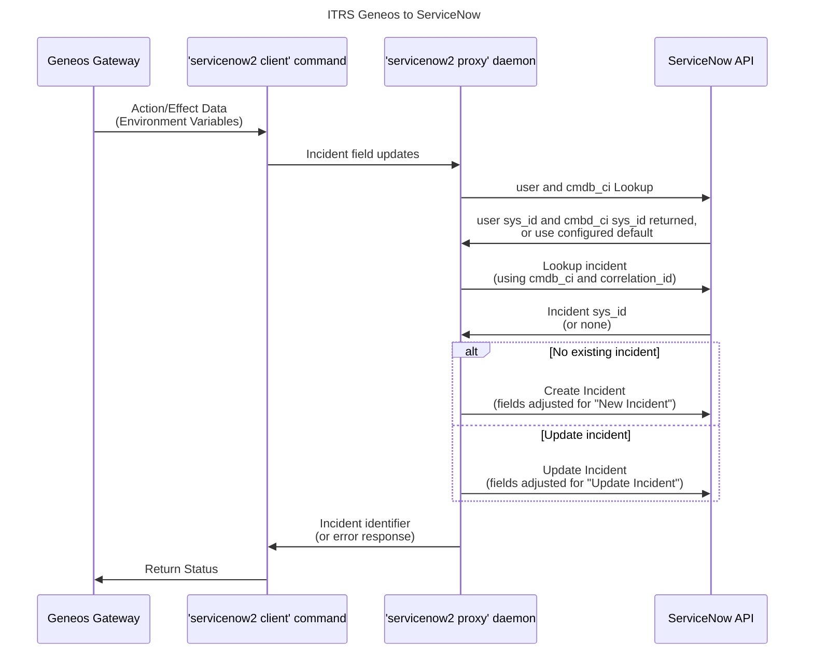

# Geneos ServiceNow Integration v2

## Introduction

The Geneos ServiceNow integration (Version 2) connects your Gateways to ServiceNow to raise and manage incidents. The integration understands the environment set-up by Gateway Actions and Alert/Effects, transforming them into ServiceNow field values.

The integration is divided into two commands; A _client_, executed by Gateways, and a background _router_. The proxy acts both as a proxy and an additional layer of configuration driven data transformation. There is also a _query_ command to fetch incidents assigned to a specific user.

The _client_ command uses environment variables and command line flags, while the _router_ then accepts the resulting key/value pairs from clients and creates and sends a ServiceNow table data set. The _client_ command has no direct link to the ServiceNow instance.

>[!NOTE]
>Previous versions of this integration also required a wrapper script to perform the initial mapping of Gateway Action/Effect environment variables, but these functions have now all been incorporated into the client command. This version also uses two distinct configuration files for client and proxy.

## Getting Started

The ServiceNow integration is delivered as a single binary. A command argument is used to select _client_, _router_ or _query_ modes. You will need to install the binary (**`servicenow2`**) in a suitable directory so that it can be executed by Geneos Gateways as a client and, if the same host is used to connect to your ServiceNow instance, run as a proxy.

If your ServiceNow instance can only be contacted from a specific network endpoint then you must also install the binary there and ensure you select a listening port that the Gensos Gateway's ServiceNow _client_ process can connect to.

The example configuration files provided with the integration should serve as a good starting point to get you up and running. You will need to, at minimum, edit the **`proxy`** configuration file with the details of your ServiceNow instance; the network address and authentication details. If your proxy process runs on a different endpoint to your client(s) then you will also need to modify the listening address, which defaults to localhost only (and also consider implementing TLS which requires a certificate and private key matching the host and domain name of the proxy endpoint).

### Run The Proxy

Copy the **`servicenow2`** binary to a suitable directory. If you are not sure where then use either `/usr/local/bin/` (if you have superuser privileges), or `${HOME}/bin/` if you are doing this as a normal user. If `${HOME}/bin` does not exist then create it with `mkdir ${HOME}/bin`. (Note: `${HOME}` is your user home directory and is automatically set by your Linux shell when you login). Check that the binary is executable using `ls -l` or just set it to executable by running `chmod +x [PATH]` where `[PATH]` is the full path to the binary, e.g. `${HOME}/bin/servicenow2`

Create a proxy configuration file using the example one provided with the binary. This configuration file should go in one of three locations that are checked on start-up (in the order given, first one found is used):

* `./servicenow2.proxy.yaml`
* `${HOME}/.config/geneos/servicenow2.proxy.yaml`
* `/etc/geneos/servicenow2.proxy.yaml`

In most cases you will select the first option (the current working directory) for a Gateway if there is a different configuration for each Gateway, or the second for the user running the Geneos Gateways on the server. You may need to create the user config directory with `mkdir -p ${HOME}/.config/geneos` first. So, for example:

```bash
mkdir -p ${HOME}/.config/geneos
cp servicenow2.proxy.example.yaml ${HOME}/.config/geneos/servicenow2.proxy.yaml
```

Edit the new proxy configuration file, following the suggestions in the comments. At minimum you will need to set the ServiceNow instance name and authentication details for the ServiceNow user that will be used to create and update incidents.

First, start by running the proxy in the foreground, so you can watch for any errors:

```bash
servicenow2 proxy
```

If the directory you installed the binary is not in your executable path (such as if you had just created the `${HOME}/bin` directory and not logged out and in again) then use the full path to the binary.

In another terminal session test the proxy by issuing a `curl` command to query existing incidents. To do this you will need the plaintext value of the proxy's authentication token (in the `proxy.authentication.token` configuration field). Then run:

```bash
curl -H 'Authorization: Bearer EXAMPLE' http://localhost:3000/snow/api/v2/incident
```

>[!NOTE]
> If you have changed the listening address or port or the API endpoint path then you must, of course, adjust the URL above to match.

Where `EXAMPLE` should be replaced by your token, in plaintext. You should see output in JSON format with all the configured user's incidents. If you see an empty list (`[]`) then that may be OK. On the proxy side you should see a corresponding log entry, like this:

```log
2025-05-07T15:52:47+01:00  HTTP/1.1 200 0/5524 1.794s 127.0.0.1 GET /snow/api/v2/incident ""
```

Any other results means you need to review the configuration, the ServiceNow user details and the connectivity to your ServiceNow instance.

### Configure The Client

Now that the proxy is running you can build the client configuration file and the Gateway Actions/Effects you want to use it.

Just like for the proxy functionality, the client looks for a configuration file in this order:

* `./servicenow2.client.yaml`
* `${HOME}/.config/geneos/servicenow2.client.yaml`
* `/etc/geneos/servicenow2.client.yaml`
  
If you want to use a different location or filename you can use the `--config /path` option on the command line. For typical use with a Gateway you can put the configuration file in the Gateway working directory (the first in the list above).

For the initial implementation you should start with the example configuration file packages with the binary and edit it as suggested by the comments.

## How It Works

When the Gateway runs an Action from a Rule or an Effect from an Alerting hierarchy, it sets environment variables for the external process to use as a context. The names and values varies slightly between the two and are documented in these sections of the reference manuals:

* [*Geneos Actions*](https://docs.itrsgroup.com/docs/geneos/current/processing/monitoring-and-alerts/geneos_rulesactionsalerts_tr/index.html#action-configuration)

* [*Geneos Effects*](https://docs.itrsgroup.com/docs/geneos/current/processing/monitoring-and-alerts/geneos_rulesactionsalerts_tr/index.html#effects)

In addition to environment variables that Actions or Effects set for specific data-items, variables for the values in each cell on the same row (where the Action/Effect is for a table cell) and also for each Managed Entity Attribute are set.

The servicenow2 client can use these environment variables both to set incident field values and also to test for conditions and set or remove fields driven by these tests.

### Data Flow



### Query Command

There is also a `query` command that will fetch the incidents for the given user. If no user is specified on the command line then the user the proxy uses to connect to the ServiceNow instance will be used. The table to query, which defaults to `incident`, can also be set on the command line. Finally, the output format can be in JSON or a CSV table, suitable for Geneos Toolkit samplers.

The `query` command uses the `servicenow2.client.yaml` configuration file for proxy connection information. The fields that are returned, and the query sent to ServiceNow, are both defined in the proxy configuration and cannot be controlled by the `query` command.

## Client Configuration Reference

The client configuration file controls the transformation of Geneos Action/Effect environment variables to ServiceNow files in the form of name/value pairs. The file is in YAML format but supports Cordial's "expandable" format for almost all values (right of the `:`). See below for more information.

The configuration file is evaluated for each execution, so changes to the file will take effect on the next run.

### Geneos Environment Variables To ServiceNow Fields

All data values are passed from the Geneos Gateway to the integration as environment variables. These are then transformed into the name/value fields passed to the proxy process, which in turn will process them and pass them to ServiceNow to either create or update an incident.

The client configuration includes features to test, set and unset ServiceNow fields based on environment variables.

>[!NOTE]
>The configuration is in the YAML format, so it is important to use the correct indentation. Please pay attention to change you make to ensure these are correct.

This processing is done in two _sections_, `defaults` and a selected _profile_, which are in turn made up of _action groups_. First the [**`defaults`**](#defaults) section is evaluated and then the selected profile section. Each section is processed as an ordered list of groups of tests and actions.

Each _action group_ supports the following actions (more details [below](#actions-groups)):

* `if` - Continue processing this group if the value(s) evaluate to `true`. The default is to act as if `if: true` is used.
* `then` - Starts a new, lower level, group which is then processed in order and recursively
* `set` - A list of key/value pairs. Evaluates the right side and sets the named field, overwriting any previous value
* `unset` - Removes the field from the currently defined set
* `skip` - Exits the processing of the **_parent_** group

The order that action are defined in a group is not important as they are always processed in the order above.

### ServiceNow Field Naming

All the fields built on the client-side are passed to the proxy process, which will perform further processing. Those stages are described further below, but it is worth noting the following behaviour; All fields that start with an underscore (`_`) are considered internal and are typically used to pass values to the proxy that will never be sent directly to ServiceNow. For example, the `_subject` field can be used as the `short_description` when creating a new incident or included in the `work_notes` when updating an existing incident (or dropped entirely). Other internal fields may be simply to pass query information, such as `_cmdb_ci_default`.

### Value Expansion

Almost all the right-hand side values in the YAML configuration file support a custom expansion syntax. Expansion is not recursive, unless a customer function mentions it, but multiple expansion functions can be given in one entry and are concatenated as if they were all one string value, e.g.:

```yaml
    _subject: Geneos Alert on ${select:_NETPROBE_HOST:Unknown} | ${select:_DATAVIEW:None} | ${_ROWNAME} ${_COLUMN}
```

These are standard _cordial_ expansion functions:

* `${env:ENV}` or `${ENV}`

  Return the value of the environment variable `ENV`. The second, shorter, format takes precedence of the config option below as `ENV` will very rarely contain a dot. In those very rare cases where environment variable names contain a dot character use the first format. If the environment variable does not exist then an empty string is substituted and no error is logged.

* `${config:ITEM.ITEM...}` or `${ITEM.ITEM...}`

  Return the value of the configuration item `ITEM.ITEM` etc. The second form only works when there is at least one dot separator in the configuration item path. This can be used to pull in the value of another configuration key (which can be done in native YAML, but this allows for clearer configurations). The item referred to is not expanded.

* `${file:/path/to/file}`

  Substitute the contents of the file given by the path. If the path starts `~/` then this is relative to the home directory of the user.

* `${http://example.com/path}` or `${https:///example.com/path}`

  Substitute the contents of the remote URL.

* `${enc:/path/to/aesfile:ENCRYPTED}`

  Decrypt the `ENCRYPTED` string using the AES file path given. Use this to embed credentials which cannot be decrypted without the AES file. To create a field of this format you can run `geneos aes password`.

These additional custom functions are available in this integration:

* `${match:ENV:PATTERN}` - evaluate PATTERN as a regular expression against the contents of `ENV` environment variable and return `true` or `false`. If ENV is an empty string (or not set) then `matchenv` returns `false`

* `${replace:ENV:/PATTERN/TEXT/}` - apply the regular expression `PATTERN` to the value in the `ENV` environment variable and replace all matches with `TEXT`. `PATTERN` and `TEXT` support the features provided by the Go `regexp` package. To include forward slashes (`/`) or closing brackets (`}`) you must escape them with a backslash.

* `${select:ENV1:ENV2:...:DEFAULT}` - return the value of the first environment variable that is set (including an empty string). The last field is a string returned as a default value if none of the environment variables are set. Remember to include the last colon directly followed by the closing `}` if the default value should be an empty string.

  Each ENV* field may also include multiple environment variable names separated by one of: `-`, ` `, `/`, `+` or `++`. A single plus (`+`) is a zero-width separator while a double plus (`++`) results in a single plus sign in the output. The other valid separators are included as-is. If any of the individual environment variables are set then this counts as if the whole field were set. This feature is useful for alternating between aggregate labels each as rowname and column versus headlines.

  For example:

  When `_ROWNAME` is `row`, `_COLUMN` is `data1` and `_HEADLINE` is `headline1` then:

  * `${select:_ROWNAME+_COLUMN:_HEADLINE:None}` becomes `rowdata1`
  * `${select:_ROWNAME/_COLUMN:_HEADLINE:None}` becomes `row/data1`

  And when `_ROWNAME` and `_COLUMN` are unset then:

  * `${select:_ROWNAME/_COLUMN:_HEADLINE:None}` becomes `headline1`

  Other separators are not valid and result in the field being ignored. Separators may appear before or after the environment variable names as well, but are not taken into account when checking if the values are set.

* `${field:FIELD1:FIELD2:...:DEFAULT}` - returns to current value of the first ServiceNow field set. As per `select` above, DEFAULT is a string that is returned if non of the fields are set.

### Actions Groups

Below are more details, and examples, for each action that can be included in a group. Groups may only contain at most on of each action.

#### `if`

The `if` action evaluates either a single value or an array of values, which must all be true (and so an array of values acts like `AND`-ing the values together). If the test(s) are `true` then the rest of the group is actioned, if `false` then processing of the current group stops and any further groups are then evaluated.

Not providing an `if` is the same as using `if: true`.

The kinds of layout below are supported:

```yaml
defaults:
  # single TEST
  - if: TEST
    set: ...
  # list of TESTs
  - if:
    - TEST1
      TEST2
    set: ...
  # alternative list of TESTs
  - if: [ TEST1, TEST2 ]
    set: ... 
```

#### `then`

A `then` action introduces a sub-group that can contain multiple groups as an array of YAML objects.

For example, these two `if` sections result in identical results:

```yaml
defaults:
  - if: TEST
    set: ...

  - if: TEST
    then:
      - set: ...
```

Using `then` is useful when further tests are required and these are also processed in top down order. For example, grouping together tests that all depends on a _parent_ value, such as testing a Managed Entity Attribute value. e.g.

```yaml
defaults:
  - if: ${match:ENVIRONMENT:\bPROD\b}$
    then:
      - if: ${match:CATEGORY:\bDatabase\b}
        set:
          ...
```

See `skip` below as a way of exiting a list of groups based on a test.

#### `set`

```yaml
set:
  key: value
  key: value
```

The `set` action, as the name suggests, sets the fields to the expanded values on the right.

#### `unset`

`unset` removes fields for the current set and can be one or more field names. `unset` only works on existing fields and will not affect further processing which results in the field being re-added.

```yaml
  if: ${match:_SEVERITY:\bok\b}
  unset: _text
```

#### `skip`

`skip` evaluates the value(s) on the right, the same way as the `if` action, and terminates further processing of groups in the same parent group or section. Skip is, however, evaluated last and so allows other actions to be processed in the same group and then (as the name suggests) skip further processing below at the same level.

```yaml
  # long format
  - if: ${match:_SAMPLER:mySampler}
    skip: true

  # combined
  - skip: ${match:_SAMPLER:mySampler}

  # more actions
  - if: ${match:_SAMPLER:mySampler}
    set:
      _subject: Alert in ${_SAMPLER}
    skip: true
```

### Configuration Sections

#### `proxy`

The first part of the configuration file is `proxy` and contains the settings on how to communicate with the proxy process.

#### `query`

#### `defaults`

This section sets default values for fields.

* `_cmdb_id_default`

#### `profiles`

The Geneos Gateway executing the integration client can select a _profile_ in the configuration file. If no profile is selected then the `default` profile is used. Note that this is different to the top-level `defaults` section described above. Using profiles allows you to reduce the required nesting of test and so on by categorising settings, such a `opsview` or `infrastructure` and then using this name from different Actions or Alert/Effects in the Gateway.

## Proxy Configuration Reference

### `proxy`

### `servicenow`

### `tables`
