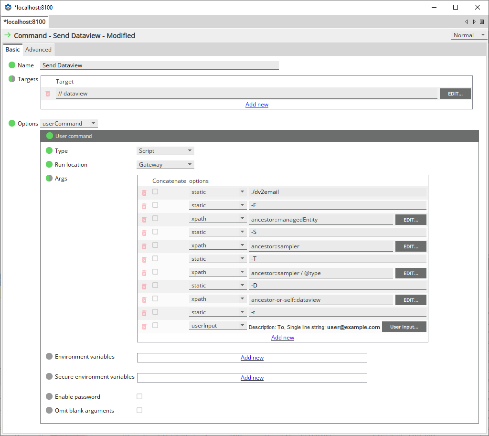

# dv2email - Dataview To EMail

`dv2email` is a lightweight program to capture and transform Geneos Dataviews to HTML or XLSX for sending as email.

You can also write the same data to local files using the `dv2email export` command.

## Requirements

The `dv2email` program is self-contained and needs external packages or libraries installed. You have to enable the REST Command API on your Geneos Gateways, for the dataview snapshots, and have the details for you SMTP EMail relay, including authentication details.

All credentials, both for the REST connection to the Gateway and the SMTP connection, can be stored encrypted in the configuration file or in a `cordial` credentials file.

The emails that `dv2email` sends can have a variety of attachment formations including:

* `text+html` - A standard HTML Email with a text alternative (for accessibility and more)
* `xlsx` - An XLSX spreadsheet
* `html` - Self-contained HTML from the HTML template
* `texttable` - Text-only formatted tables

Local files can be any combination of the above, except `text+html`, which is an email specific structure.

## Getting Started

### Configure Your Gateways

You have to enable the REST Command API in your Gateways. You should have a user account on the Gateways that support password authentication and is limited to `data` permissions, i.e. a read-only account. How to do this can be found in the following documentation:

* [REST Service 🔗](https://docs.itrsgroup.com/docs/geneos/current/Gateway_Reference_Guide/geneos_commands_tr.html#REST_Service)
* [Authentication 🔗](https://docs.itrsgroup.com/docs/geneos/6.3.0/Gateway_Reference_Guide/geneos_authentication_tr.html)

For the examples in this documentation we will use the `readonly` account name, but you can use any valid Genoes user name.

### Install `dv2email`

Install `dv2email` and, optionally, `geneos` by downloading and copying them to somewhere in your execution path (or you will have to use the full path to where they are installed). Note that `geneos` may be a existing directory name on your system, so it's wise to create a temporary directory for the download, like this:

```bash
mkdir /tmp/cordial
cd /tmp/cordial
curl -OL https://github.com/ITRS-Group/cordial/releases/latest/download/dv2email
curl -OL https://github.com/ITRS-Group/cordial/releases/latest/download/geneos
chmod +x dv2email geneos
sudo mv dv2email geneos /usr/local/bin
```

### Configure `dv2email`

Now create `dv2email.yaml` configuration file(s). You will need at least one file for the program to locate your Gateway and SMTP servers. In normal operation you should use these files:

* `${HOME}/.config/geneos/dv2email.yaml` - where `${HOME}` is the home directory of the user running the Gateway(s)

  This configuration file should contain common configuration that applies across all Gateways and also shared email server configurations and credentials.

* `dv2email.yaml` in the working directory (e.g. `geneos home gateway MyGateway`) of each Gateway

  This configuration file (see details below) should contain all customisations for the Gateway and the format of the emails you want to send. The contents of this file are merged with the file above, if it exists. Settings in this file take precedence.

If either file contains credentials, even when AES256 encrypted, they should be only readable by the Gateway user; that is `chmod 0400 dv2email.yaml`.

A very basic configuration file would look like this:

```yaml
gateway:
  host: localhost
  port: 7038
  use-tls: true
  allow-insecure: true
  name: GATEWAYEXAMPLE

email:
  smtp: smtp.example.com
  port: 465
  from: geneos@example.com
  to: alerts@example.com
  contents: [ text+html, images, xlsx ]

files: [ xlsx ]
```

There are many more configuration options, see further below for a complete reference.

### Store Credentials (optional)

Next, you can store credentials using the `geneos` program in the user's `credentials.yaml` file using `geneos login`. This is not necessary if you embed credentials in the `dv2email.yaml` files. There are two kinds of credential you can store, one set for the Gateway REST Command API and one for the SMTP server:

* `geneos login gateway:GATEWAYNAME -u READONLYUSER` or `geneos login gateway -u READONLYUSER`

  This will store credentials either for the gateway `GATEWAYNAME` or for all gateways and for the user `READONLYUSER`. You will be prompted to enter the password, twice.

* `geneos login smtp.example.com -u USERNAME`

  This will store credentials for your SMTP server for user `USERNAME`. You will be prompted for the password twice.

If you do not store your credentials this way then you must provide them directly in the `dv2email.yaml` configuration file.

### Test `dv2email`

You should now be able to test your configuration. You can do this by simulating a minimal alert on the command line, writing to a local file:

```bash
$ cd $(geneos home MyGateway)
$ _VARIABLEPATH='//dataview[(@name="SOMEDATAVIEWNAME")]' dv2email export
written dataviews-20231123112233.txt
written dataviews-20231123112233.xlsx
```

> ❕ Replace `SOMEDATAVIEWNAME` above with the name of a Dataview on your Gateway that is likely to match exactly one Dataview. If it matches more than one Dataview then `dv2email` will fetch and process each one.

You should see a list of file(s) written, or appropriate errors if there were problems connecting to the Gateway or locating the desired dataview. You should address any errors and try again before moving on to the next test.

Now, try the same but send the simulated alert as an email - which is the same but without the `export` command name:

```bash
$ cd $(geneos home MyGateway)
$ _VARIABLEPATH='//dataview[(@name="SOMEDATAVIEWNAME")]' dv2email
```

If the program returns with no output then it has succeeded in sending an email, otherwise review the errors and resolve them. Most issues will be related to authentication, either to the Gateways or to the email server.

### Update Templates

Update your templates to suite your needs. The built-in template produces output which state clearly that they are for testing and should be edited for local requirements. The templates (there is both an HTML and a plain text template) embedded into the binary are identical to the ones in the example configuration file included alongside the binary. See the `text-template` and `html-template` settings below.

### Set-up For Gateway Use

If you are happy with the results of your testing then you should be able to create and Action or Effect that is simply the program, like this:

```bash
/PATH-TO/dv2email
```

Replace `PATH-TO` with the installation directory, or if you have put the binary in the Gateway working directory then just use `./dv2email`

While there are some command line flags, you will not need to use them in normal operation as all the details are either in the configuration file(s) and the environment variables set by Geneos for Actions and Effects.

## How It Works

The program has been designed to primarily run from a Geneos Gateway Action or Effect and work with the environment variables that the Gateway sets when running an Action from a Rule or an Effect from an Alert. The full list of environment variables and their values differ slightly based on which trigger is used and also the data item that the Action or Effect is run against. Full details are documented here:

* [`Actions` 🔗](https://docs.itrsgroup.com/docs/geneos/current/Gateway_Reference_Guide/geneos_rulesactionsalerts_tr.html#Action_Configuration)
* [`Effects` 🔗](https://docs.itrsgroup.com/docs/geneos/current/Gateway_Reference_Guide/geneos_rulesactionsalerts_tr.html#Alerting-Effects)

The primary difference for `dv2email` is that when running from an `Alert` and `Effect` some of the email headers are automatically set based on the Notification set-up. `dv2email` will recognise these and process them as expected. For `Actions` the `To`, `From`, `Subject` items must be set. You can define defaults in the configuration files and override them using `userdata` functions in the Rule, e.g. (in the Geneos configuration):

```text
if value < 1 then
    userdata "_TO" "manager@example.com"
    userdata "_SUBJECT" "ALERT! System ABC is Broken!"
    run "dv2email Action"
else
...
```

The contents of the email are assembled from the two templates (text and HTML), any image attachments and a dynamically created XLSX file.

> 💡 The resulting HTML is also run through an "inliner" to ensure that any CSS defined in the HTML `<head>` section is inlined to the tags that need the settings as many email clients (GMail and others) only support a simple HTML5/CSS3 format. If you wnt to save data then you can disable this inlining with the `--inline-css=false` command line flag.

### Running As A Geneos Command

To run the `dv2email` program as a right-click style command, allowing users to email dataviews, you have to use command line arguments to extract the XPath components from the command target. These command line arguments are:

```bash
  -E, --entity string     entity name
  -S, --sampler string    sampler name
  -T, --type string       type name
  -D, --dataview string   dataview name

  -t, --to string         To as comma-separated emails
  -c, --cc string         Cc as comma-separated emails
  -b, --bcc string        Bcc as comma-separated emails
```

A typical command (XML below) would be set-up like this. Remember to set the path to the program correctly!



```xml

<command name="Send Dataview">
    <targets>
        <target>//dataview</target>
    </targets>
    <userCommand>
        <type>script</type>
        <runLocation>gateway</runLocation>
        <args>
            <arg>
                <static>./dv2email</static>
            </arg>
            <arg>
                <static>-E</static>
            </arg>
            <arg>
                <xpath>ancestor::managedEntity</xpath>
            </arg>
            <arg>
                <static>-S</static>
            </arg>
            <arg>
                <xpath>ancestor::sampler</xpath>
            </arg>
            <arg>
                <static>-T</static>
            </arg>
            <arg>
                <xpath>ancestor::sampler/@type</xpath>
            </arg>
            <arg>
                <static>-D</static>
            </arg>
            <arg>
                <xpath>ancestor-or-self::dataview</xpath>
            </arg>
            <arg>
                <static>-t</static>
            </arg>
            <arg>
                <userInput>
                    <description>To</description>
                    <singleLineString>user@example.com</singleLineString>
                    <requiredArgument>true</requiredArgument>
                </userInput>
            </arg>
        </args>
    </userCommand>
</command>
```

### Exporting to Local Files

The other mode of operation is to write the Dataview(s) to local files. To do this use the `dv2email export` sub-command.

The `dv2email export` command will accept the same environment variables settings, allowing it to be run as an Action or Effect, or you can also set additional parameters for headline/row/column selection and ordering through command line flags, as below:

```text
Flags:
      --dir directory      destination directory, defaults to current
  -N, --rowname name       set row name
  -H, --headlines string   order and filter headlines, comma-separated
  -R, --rows string        filter rows, comma-separated
  -O, --order string       order rows, comma-separated column names with optional '+'/'-' suffixes
  -C, --columns string     order and filter columns, comma-separated

Global Flags:
  -f, --config string     config file (default is $HOME/.config/geneos/dv2email.yaml)
  -D, --dataview string   dataview name, ignored if _VARIBLEPATH set in environment
  -E, --entity string     entity name, ignored if _VARIBLEPATH set in environment
  -S, --sampler string    sampler name, ignored if _VARIBLEPATH set in environment
  -T, --type string       type name, ignored if _VARIBLEPATH set in environment
                          To explicitly select empty/no type use --type/-T ""
```

The list of file formats written is set through the top-level `files` option in the configuration file, see below.

## Configuration Reference

### File locations

The `dv2email` program will look in three locations for a `dv2email.yaml` file and merge the contents in the following order (later versions of a value overrides previous ones):

1. `/etc/geneos` - a global configuration directory for `geneos`. These are general, global settings and in many instances this file is not used.

2. `${HOME}/.config/geneos` - the user's `geneos` configuration directory. This is the user running the program, which again will be typically the Gateway user.

3. `${PWD}` - Working directory of process - i.e. where you are when you run it, not the installation directory (`pwd`). This is normally the same as the working directory of the Gateway running it.

Additionally there is support for "defaults" files for all the above. You can have `dv2email.defaults.yaml` files in any of the above directories and these are read before the main configurations but after built-in defaults. They make a good option for complex templates that would otherwise pollute the visibility of other configuration options.

Note: If the program is renamed then the base name of the files above are also changed. e.g. if you rename the program `dv2mailserver` then the configuration files that the program searches for will be `dv2mailserver.yaml` and so on.

### Configuration Options

The configuration is in three parts; Gateway connectivity, EMail server connectivity and everything else. These are described below along with their defaults - a full copy of the default settings is at the end of this file, including the text and HTML templates:

* `gateway`

  This section is for the connectivity to the Gateway REST API. If `dv2email` is running alongside the Gateway then you probably only need to configure the username and password.

  * `host` - default `localhost`

    The hostname or IP address of the Gateway.

  * `port` - default `7038`

    The port that the Gateway accepts REST Commands on. The default is 7038 regardless of the `use-tls` setting below. This is intentional as the REST Command API will normally only accept commands on a secure port.

  * `use-tls` - default `true`

    Use a secure connection. This is the default for the REST Command API when enabled.

  * `allow-insecure` - default `true`

    This setting controls the checking of the Gateways server certificate and default to `true` as most Gateways will use private certificates.

    In a future release the program may be able to automatically check against the certificate chain created and maintained by the `geneos` program.

  * `username` - no default
  * `password` - no default

    The username and password used to authenticate to the Gateway REST Command API. The password should normally be AES256 encrypted using Geneos formatted secure passwords but enclosed in `cordial` expandable format. These can be generated using `geneos aes password`.

  * `name` - no default

    If no username and password are configured then the program tries to locate credentials using the value of `name` - typically the gateway name - that have been created and stored using `geneos login`. The credential used must be prefixed with `gateway:` to the login command. e.g.

    ```bash
    geneos login gateway:MyGateway -u readonly
    ```

* `email`

  * `smtp` - default `localhost`

    The hostname or IP of the SMTP server.

  * `port` - default `25`

    The port of the SMTP server. While the default is 25 most modern SMTP server will be listening on ports 465 or 587 depending on their configured services, especially when using TLS to protect the connection.

  * `use-tls` - default `default`

    By default the the SMTP connection is made using opportunistic TLS, i.e. TLS is used if the server advertises STARTTLS but otherwise the email is sent in the clear. The other options are `force` and `none` which do what the names suggest.

    Note that is it not possible to ignore server certificate errors for SMTP. This is intentional.

  * `username` - no default
  * `password` - no default

    The username and password to use for the SMTP connection. The password should ne AES256 encrypted as for the Gateway password above.

    If no username or password are given then the SMTP connection is attempted without authentication.

    In a future release there may be support for fetching these values from the `cordial` credentials store but for now they must be in one of the `dv2email` configuration files.

  * `contents` - default `[ text+html, images ]`

    This setting controls which content formats are sent in the resulting email. Future releases should add support for `text` and `html` attachments as files and perhaps textual tables.
    
    💡 A plain text body is **always** included and built from the `text-template`. The currently supported formats are:

    * `text+html`

      A MIME `multipart/alternative` HTML attachment is built from the `html-template`. Modern email clients will present only the HTML part, but the text body should match and is there to provide for accessibility and machine processing.

    * `images`

      Images are attached for reference from the HTML template above. They are defined in the separate `images` configuration section and are referred to in the HTML template using `cid` image references. See the default template for an example.

    * `xlsx`

      An XLSX format spreadsheet is attached and, depending on the configuration further below, will contain a worksheet (tab) for each Dataview which in turn will contain three tables of data; Metadata about the source of the Dataview, the Headings and the main data table.

  * `from` - no default
  * `to` - no default
  * `subject` - default `Geneos Alert`

* `files`- default `[ xlsx, html ]`

  A list of file formats to write using the `dv2email export` command. The available formats are: `texttable`, `html`, `xlsx`. There is no plain `text` or `text+html` formats as these are specific to email.

  File names are controlled by the respective format settings, see [Output Formats](#output-formats) below and have the same names as attachments in emails would. The destination directory is controlled through the `--dir` command line flag and cannot be set in the configuration file; the default is the current working directory.

#### Filters, Ordering and First Column

* `column-filter` - default from Environment Variable `__COLUMNS` (two underscores)
* `row-filter` - default from Environment Variable `__ROWS` (two underscores)
* `headline-filter` - default from Environment Variable `__HEADLINES` (two underscores)
* `first-column` - default from Environment Variable `_FIRSTCOLUMN` (single underscore)
* `row-order` - default first column ascending

  These five configuration settings influence the way that Dataview cells are passed into the templates.
  
  The three `filter` items all work the same way but have some difference depending on the dimension of data they apply to. The configuration formats all follow the same pattern:

  ```yaml
  column-filter:
    pattern1: [ item1, item2, item3 ]
    pattern2: [ item4, item5, item6 ]
    '*': [ other, values ]
  ```

  The pattern on the left is matched against the Dataview name and for all the patterns that match the longest match is selected. This means you can have specific configuration for one Dataview and then more general defaults for others. The pattern matching is not a regular expression but the simpler shell style file patterns known as `globbing`. The supported patterns are documented in the Go [path.Match 🔗](https://pkg.go.dev/path#Match) docs. The final pattern above, the catch-all wildcard must be enclosed in quotes for YAML to be valid.

  Once the list of items is matched they are then applied to the data set in the following ways:

  * rows - each item is matched against the rowname using the same `globbing` rules as above. The total set of rows matched is passed to the template in the `Rows` slice. The order of `Rows` is further refined by the `row-order` item (see below).

  * columns - each item is matched against the columns names (except the first column, see below) and the order of the columns is determined by how they matched the items.

    The first column, the `rowname`, is special and is always included. If the program is called from the Gateway on a Dataview table cell then the environment variable `_FIRSTCOLUMN` is set and this is used instead of the literal `rowname`. The configuration item `first-column` can be used, with the same syntax as for the filters above, to define the name on a per-Dataview basis.

  * headlines - Headline cells are treated in a similar way to columns and for all the patterns that match the Dataview name, each item is matched against all the available headlines and all that match are passed into the template. Headlines are not ordered in anyway.

  Rows can be ordered by one column, including the name of the first column (or `rowname` if none is defined) using a similar pattern match to the filters above. Only the first item is used and it must be an exact match for a column name followed by an option '+' or '-' to indicate ascending or descending order, respectively.

#### Output Formats

Settings for each type of email attachment.

For all the settings in this section, lookup tables are dynamically built for each dataview processed and can be referenced in "expandable" format, e.g. `${gateway}`.

From the XPath to the Dataview:

| Name | Description |
|------|-------|
| `${gateway}` | The Gateway name |
| `${probe}` | The Probe name |
| `${entity}` | The Managed Enitity name |
| `${sampler}` | The Sampler name |
| `${type}` | The Type name (can be empty) |
| `${dataview}` | The Dataview Name |

Time and date, for use to distinguish values, all in the local timezone:

| Name | Description |
|------|-------|
| `${date}` | The date in the format `YYYYMMDD` |
| `${time}` | The time in the format `HHMMSS` |
| `${datetime}` | The time in ISO8601 format |

* `text`

  * `filename` - default `dataviews-${date}${time}.txt`

  When a text attachment is also used, not yet implemented, this is the name of the attachment.

  * `template` - default `${config:text-template}`
  
  The contents of the text template, see [Templates](#templates) below. 

  * `type` - default `single`
  
  The type of text attachments and their content. The default `single` produces a single text block which aggregates all the Dataviews matched by the XPath or command line arguments. Not yet implemented, but a `multiple` value would result in one text attachment per Dataview. The main body of the EMail in this mode is yet to be defined.

* `html`

  * `filename` - default `dataviews-${date}${time}.html`

    When an HTML attachment is also used, not yet implemented, this is the name of the attachment.

  * `template` - default `${config:html-template}`

    The contents of the HTML template, see [Templates](#templates) below.

  * `type` - default `single`

    The type of HTML attachments and their content. The default `single` produces a single HTML block which aggregates all the Dataviews matched by the XPath or command line arguments. Not yet implemented, but a `multiple` value would result in one HTML attachment per Dataview.

* `xlsx`

  * `filename` - default `dataviews-${date}${time}.xlsx`

    The name of the attachment.

  * `sheetname` - default `auto`

    This setting controls how sheets (worksheets) in each XLSX file are named. The default `auto` setting applies the following rules:

    | Dataviews | Entities | Naming |
    |-----------|----------|--------|
    | Single | Single | The worksheet is named for the Dataview, truncated to a maximum of 31 characters |
    | Multiple | Single | Each worksheet is named for the Dataview, truncated to 31 characters |
    | Multiple | Multiple | Each worksheet is named `${entity}-${dataview}`, truncated to 31 characters |

    Any other value is used to name each worksheet, but names are limited to 31 characters.

  * `type` - default `single` # / multiple (per dataview)

    The type of XLSX attachments and their content. The default `single` produces a single XLSX attachment with one worksheet per Dataview, named as above. Not yet implemented, but a `multiple` value would result in one XLSX attachment per Dataview.

  * `password` - no default

    If defined then each XLSX attachment is protected with the password given. This can be used to protect confidential information in the Dataview from unintentional sharing or accidental viewing by unauthorised recipients. The encryption used is AES-256 as per the Open XML standards.

  * `column-width` - default `20.0`

    The default column is fixed at 20.0, but if set to 0 (zero) then the `dv2email` program tries to set each column width based on the widest content over the Headline and the columns of the main data table. As columns are shared by three tables per worksheet this can result in difficult to view results.

  * `style` - default `TableStyleMedium2`
  
    The style for the data table part of the worksheet. These follow the standard name for XLSX Tables, as list can be seen here: <https://xuri.me/excelize/en/utils.html#AddTable>

  * `row-stripes` - default `true`

    If set to `true` then rows in the main data table are striped light and dark, depending on the `style` chosen above.

  * `column-stripes` - default `false`

    If set to `true` then columns in the main data table are striped light and dark, depending on the `style` chosen above.

* `images`

  A list of image files to embed into the resulting email. The name, on the left, is used as the href `cid` value. e.g.

  ```yaml
  images:
    logo1.png: /path/to/my/logo.png
    alert.png: /path/to/another/image.png
  ```

  The path to the images should always be absolute paths, as relative paths may not evaluate as expected depending on the working directory when `dv2email` is executed.

  💡 In future releases it may be possible to refer to images using URLs or other "expandable" formats.

#### Templates

The two templates below are used to build the text body and, by default, a MIME `multipart/alternative` HTML message. You should ensure that changes in one template are correctly reflected in the other as normally both are used and an unchanged text template, for example, may expose data that is not rendered in an updated HTML template and visa versa.

💡 The two top-level configuration names below are not used directly bu instead are referenced from `attachments.text.template` and `attachments.html.template` (see above). This can be used to defined multiple templates in a defaults configuration file and then reference different templates in Gateway specific `dv2email.yaml` files without having to duplicate the template contents.

The templates are passed the following data structure:

```go
type DV2EMailData struct {
  // Dataviews is a slice of each Dataview's data, including Columns
  // and Rows which are ordered names for the columns and rows
  // respectively, suitable for range loops. See
  // https://pkg.go.dev/github.com/itrs-group/cordial/pkg/commands#Dataview
  // for details
  Dataviews []*commands.Dataview

  // Env is a map of environment variable, names to values
  Env       map[string]string
}
```

* `text-template`

  A template in [text/template](https://pkg.go.dev/text/template) format to be used to generate the plain text to be used as the `text/plain` alternative part in the email. This part of the email is not normally visible in modern email clients but it is used for assistive text readers and other accessibility tools and should be used to describe the contents of the email.

  The default, embedded text template is very simple:

  ```gotmpl
  This email has been generated by the ITRS Geneos system using the
  dv2email program. If you did not expect to received this email then
  please contact the sender.

  Environment Variables:
  {{range $key, $value := .Env}}
  * {{$key}}={{$value -}}
  {{end}}
  ```

* `html-template`

  A template in [html/template](https://pkg.go.dev/html/template) format to be used to generate the HTML to be used as the `text/html` alternative part of the email.

  The data available to the template (and the text template above) is detailed in the `dv2email.yaml` file.

  For both template types it is possible to include the contents of a file or a URL using "expandable" syntax, like this:

  ```yaml
  text-template: ${https://myserver.example.com/files/txt.gotmpl}
  html-template: ${file:/path/to/template.gotmpl}
  ```

  The default, embedded HTML template is:

  ```gotmpl
  <html>
  <head>
    <style>
      .CRITICAL {
        background-color: crimson;
        color: white;
      }

      .WARNING {
        background-color: gold;
        color: black;
      }

      .OK {
        background-color: limegreen;
        color: white;
      }

      .UNDEFINED {
        background-color: lightgrey;
        color: black;
      }

      table, th, td {
        table-layout: fixed;
        font-family: Lucida Console, monospace;
        border: 1px solid black;
        border-collapse: collapse;
        padding: 5px;
        text-align: left;
        vertical-align: top;
      }

      td {
        word-wrap: break-word;
      }

      .envname {
        width: 25%;
      }

      dt {
        font-weight: bold;
      }

      .dataview {
        /* border: 1px solid black; */
        padding: 5px;
      }

      .headlines {
        border: 1px solid white;
      }

      .rows {
        font-size: 0.8em;
      }

      .target {
        border: 3px solid blue;
      }
    </style>
  </head>
  <body>
    <a href="https://www.itrsgroup.com/products/geneos"></a>

    <h1>ITRS Geneos DV2EMAIL Default Template</h1>

    <p>This content has been generated by the default template built
    into the dv2email program from the ITRS <a
    href="https://github.com/ITRS-Group/cordial">cordial</a> tool set.
    It is normally only seen when testing. If you did not expect to
    receive this please contact the sender and let them know.</p>

    <h2>Dataviews</h2>

    <p>These Dataviews matched the input <b>_VARIABLEPATH</b>:
    <code>{{.Env._VARIABLEPATH}}</code></p>

    <p></p>

    {{range $index, $dataview := .Dataviews}}

    <table class="dataview">
      <tbody>
        <tr><th>Dataview</th><td>{{.Name}}</td></tr>
        <tr><th>XPath</th><td>{{.XPath}}</td></tr>
        <tr><th>Last Sample</th><td>{{.SampleTime}}</td></tr>
        <tr>
          <th>Headlines</th>
          <td>
            <table class="headlines">
              <tbody>
                {{range $headline, $values := .Headlines}}<tr>
                  <th class="headlines">{{$headline}}</th>
                  <td class="headlines {{.Severity}} {{if and (eq $.Env._HEADLINE $headline)}} target{{end}}">{{$values.Value}}</td>
                </tr>
                {{end}}
              </tbody>
            </table>
          </td>
        </tr>
        <tr>
          <th>Rows</th>
          <td>
            <table class="rows">
              <thead>
                {{range .Columns}}<th>{{.}}</th>{{end}}
              </thead>
              <tbody>
                {{range $row := .Rows}}
                <tr>
                  <th>{{$row}}</th>
                  {{range $i, $column := $dataview.Columns}}
                      {{if ne $i 0}}
                        {{with (index $dataview.Table $row $column)}}
                          <td class="cells {{.Severity}}{{if and (eq $.Env._ROWNAME $row) (eq $.Env._COLUMN $column)}} target{{end}}">{{.Value}}</td>
                        {{end}}
                      {{end}}
                  {{end}}
                </tr>
                {{end}}
              </tbody>
            </table>
          </td>
        </tr>
      </tbody>
    </table>

    <hr>

    {{end}}

    <h2>Environment Variables</h2>
    <table style="width: 100%;">
      <thead>
        <th class="envname">Name</th>
        <th>Value</th>
      </thead>
      <tbody>
        {{range $key, $value := .Env}}<tr>
          <th class="envname">{{$key}}</th>
          <td style="word-wrap: break-word;">{{$value}}</td>
        </tr>{{end}}
      </tbody>
    </table>
  </body>
  </html>
  ```
