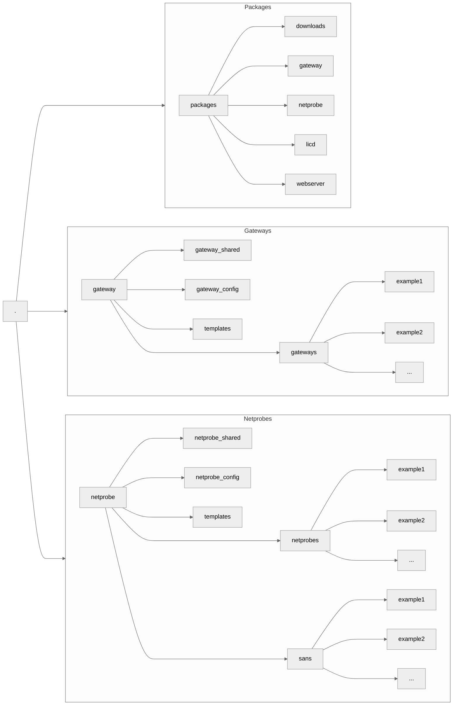

# `geneos`

The `geneos` program will help you manage your Geneos environment.

> The reference documentation, included in the program as help text, for all commands and their options is [here](docs/geneos.md)

## Aims

* To make your life easier; at least the Geneos part
* Keep it simple through the [Principle of least astonishment](https://en.wikipedia.org/wiki/Principle_of_least_astonishment)
* Help you use automation tools with Geneos

## Features

* Initialise a new installation with a single command
* Download, install and update Geneos software
* Adopt an existing installation created using older tools
* Operate Geneos across a group of servers with a single command
* Manage certificates for Secure Connections (TLS) between Geneos components
* Create Geneos compatible AES256 encoded passwords and manage other credentials
* Change instance settings from the command line
* Simple installation of Self-Announcing and Floating Netprobes

## Getting Started

First download the [latest binary](https://github.com/ITRS-Group/cordial/releases) to your user's `bin` directory and make it executable

```bash
mkdir -p ${HOME}/bin && cd ${HOME}/bin
curl -OL https://github.com/ITRS-Group/cordial/releases/latest/download/geneos
chmod +x ./geneos
```

You can also build from source. For more details see the [Installation](INSTALL.md#installation) documentation.

If you are on a system (or in a container) without an existing Geneos installation and with Internet access, you can try this:

```bash
geneos init demo -u email@example.com
```

You will be prompted for your download password and then, after a short while, you will have a running Geneos Demo environment.

> 💡 Replace `email@example.com` with your registered email for downloading ITRS software. If you need to register [go here](https://www.itrsgroup.com/?register=1)

### Adopting An Existing Installation

If you have a running Geneos environment and you currently use older ITRS tools like `gatewayctl` and `netprobectl` to manage it, then you can start using the new `geneos` program straight away. There are a couple of options, but the simplest is to tell `geneos` where the existing Geneos installation is:

```bash
geneos config set geneos=/path/to/geneos
```

The path you need to use above is the one with the `bin` directory that contains the existing `gatewayctl` etc., typically `/opt/itrs` or `/home/geneos`. If you happen to have an environment variable `ITRS_HOME` already set then you can skip the above step altogether. You can just try listing existing Geneos instances like this, without any risk of changes:

```bash
geneos list
```

If this works then you are all set.

#### Legacy Command Emulation

To help you migrate from older tools to `geneos`, the program will emulate the syntax of the older command (with some restrictions, such as no `create` command emulation) if invoked using the same names. This allows your users or existing automations to continue to work as before.

To back-up your old scripts and create the links to the new `geneos` program just run:

```bash
geneos migrate -X    # mnemonic: -X means "executables"
```

This will rename any `*ctl` programs for Geneos components to an `.orig` suffix and then create symbolic links to the current location of the `geneos` program.

To reverse this simply run:

```bash
geneos revert -X
```

This works by taking the first part of the executable name and mapping it to the component type, so for example a legacy command `TYPEctl NAME COMMAND` becomes `geneos COMMAND TYPE NAME`, e.g. `gatewayctl all start` is translated to `geneos start gateway all`.

The word `all` instead of a specific instance name is supported as per the original shell scripts.

### Command Structure

For typical commands the command line will look something like this:

`geneos COMMAND [flags] [TYPE] [NAMES...]`

* `COMMAND` is the one or two word name of the command
* `flags` are dash or double-dash prefixed options. Many of these options will require arguments and the details for each command will be in the help text.
* `TYPE` is the optional component type
* `NAMES` is an optional list of instance names. They can have an optional `@HOST` suffix which restricts the match to only the configured HOST.

The overall goal when choosing command names and their flags/options has been to make things more intuitive, rather than less. This is not always possible and so some options will be different between commands while performing the same task; One examples is the `-f` (follow) flags for `logs` which has similar functionality to the `-l` (logs) flag for `init` commands.

## Concepts & Terminology

We assumes some familiarity with the [ITRS Geneos](https://www.itrsgroup.com/products/geneos) product family. Please take the time to review the [Geneos Architecture](https://docs.itrsgroup.com/docs/geneos/current/getting-started/architecture/index.html) documentation.

Many of the terms used by the `geneos` program have been inherited from earlier systems and may not be as intuitive as we would like.

### Components

A _Component_ is a stand-alone software release that forms one part of the ITRS Geneos product.

The currently supported _Component_ types are listed in [Recognised Component Types](docs/geneos.md#component-types).

A _Component_ can also refer to a specific variety of another parent _Component_ type. The most common one is a Self-Announcing Netprobe which can be a variety of Netprobe or Fix Analyser 2 Netprobe.

_Components_ are normally referred to as a `TYPE` in command help and documentation.

_Components_ (more specifically the software releases that they are made up of) are managed through the [`package`](cmd/pkgcmd/README.md) sub-system.

### Instances

An _Instance_ is a runnable copy of a _Component_. An _Instance_ is made up of a working directory, a configuration file and other related files. The `geneos` utility uses these to manage the lifecycle of a _Component_ independently of other _Instances_ of the same _Component_ `TYPE`.

_Instances_ are referred to as `NAME` in the command help and documentation.

Each _Instance_ must have a unique, case-insensitive, name for that _Component_ `TYPE` and on that `HOST` (see below) and must not be one of the reserved names.

Reserved name are those that would be ambiguous on the command line and include _Component_ names and the aliases, command names and their aliases and some special terms (such as `all` or `any`).

An _Instance_ name can have a suffix that refers to the `HOST` it is located on in the form `NAME@HOST`. If not specified then commands will apply to all _Instances_ of `NAME` across all hosts.

### Hosts

A _Host_ is the location that components are installed and can be managed. There is always a `localhost`. There is also a special `all` host keyword that is implied when no specific host is specified.

Normally commands will apply to all _Hosts_. Operations can be limited using the global option `--host`/`-H` for most commands.

Hosts are managed through the [`hosts`](cmd/hostcmd/README.md) sub-system.

## Instance Protection

Individual instances can be protected again being stopped or deleted by setting the protected parameter.

```bash
geneos protect gateway IMPORTANT_GW
```

This also applies to any command that stops an instance, such as the more obvious ones like `restart` but also `disable` and others. The `copy` command, because it must be given the name for a source, does not check this setting. For most commands that check the protection setting before running there is a `--force` flag to override the protection. The `delete` command already requires that an instance be disabled or must be called with the `--force` flag.

If you run `geneos delete -H HOSTNAME` with the `--stop` flag to stop instance on the remote host first, then the `protected` settings is also checked and the command will terminate on the first error. This does however mean that unprotected instances on that host may have been stopped in the meantime.

The `update` command will not run if any protected instance is using the base link that would be updated.

## Instance Settings

Every instance has a configuration file stored in it's directory. This is the most basic requirement for an instance. New instances that you create will have a configuration file named after the component type plus the file type extension `.json`. Older instances which you have adopted from previous scripts will have a configuration file with the extension `.rc`

### JSON Configuration Files

The `.json` configuration files share common parameters as well as component type specific settings. For simplicity some of these parameters have different meanings depending on the component type they apply to.

While editing the configuration files directly is possible, it is best to use the `set` and `unset` commands to ensure the syntax is correct.

### Special parameters

All instances support custom environment variables being set or unset. This is done through the `set` and `unset` commands.

Some component types, Gateways, SANs and Floating Netprobes, support other special parameters through options to the various commands that create or edit instance configurations. See the help text for the `set` and `unset` commands for more details as well as `add` and the `init` subsystem.

To set an environment variable use this syntax:

```bash
geneos set netprobe example1 -e PATH_TO_SOMETHING=/file/path
```

If an entry already exists it is overwritten.

To remove an entry, use `unset`, like this

```bash
geneos unset netprobe example1 -e PATH_TO_SOMETHING
```

You can specify multiple entries by using the flag more than once:

```bash
geneos set netprobe example1 -e JAVA_HOME=/path -e ORACLE_HOME=/path2
```

If the value of the environment variable contains spaces then use quotes to prevent those spaces being caught by the shell. In bash you can do any of these to achieve the same result:

```bash
geneos set netprobe example1 -e MYVAR="a string with spaces"
geneos set netprobe example1 -e "MYVAR=a string with spaces"
```

You can review the environment for any instance using the `show` command:

```bash
geneos show netprobe example1
```

Also, output is available from the `command` command to show what would be run when calling the `start` command:

```bash
geneos command netprobe example1
```

Other special parameters behave in similar ways. Please see the command documentation for details.

### File and URLs

Most configuration file values support URLs, e.g. importing certificate and keys, license files, etc.

The primary exception is for Gateway include files used in templated configurations. If these are given as URLs then they are used in the configuration as URLs.

### Legacy Configuration Files

Historical (i.e. legacy) `.rc` files have a simple format like this:

```bash
GatePort=1234
GateUser=geneos
```

Where the prefix (here: `Gate`) also implies the component type and the suffix (`Port`) is the parameter. Any lines that do not contain the prefix are treated as environment variables and are evaluated and passed to the program on start-up. Parameter values that contain environment variables in the format `${HOME}` will be expanded at run time. If the configuration is migrated, either through an explicit `geneos migrate` command or if a setting is changes through `geneos set` or similar then the value of the environment variable will be carried over and continue to be expanded at run-time. The `geneos show` command can be passed a `--raw` flag to show the unexpanded values, if any.

While the `geneos` program can parse and understand the legacy `.rc` files above it will never update them, instead migrating them to their `.json` equivalents either when required or when explicitly told to using the `migrate` command.

For compatibility with earlier tools, the per-component configurations are loaded from `.rc` files in the working directory of each component. The configuration names are also based on the original names, hence they can be obscure. the `migrate` command allows for the conversion of the `.rc` file to a JSON format one, the original `.rc` file being renamed to end `.rc.orig` and allowing the `revert` command to restore the original (without subsequent changes).

If you want to change settings you should first `migrate` the configuration and then use `set` to make changes.

Note that execution mode (e.g. `GateMode`) is not supported and all components run in the background.

#### Instance Configuration File

These configuration files - in JSON format -  should be found in sub-directories under the `geneos` base directory (typiocally `/opt/itrs`, `/opt/itrs/geneos` or `/opt/geneos`) as `GENEOS_BASE_DIRECTORY/TYPE/TYPEs/INSTANCE/TYPE.json` where:

* `GENEOS_BASE_DIRECTORY` is the base directory for `geneos`.
* `TYPE` is the component type (`licd`, `gateway`, `netprobe`, `san`, `fa2`, `fileagent` or `webservcer`).
* `TYPEs` is the component type followed by the letter "s" (lowercase) to indicate a plural.
* `INSTANCE` is the instance name.
* `TYPE.json` is a the file name (e.g. `licd.json`, `gateway.json`, etc.).]


## Directory Layout

