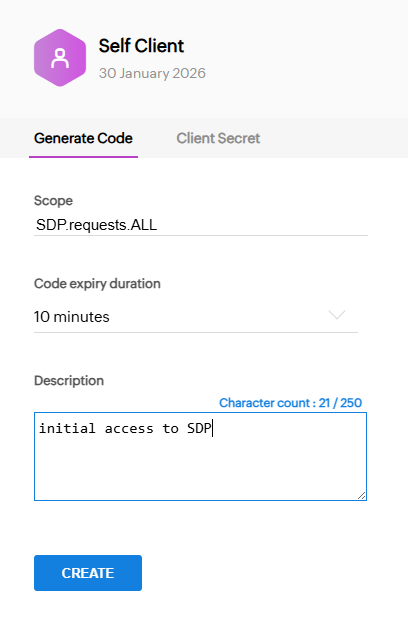

# ServiceDesk Plus OAuth2 Authentication

## Overview

To authenticate against ServiceDesk Plus using OAuth2 Client Credentials Grant, you need to provide a `client_id` and `client_secret` in your configuration file. These credentials can be obtained by registering your application in the ServiceDesk Plus admin console. Once you have the credentials, you can store them securely using Cordial's encrypted configuration feature.

Next, you have to obtain a grant token (code) from ServiceDesk Plus. This token is used to request access tokens for API calls. The grant token can be generated in the ServiceDesk Plus admin console under the OAuth settings. The code is only valid for up  to 10 minutes after generation, so ensure you use it promptly. Run `sdp auth` command to generate and store the an access and refresh token securely in you user configuration directory. These tokens are stored using AES256 encryption for security.

Once the initial tokens are stored, the OAUTH2 client will automatically handle token refreshes as needed, so you don't have to worry about manually refreshing tokens.

## Create a Self-Client

First, you have to locate the correct URL for your ServiceDesk Plus API Console. Depending on your region the URL will differ. There is a list on the Zoho developer site. For Europe this is http://api-console.zoho.com/. For a full list see: (https://www.zoho.com/analytics/api/v2/api-specification.html)

Once you are connected then create a new "Self Client" application. This will generate a `client_id` and `client_secret` for you to use in your configuration file. Save these in your `ims-gateway.yaml` configuration file under the `sdp` section. You can use `geneos aes password -p <your_password>` to encrypt the `client_secret` for added security in the configuration file.

>[!CRITICAL]
> The initial access token is only valid for a short period, which you select, up to a MAXIMUM of 10 minutes. Ensure you use it promptly to generate the access and refresh tokens.

Next, use "Generate Code". The scope should be (at minimum) `SDP.requests.ALL`:

Use `ims-gateway sdp-auth` to use the above code to generate and store the access and refresh tokens securely in your user configuration directory. The tokens are stored using AES256 encryption for security. Once stored, the OAUTH2 client will automatically handle token refreshes as needed, so you don't have to worry about manually refreshing tokens.

## Implementation Details

The file `${HOME}/.config/geneos/sdp.token.yaml` is used to store the encrypted access and refresh tokens. The `sdp auth` command will create or update this file with the latest tokens.
